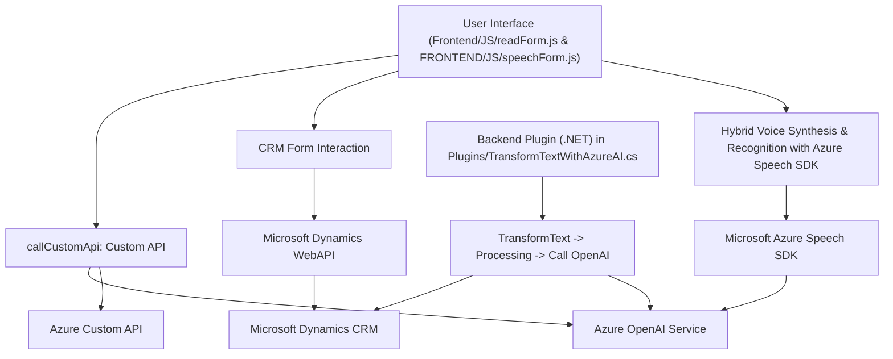

### Breve resumen técnico:
Este repositorio consiste en una solución de software integrada que utiliza Microsoft Azure y Dynamics CRM para ofrecer capacidades de interacción con formularios. Incluye dos componentes principales: un frontend en JavaScript para interacción con formularios y síntesis/reconocimiento de voz, y un plugin basado en .NET que utiliza Azure OpenAI para procesar texto en un sistema CRM.

---

### Descripción de arquitectura:
La arquitectura es modular y distribuida, con dos componentes principales:
1. **Frontend**: Modularidad en JavaScript para funciones específicas en la interacción con formularios y el manejo de comandos de voz. Además, se integra dinámicamente con Microsoft Azure Speech SDK para reconocimiento y síntesis de voz.
2. **Backend**: Plugin en .NET para procesamiento de datos, soportando integración con Azure OpenAI Service. Este componente utiliza el patrón `Plugin` de Dynamics CRM para la ejecución en eventos específicos del sistema.
   
Es una solución que aplica arquitectura **n-capas** donde:
- La capa frontend se encarga de la interacción del usuario y procesamiento inicial.
- La capa backend maneja la lógica empresarial y el procesamiento avanzado (interacción con Azure AI).

El uso de servicios externos como APIs de Azure refuerza características de **microservicios** en tareas específicas.

---

### Tecnologías usadas:
1. **Frontend**:
   - JavaScript (ES6): Lenguaje primario para la interactividad y funciones cliente.
   - Azure SDK: Para reconocimiento y síntesis de voz con Speech SDK.
   - REST API: Integración con APIs personalizadas y servicios de Azure.
   - Dynamics CRM Web API (`Xrm.WebApi`).

2. **Backend**:
   - ASP.NET Framework con Dynamics CRM SDK.
   - C#:
     - Clases para lógica empresarial dentro de plugins.
     - Serialización y deserialización JSON (`Newtonsoft.Json`, `System.Text.Json`).
   - HTTP client para conexiones API con Azure OpenAI.

---

### Dependencias o componentes externos:
1. **Azure Speech SDK**: Utilizado para reconocimiento y síntesis de voz.
2. **Azure OpenAI Service**: Para el procesamiento inteligente del texto mediante GPT o otros modelos de lenguaje.
3. **Dynamics CRM SDK (`Microsoft.Xrm.Sdk`)**: Se utiliza para integrar el plugin con el sistema de datos del CRM.
4. **APIs personalizadas**: Manejadas por el módulo `callCustomApi`.
5. **JSON libraries (`Newtonsoft.Json` y `System.Text.Json`)**: Para manipulación avanzada de datos estructurados.

---

### Diagrama Mermaid:

---

### Conclusión final:
La solución presentada es un **ecosistema para interacción verbal y textual con formularios dinámicos en un sistema CRM** (Dynamics 365). Está compuesto por un frontend JS altamente modular que utiliza el Azure Speech SDK y encapsula funcionalidades para síntesis y reconocimiento de voz, mientras el backend (plugin .NET) emplea el servicio Azure OpenAI para realizar procesamiento avanzado de texto. 

La solución adopta una **arquitectura n-capas**, combinada con integración de servicios externos (Azure SDKs y APIs personalizadas), permitiendo un enfoque de microservicios en tareas específicas. Con su uso de tecnologías modernas como JavaScript, .NET, y Azure, este sistema es flexible y puede ser escalado para cumplir diversos requisitos empresariales.