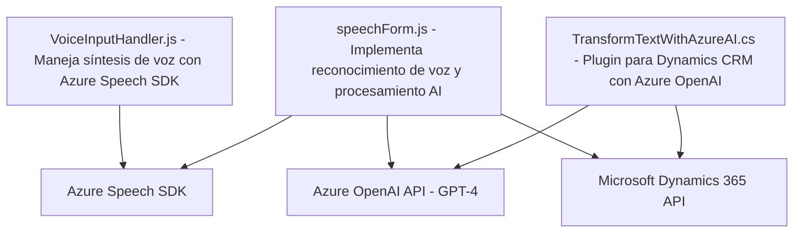

### Resumen técnico

El repositorio contiene código que implementa diferentes funciones relacionadas con la interacción con Microsoft Dynamics 365 utilizando servicios externos, como Azure Speech SDK y Azure OpenAI. Principalmente, se enfoca en:
1. **Front-end para procesamiento de formularios:** `VoiceInputHandler.js` y `speechForm.js` manejan la síntesis y reconocimiento de voz respectivamente, utilizando el Azure Speech SDK y el contexto de formularios de Dynamics 365.
2. **Plugin para el backend de Dynamics CRM:** `TransformTextWithAzureAI.cs` define un plugin que aplica reglas predefinidas para transformar texto mediante el servicio Azure OpenAI.

---

### Descripción de arquitectura

La solución presenta una **arquitectura N-capas**, donde:
1. **Presentación (Frontend)**: Implementada en JavaScript, interactúa con Dynamics CRM vía el Form Context API.
2. **Negocio (Backend y Plugins)**: Utiliza el patrón Plugin de Dynamics CRM para aplicar lógica empresarial avanzada, en este caso mediante Azure OpenAI.
3. **Servicios Externos y Datos**: Dependencia del **Azure Speech SDK** y la API de Microsoft Dynamics, además del servicio Azure OpenAI para procesamiento mediante IA.

En resumen, la arquitectura se centra en la integración de un sistema monolítico (Dynamics CRM) con servicios externos a través de plugins y archivos front-end especializados.

---

### Tecnologías usadas

1. **Frontend / presentación:**
   - **JavaScript**: Para la interacción y procesamiento de formularios en Dynamics CRM.
   - **Azure Speech SDK**: Para la síntesis y reconocimiento de voz.
   - **Form Context API**: Para obtener y manipular datos de formularios en Dynamics 365.
   
2. **Backend / negocio:**
   - **C#** con la interfaz `IPlugin`: Para implementar el plugin en Dynamics CRM.
   - **Newtonsoft.Json** y **System.Text.Json**: Utilizadas para serialización y deserialización de JSON.
   - **Azure OpenAI API (GPT-4)**: Para transformación de texto según reglas predefinidas.

3. **Patrones de diseño:**
   - **Plugin pattern**: Implementación en el backend de Dynamics CRM.
   - **Modularidad**: Separación de responsabilidades en funciones y métodos conexos en el front-end.
   - **Carga dinámica de dependencias:** Scripts externos (`Azure Speech SDK`).

---

### Diagrama Mermaid válido para GitHub

---

### Conclusión Final

La solución implementada en este repositorio tiene una estructura funcional, con enfoque modular en el front-end y plugin-based en el backend. Se apoya fuertemente en APIs de Azure para proporcionar habilidades avanzadas como síntesis, reconocimiento de voz, y procesamiento de texto mediante IA. Al aprovechar una arquitectura N-capas, el sistema asegura una separación clara entre presentación, lógica empresarial y servicios externos, facilitando el mantenimiento y escalabilidad para escenarios empresariales de Dynamics 365. Sin embargo, debe considerarse la gestión de credenciales de servicios externos de forma segura para evitar problemas de seguridad.