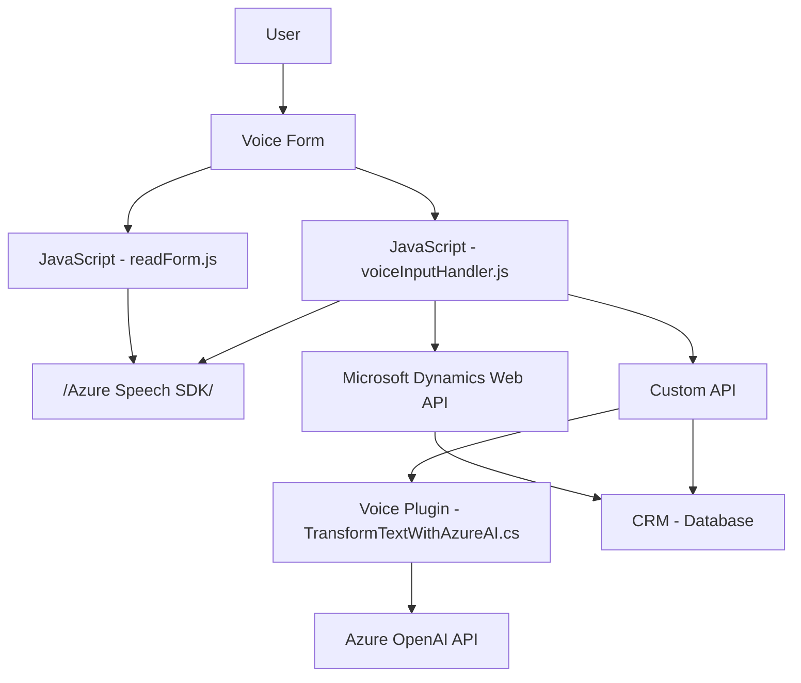

### Breve Resumen Técnico

Este repositorio proporciona una solución que integra un frontend (usando JavaScript) y un backend (mediante un plugin en .NET/C#) para interactuar con Microsoft Dynamics CRM. Utiliza funcionalidades como entrada/salida de voz mediante **Azure Speech SDK**, reconocimiento avanzado de voz y mapeo dinámico de datos a formularios en entornos CRM. Además, el backend utiliza **Azure OpenAI API** para transformar texto de manera inteligente.

---

### 1. Descripción de Arquitectura

- **Tipo de Solución:** Este es un sistema híbrido que conecta un frontend basado en JavaScript con funcionalidades de procesamiento de voz y un backend basado en Microsoft Dynamics CRM plugins para manejo avanzado de datos.
- **Arquitectura:** En términos de diseño, el backend sigue una arquitectura **Plug-in** típica de Dynamics CRM, que permite ejecutar módulos específicos en respuesta a eventos del CRM. Para el frontend, el sistema presenta una **arquitectura de capas** tradicional:
  - **Frontend:** Encargado de la captura de eventos de usuario, reconocimiento de voz, y envío de solicitudes al backend.
  - **Backend:** Basado en un plugin que procesa las solicitudes mediante servicios externos (Azure OpenAI API) y devuelve datos estructurados útiles para el modelo de negocio.

---

### 2. Tecnologías Usadas, Frameworks y Patrones

#### **Frontend**:
1. **JavaScript**: Lenguaje base para la construcción del frontend.
2. **Azure Speech SDK**:
   - Utilizado para la entrada y síntesis de voz.
   - Implementación modular con carga dinámica del SDK.
3. **Patrones observados**:
   - **Orquestador basado en funciones**: Cada función cumple un propósito único como síntesis de datos, gestión de formularios o integración con servicios externos.
   - **Desacoplamiento funcional**: Varias funciones específicas para mapeo, obtención de datos, y conversión a valores legibles.
   - **Integración con servicio externo**: Usa Azure Speech para reconocimiento y síntesis de voz.

#### **Backend**:
1. **Microsoft Dynamics CRM SDK**: Base para la implementación del plugin.
2. **Azure OpenAI API**: Servicios externos de IA para procesamiento avanzado de texto.
3. **Patrones observados**:
   - **Plugin Architecture**: Utiliza el modelo de extensibilidad basado en plugins de Dynamics CRM.
   - **Adapter Pattern**: Convierte los datos recibidos en un formato compatible con el sistema CRM.
   - **External Service Integration**: Llama a servicios de terceros para procesamiento y transformación de datos.
   - **Manejo de errores**: Controla excepciones y situaciones fuera de lo esperado, como falla al cargar el SDK.

---

### 3. Dependencias y Componentes Externos

1. **Microsoft Azure Speech SDK**:
   - Maneja entrada y salida por voz (síntesis y reconocimiento de voz).
   - Se carga dinámicamente en los navegadores con un paquete específico de JavaScript (`https://aka.ms/csspeech/jsbrowserpackageraw`).

2. **Microsoft Dynamics CRM API**:
   - Gestiona las interacciones con formularios dinámicos, mapeando datos a los campos específicos usando una API personalizada escrita en .NET/C#.

3. **Azure OpenAI**:
   - Usado por el plugin de backend para realizar transformaciones y procesamiento basado en texto con GPT.

4. **Microsoft Dynamics Web API**:
   - Posibilita interacciones con entidades CRM y la ejecución de integraciones avanzadas, como entidades Lookup y APIs personalizadas.

5. **Bibliotecas estándar .NET**:
   - `Newtonsoft.Json`, `System.Http`, `System.Text` y similares para manejo de solicitudes web y transformación JSON para el plugin.  

---

### Diagrama **Mermaid** válido para GitHub

#### Explicación del Diagrama
1. El **usuario** interactúa con un formulario de voz representado en el frontend (`readForm.js` y `voiceInputHandler.js`).
2. El frontend utiliza **Azure Speech SDK** para entrada y salida de voz (síntesis/reconocimiento).
3. Si es necesario procesar datos transcritos, el sistema llama a una **Custom API** del **Dynamics Web API**.
4. La **Custom API** emplea el **Plugin (TransformTextWithAzureAI)** para enviar texto al servicio externo **Azure OpenAI AI API**, recuperando datos estructurados en JSON.
5. Los datos procesados se integran finalmente en la base de datos del **CRM**.

---

### 4. Conclusión final

Este repositorio configura una solución avanzada de procesamiento por voz y texto que potencia la interactividad de sistemas de formularios en Microsoft Dynamics 365 mediante servicios de reconocimiento de voz y de inteligencia artificial (AI). La arquitectura es modular, alineada con dos capas principales: interacción en el cliente (JavaScript) con las capacidades de Azure Speech SDK y procesamiento backend mediante plugins y APIs. La implementación incluye prácticas como desacoplamiento funcional y patrones para integración con servicios externos que facilitan el mantenimiento y escalabilidad del sistema.

Sin embargo, el diseño presenta un problema en el manejo de configuraciones estáticas (e.g., claves de API) dentro del plugin. Para cumplir con buenas prácticas de seguridad, se recomienda centralizar esas configuraciones fuera del código fuente (por ejemplo, usando Azure Key Vault).