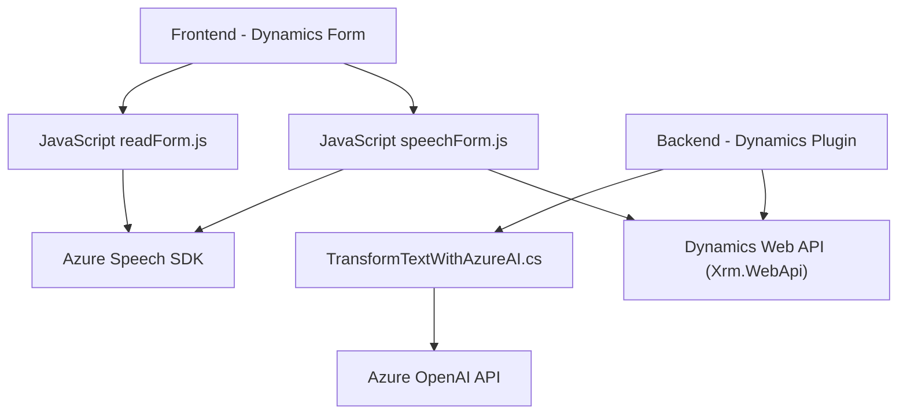

### Breve resumen técnico
El proyecto implementa una solución integrada de entrada de voz y procesamiento de datos para sistemas de Microsoft Dynamics 365. Utiliza tecnologías de Microsoft, incluyendo Azure Speech SDK y Dynamics 365 Web API junto con el plugin TransformTextWithAzureAI desarrollado en C#. Tiene módulos frontend en JavaScript que interactúan con Dynamics 365 y un plugin en C# que conecta Dynamics a la API de Azure OpenAI. La solución está diseñada para optimizar la entrada y procesamiento de datos mediante voz y GPT.

---

### Descripción de la arquitectura
La solución utiliza una arquitectura de **modelo cliente-servidor**. Los scripts de JavaScript gestionan la interacción directa con el usuario y datos de formularios locales (cliente) dentro de Dynamics 365. Paralelamente, se integra con servicios externos, como Azure Speech SDK y la API de Azure OpenAI, para gestionar la síntesis y el reconocimiento de voz, así como el procesamiento avanzado de datos con GPT.

El plugin `TransformTextWithAzureAI` utiliza un **patrón de extensión (Plugin)** en Dynamics CRM. La solución tiene componentes bien estructurados con modularidad en su diseño, indicativos de una arquitectura **por capas (n-capas)**, donde cada módulo tiene roles definidos:
1. **Capa de presentación:** Scripts en el frontend (JavaScript) para la interacción con el usuario.
2. **Capa de aplicación:** Metodología de invocación y procesamiento mediante plugins en Dynamics CRM.
3. **Capa de integración:** Uso de APIs externas (Azure Speech SDK y Azure OpenAI API).
4. **Capa de datos:** Dynamics CRM para la gestión de datos y formularios internos.

---

### Tecnologías usadas
1. **Frontend**
   - **JavaScript**: Para la lógica del cliente y manipulación del DOM.
   - **Azure Speech SDK**: Llamadas a servicios de síntesis y reconocimiento de voz.
   - **Dynamics 365** Web API: Interacción con datos del formulario.

2. **Backend/Plugin**
   - **C#/.NET**:
     - **Microsoft.Xrm.Sdk**: Lógica de plugin para Dynamics CRM.
     - **Newtonsoft.Json.Linq**: Manipulación de JSON.
     - **HttpClient**: Comunicación con API de Azure OpenAI.
   - **Azure OpenAI API**: Procesamiento avanzado de texto con GPT.

3. **Servicios externos**
   - **Azure Speech SDK (Frontend)**: Reconocimiento y síntesis de voz.
   - **Dynamics 365 API (Backend)**: Actualización de datos en formularios.
   - **Azure OpenAI API (Backend)**: Respuestas estructuradas en JSON basadas en IA.

---

### Diagrama Mermaid válido para GitHub

---

### Conclusión final
Este repositorio implementa una solución basada en **n-capas con integración avanzada de API externas**, ideal para sistemas empresariales que requieran entrada y procesamiento de datos basado en voz e IA. Utiliza tecnologías modernas de Microsoft como Azure Speech SDK y Dynamics CRM junto con Azure OpenAI para proporcionar capacidades avanzadas. La modularidad y uso de patrones como el de extensiones (Plugins) y cliente-API garantizan que la solución sea escalable y adaptable. Sin embargo, aspectos como la seguridad en el manejo de claves API y lógica de reintentos podrían ser áreas de mejora clave en el diseño de la solución.