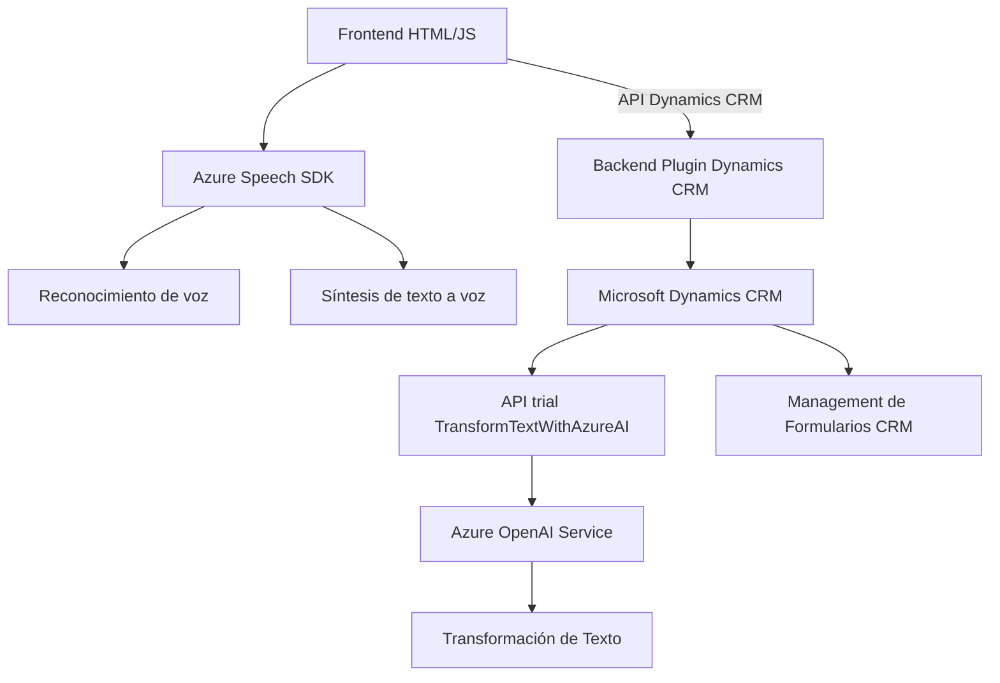

### Breve resumen técnico:
El repositorio analiza una solución integrada entre un frontend y un backend, diseñada principalmente para gestionar interacciones de usuario mediante voz y sintetizar datos utilizando Azure Speech SDK y Azure OpenAI Service. La arquitectura muestra un enfoque híbrido que conecta una interfaz CRM y su backend a servicios externos de IA y reconocimiento de voz.

---

### Descripción de arquitectura:
1. **Solución principal**:
   - La solución combina un **frontend** dinámico basado en formularios y controladores JavaScript junto con un **backend** desarrollado como plugin para Microsoft Dynamics CRM.
   - Integra APIs externas mediante servicios Azure, específicamente Azure Speech SDK para síntesis/reconocimiento de voz y Azure OpenAI para transformación de datos.
   
2. **Modelo arquitectónico**:
   - **Frontend**:
     - Modular con separación de componentes funcionales según tareas específicas (reconocimiento/síntesis de voz, manipulación de datos).
   - **Backend**:
     - Se implementa como un **plugin** sobre Dynamics CRM, siguiendo un patrón basado en eventos que interactúan con las APIs de CRM y servicios externos.
   - **Patrón arquitectónico global**: Mayormente orientado a **n capas**, centrado en la separación entre backend (lógica del plugin) y frontend (controladores visuales y de interacción).

---

### Tecnologías usadas:
1. **Frontend**:
   - **JavaScript**: Gestión de lógica mediante funciones modulares.
   - **Azure Speech SDK**: Para procesamiento de voz (reconocimiento/síntesis).
   - **Dynamics CRM API**: Envío y recuperación de datos estructurados desde formularios.

2. **Backend**:
   - **C#**: Desarrollo del plugin interno para Dynamics CRM.
   - **Azure OpenAI Service**: Para transformación inteligente de texto recibido.
   - **Newtonsoft.Json** y **System.Text.Json**: Manejo de datos JSON serializados.

3. **Infraestructura**:
   - **Microsoft Dynamics CRM**: Plataforma base para interacción de formularios.
   - **APIs externas**: Azure Speech y OpenAI como servicios en la nube.
   - **Carga dinámica**: Descarga del Azure Speech SDK en tiempo real utilizando JavaScript.

---

### Dependencias y componentes externos:
1. **Frontend**:
   - Azure Speech SDK descargado dinámicamente.
   - Dependencias de Dynamics CRM proporcionadas por la estructura del formulario CRM.

2. **Backend**:
   - Microsoft Dynamics CRM SDK (para construcción del plugin).
   - Azure OpenAI Service: Necesita credenciales y endpoint configurado.

3. **Otros**:
   - Frameworks para validación y enriquecimiento de transcripciones, probablemente utilizando estándares HTTP y formato JSON.

---

### Diagrama Mermaid:

---

### Conclusión final:
La solución implementa una arquitectura híbrida que integra servicios externos de IA y reconocimiento de voz para una plataforma basada en Microsoft Dynamics CRM. La estructura sigue un diseño basado en **n capas**, donde el frontend y backend interactúan a través de APIs. La modularidad en JavaScript permite un fácil manejo y escalabilidad en el procesamiento de datos dinámicos. Escritura de plugins en **C#** y utilización de APIs de Azure proporcionan enriquecimiento funcional sin incrementar la complejidad de integración.