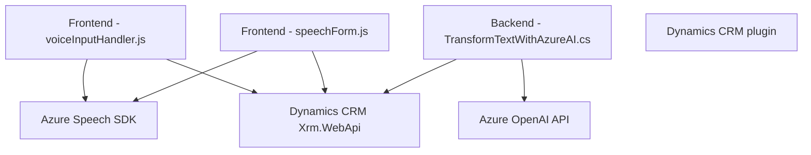

### Breve Resumen Técnico
El repositorio presenta una solución híbrida que integra funcionalidad web (frontend en JavaScript y un plugin en C#) para procesamiento de formularios, análisis de datos, interacción mediante voz y texto, y transformación avanzada de datos usando Azure AI. La solución incluye integración con Dynamics CRM, Azure OpenAI, y Azure Speech SDK.

---

### Descripción de Arquitectura
La arquitectura combina patrones basados en **n capas** y **orientada a servicios**:  
1. La capa **frontend** realiza la interacción con el usuario, que incluye la captura y síntesis de voz, además del reconocimiento de voz.
2. En el backend (plugin escrito en C# para Dynamics CRM), se procesa información avanzada y se interactúa con Azure OpenAI para transformación de texto.  
La solución utiliza APIs externas y conceptos de extensibilidad en Dynamics CRM, integrando servicios inteligentes de Azure dentro de una arquitectura distribuida.

---

### Tecnologías Usadas
1. **Frontend:**
   - **JavaScript:** Lenguaje principal para manejo de formularios y voz.
   - **Azure Speech SDK:** Utilizado en el frontend para reconocimiento y síntesis de voz.
   - **Dynamics 365 API (Xrm.WebApi.online):** Para integrar el frontend con los formularios de Dynamics CRM.

2. **Backend:**
   - **C#**:
     - Plugin para Dynamics CRM.
     - Manejo de eventos usando `IServiceProvider`.
   - **Microsoft.Xrm.Sdk y Microsoft.Xrm.Sdk.Query:** Librerías de Dynamics 365 para interacción con entidades CRM.
   - **Newtonsoft.Json** y **System.Text.Json**: Manipulación de objetos JSON.
   - **System.Net.Http**: Realización de llamados HTTP al servicio Azure OpenAI.

3. **Servicios Externos:**
   - **Azure OpenAI API:** Convertir texto a estructuras JSON predefinidas.
   - **Azure Speech SDK:** Procesamiento y síntesis de voz.

---

### Diagrama Mermaid

---

### Conclusión Final
La solución representa una integración robusta entre frontend y backend, con apoyo de servicios externos de Azure. Los patrones arquitectónicos incluyen n capas para frontend y backend, orientación a servicios (Azure Speech SDK y Azure OpenAI), y extensibilidad a través de plugins en Dynamics CRM. El uso de dependencias como Azure Speech SDK y la API de Dynamics CRM resalta el enfoque en modularidad y escalabilidad. Este diseño puede optimizarse más al consolidar integraciones para mejorar rendimiento en llamadas a Azure OpenAI.