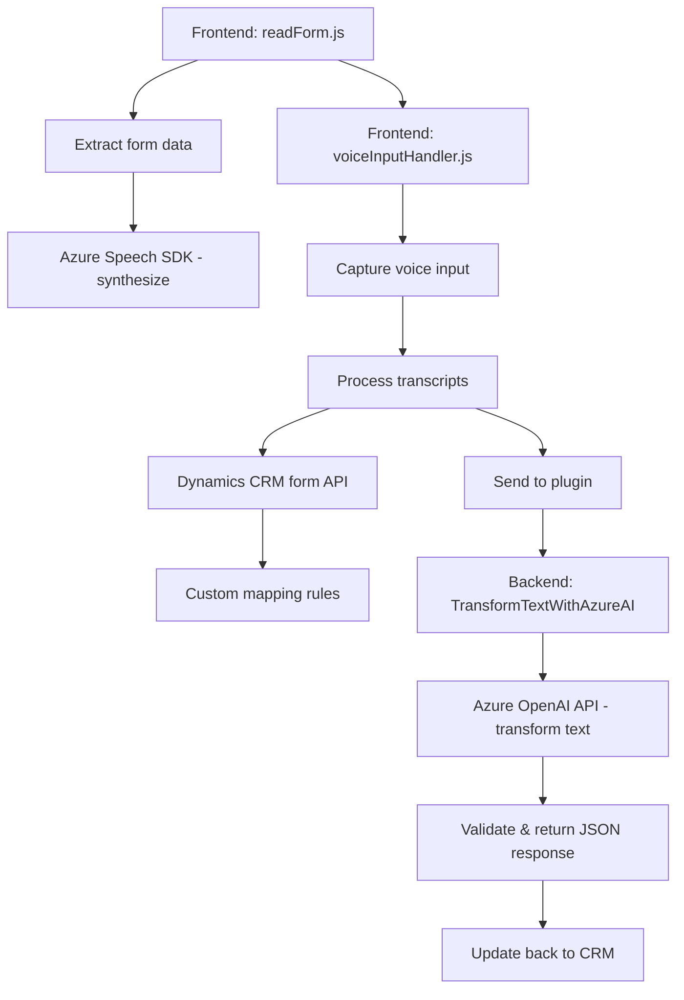

# Breve resumen técnico

El repositorio parece ser una solución que incluye un **frontend** basado en JavaScript y una integración con servicios externos orientados a voz (Azure Speech SDK) y procesamiento de textos estructurados (Azure OpenAI) en el contexto de Microsoft Dynamics CRM. Además, hay una extensión agregada bajo la forma de un **plugin** en `.NET` C# que interactúa directamente con Azure OpenAI API para gestionar datos estructurados en el backend del sistema CRM.

---

# Descripción de arquitectura

La solución muestra una arquitectura híbrida con los siguientes componentes y patrones:
1. **Frontend orientado a eventos**: Para captura de voz e interacción con servicios externos como Azure Speech SDK.
2. **Backend basado en plugins (Dynamics CRM)**: Utiliza una arquitectura basada en invocación de plugins (`IPluginFramework`) para ejecutar transformaciones de texto con Azure OpenAI.
3. **Servicios distribuidos**: Aunque cada componente tiene independencia funcional, se integran mediante APIs externas (RESTful) con Azure Speech y OpenAI.
4. **Arquitectura de varias capas (N-capas)** combinada con componentes **event-driven** y **modular design**:  
   - **Presentación**: JavaScript (gestiona formulario y captura de voz).  
   - **Control**: Integración mediante Dynamics WebAPI y Azure APIs.  
   - **Procesamiento**: Metodologías basadas en reglas y modelos de IA aplicadas en backend (C#).  

---

# Tecnologías usadas

### **Frontend (JavaScript)**
- **Azure Speech SDK**: Reconocimiento y síntesis de voz en español.  
- **Microsoft Dynamics CRM WebAPI (`Xrm.WebApi`)**: Manipulación de datos en formularios CRM.  
- **JavaScript Promises y callbacks**: Asincronía para procesos como la carga dinámica de SDK y manejo de respuestas API.  

### **Backend (.NET Plugins)**
- **Plugin Framework de Dynamics CRM (`IPlugin`)**: Extensión CRM en forma de plugin para procesos específicos.  
- **Azure OpenAI API**: Interacción RESTful con modelos de inteligencia artificial.  
- **.NET Framework**:
  - **System.Net.Http**: Solicitudes API RESTful.  
  - **System.Text.Json y Newtonsoft.Json.Linq**: Procesamiento JSON.  

---

# Diagrama Mermaid

---

# Conclusión final

La solución presentada combina un **frontend modular** con funcionalidades dinámicas de voz (reconocimiento y síntesis) y un **backend especializado** diseñado como plugin de Dynamics CRM. El uso de servicios como Azure Speech SDK y Azure OpenAI API permite que esta arquitectura sea altamente extensible y adecuada para entornos empresariales que requieren interacción avanzada con datos. Ejecutar procesos de transformación de texto a través de un modelo descentralizado y con APIs externas muestra dependencia estratégica en servicios en la nube. 

Sin embargo, se debe tener precaución con la **gestión de claves API** y tratar de aplicar patrones seguros como inyección de dependencias con configuración externa. En términos de funcionalidad, la solución está correctamente construida utilizando patrones modernos como **modular**, **event-driven** y **multicapas**.