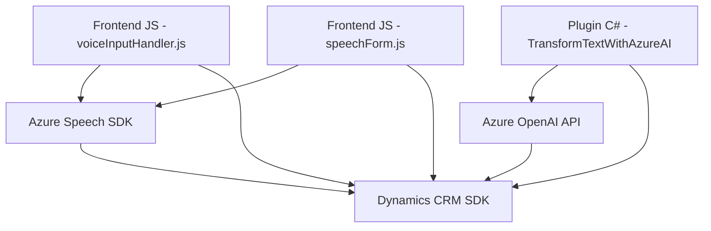

### Resumen Técnico  
Este repositorio implementa una solución destinada a interactuar con formularios, procesar entrada de voz y transformar texto dinámico para sistemas CRM (Customer Relationship Management). Utiliza servicios externos como Azure Speech SDK y Azure OpenAI para integrarse con Microsoft Dynamics CRM, facilitando procesos que involucran voz, IA y manipulación de formularios dinámicos.

---

### Descripción de Arquitectura  
La implementación sigue una arquitectura orientada a **microservicios** con componentes distribuidos:
1. **Frontend (JavaScript):** Maneja entrada de voz, síntesis y conversión de texto en tiempo real, interactuando con servicios como Azure Speech SDK y APIs personalizadas para el procesamiento.
2. **Plugin (C#):** Define un servicio que se integra dentro de Microsoft Dynamics CRM para manejar estructuras y procesos de negocios específicos. Este plugin realiza transformaciones de texto a través de Azure OpenAI y gestiona la interacción con el modelo CRM.

La arquitectura refleja modularidad y separación de responsabilidades, orientada a la integración de servicios externos, como Azure Speech SDK y Azure OpenAI.

---

### Tecnologías Usadas  
1. **Lenguajes de programación:**
   - **JavaScript (Frontend):** Usado para implementar funciones vinculadas a entrada de voz, síntesis de texto y manipulación de formularios.
   - **C# (Backend Plugin):** Usado para crear plugins integrados con Microsoft Dynamics CRM.

2. **Frameworks y SDKs:**
   - **Azure Speech SDK:** Para tareas de síntesis y entrada de voz.
   - **OpenAI API (Azure-hosted):** Para el procesamiento y transformación de texto en formatos JSON.
   - **Dynamics CRM SDK:** Para operaciones relacionadas a formularios y servicios del CRM.

3. **Patrones:**
   - **Lazy-loading:** Carga de Azure Speech SDK dinámicamente.
   - **Single Responsibility Principle (SRP):** Las clases y funciones tienen responsabilidades aisladas.
   - **Microservicios y modularidad:** Componentes desacoplados que interactúan mediante APIs.  

---

### Dependencias o Componentes Externos  
1. **Azure Speech SDK (`https://aka.ms/csspeech/jsbrowserpackageraw`)**
   - Síntesis de texto y entrada de voz en tiempo real.

2. **Azure OpenAI API (Plugin en C#):**
   - Realiza procesamiento basado en reglas para estructurar el texto en JSON.

3. **Dynamics CRM SDK (`Microsoft.Xrm.Sdk`):**
   - Interacción con formularios y manejo de datos en el CRM.

4. **APIs personalizadas:**
   - Ejemplo: `trial_TransformTextWithAzureAI` usada para procesar entrada.

5. **Bibliotecas externas:**
   - **Newtonsoft.Json:** Manipulación avanzada de JSON.
   - **System.Net.Http:** Realización de solicitudes HTTP externas.

---

### Diagrama Mermaid  

---

### Conclusión Final  
Este repositorio ejemplifica una integración avanzada entre frontend dinámico, servicios de entrada de voz, APIs de IA y backend especializado en plugins de CRM. Adopta una arquitectura modular y orientada a microservicios, diseñada para integrar tecnología moderna como Azure Speech y OpenAI dentro de un ecosistema corporativo. La solución puede escalarse y adaptarse para entornos de CRM complejos que necesiten entrada de voz y procesamiento con IA.