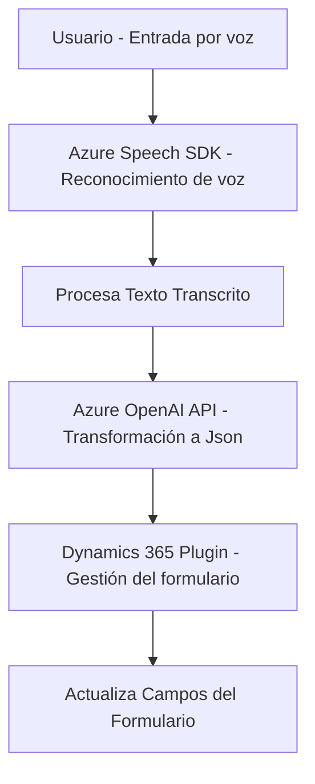

### Resumen técnico:
El repositorio está orientado a extender la funcionalidad de una aplicación basada en Dynamics 365, habilitando soporte de entrada de voz y procesamiento avanzado de texto con la integración de servicios como **Azure Speech SDK** y **Azure OpenAI**. Se centra en interacción mediante voz, sintetización, reconocimiento y transformación de datos utilizando tecnologías modernas.

---

### Descripción de arquitectura:
La solución implementada en el repositorio tiene una **arquitectura híbrida**, que combina las siguientes características:
1. **Integración de servicios**: El frontend actúa como punto de interacción del usuario y se conecta indirectamente con Dynamics 365 y Azure mediante APIs.
2. **Patrones por capas (n-capas)**:
   - **Presentación**: `frontend` maneja la interfaz para interacción con voz.
   - **Lógica de negocio**: Plugins procesan y transforman texto utilizando Dynamics CRM y Azure OpenAI.
   - **Acceso a datos**: Dynamics proporciona un nivel de abstracción para la manipulación de datos.
3. **Desacoplamiento lógico**:
   - Plugins y funciones JavaScript están modularmente definidos, facilitando su mantenimiento y escalabilidad.

---

### Tecnologías y patrones usados:
1. **Tecnologías**:
   - **Frontend**: JavaScript (modular y funcional).
   - **Dynamics CRM SDK**: Framework para interoperabilidad con entidades y procesos de Dynamics 365.
   - **Azure Speech SDK**: Sirve para reconocimiento de voz y sintetización de voz hacia texto.
   - **Azure OpenAI API**: Ejecuta operaciones avanzadas de transformación de lenguaje natural.
   - **Newtonsoft.Json**: Facilita la gestión estructurada de JSON.

2. **Patrones de diseño**:
   - **Delegate Pattern**: Se utiliza para coordinar diferentes tareas, como cargar el SDK, manejar entrada de voz o procesar texto.
   - **Clean Code y Modularidad**: Código organizado en funciones específicas.
   - **Service Factory Pattern**: Implementado para manejar contextos extendidos de Dynamics CRM mediante `IOrganizationServiceFactory`.
   - **HTTP Encapsulation**: Las llamadas a servicios externos están encapsuladas en métodos específicos.

---

### Diagrama **Mermaid** válido para GitHub:

---

### Conclusión final:
El repositorio corresponde a una **solución híbrida** para aplicaciones empresariales modernas, donde el frontend habilita la entrada por voz y la integración con APIs externas complementa funcionalidades avanzadas de procesamiento de texto. Las tecnologías seleccionadas son altamente adecuadas para su contexto y el diseño modular garantiza escalabilidad y mantenimiento eficiente.