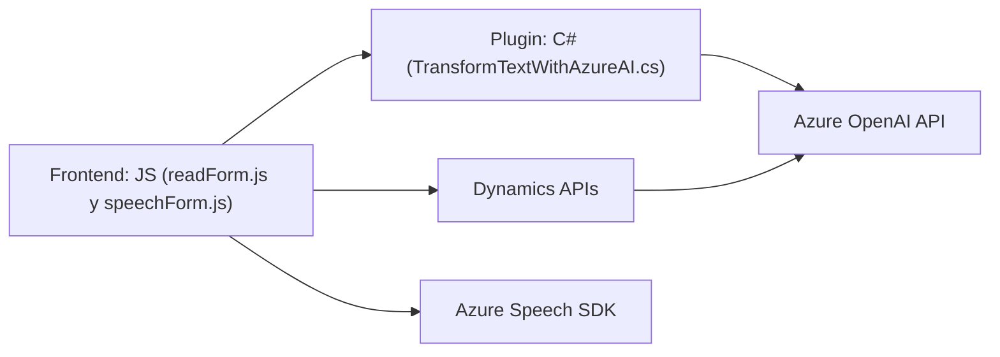

### **Resumen Técnico**
El repositorio presenta una solución integrada que combina *frontend*, *API plugins* y servicios externos (Azure Speech SDK, Azure OpenAI API). Está diseñada para interactuar con formularios de Microsoft Dynamics 365, facilitando la interacción con reconocimiento y síntesis de voz, y transformación de texto mediante IA.

---

### **Descripción de la Arquitectura**
1. **Arquitectura General:**
   - La solución combina un cliente web (JavaScript en los archivos del frontend), plugins en Dynamics CRM (C#), y servicios externos de Azure (Speech y OpenAI APIs). Esto implica una arquitectura distribuida y heterogénea basada en tres capas: *presentación*, *negocio* y *datos*.
   - Los plugins actúan como microservicios complementarios, integrados en el CRM, mientras que el frontend utiliza un modelo basado en modularidad y eventos asíncronos (con promesas y callbacks).

2. **Estructura destacada:**
   - El frontend implementa módulos organizados por contexto de funcionalidad: procesamiento de formularios (lectura/síntesis) y control por voz con reconocimiento.
   - Los plugins implementan un patrón de *Service Locator* para interactuar con Dynamics CRM y servicios externos.
   - Azure Speech SDK y Azure OpenAI actúan como servicios externos en tiempo de ejecución, siendo invocados dinámicamente desde el frontend o los plugins del backend.

---

### **Tecnologías, Frameworks y Patrones Utilizados**
1. **Frontend:**
   - **Lenguaje/Framework:** JavaScript (modular).
   - **SDK:** Azure Speech SDK (para síntesis y reconocimiento de voz).
   - **Dynamics 365 APIs:** Integración profunda vía `formContext` y `Xrm.WebApi`.
   - **Patrones:** Modularidad, Callback-based loading, Promesas para asincronía, MVC-like (procesamiento de lógica separada de la vista).

2. **Backend (Plugin):**
   - **Lenguaje/Framework:** C#.
   - **Framework:** Microsoft Dynamics CRM (con `IPlugin`).
   - **Libraries:** Newtonsoft.Json para manipulación de JSON, `System.Net.Http` para solicitudes HTTP a APIs externas.
   - **Externo:** Azure OpenAI API para procesamiento de texto.
   - **Patrones:** Plugin Architecture (Dynamics), Service Locator (con `IServiceProvider`), integración de servicios externos.

---

### **Dependencias o Componentes Externos**
1. **Azure Speech SDK:** Integrado en el frontend, para síntesis y reconocimiento de voz.
2. **Azure OpenAI API:** Usada en el plugin para transformar texto en estructuras JSON.
3. **Microsoft Dynamics CRM:** Framework base y APIs para interacción con formularios y datos.
4. **JSON Libraries:** *Newtonsoft.Json* y *System.Text.Json* para procesar y manipular datos en formato JSON.
5. **Custom API de Dynamics:** API personalizada para realizar operaciones específicas como transformaciones o consultas adicionales.

---

### **Diagrama Mermaid 100% compatible con GitHub Markdown**

---

### **Conclusión Final**
El repositorio representa una solución tipo **distribuida** que interactúa directamente con entornos de Microsoft Dynamics 365 y servicios de cloud de Azure. Utiliza una integración bien estructurada entre el cliente, servicios externos, y plugins que se ajustan al modelo de *extensibilidad dinámica*. La implementación sigue patrones modernos como modularidad en el frontend, asincronía con promesas y callbacks, y patrones de integración como la arquitectura de plugins y service locator en el CRM. Es una solución robusta para escenarios empresariales donde se necesitan interacciones avanzadas basadas en voz e inteligencia artificial.