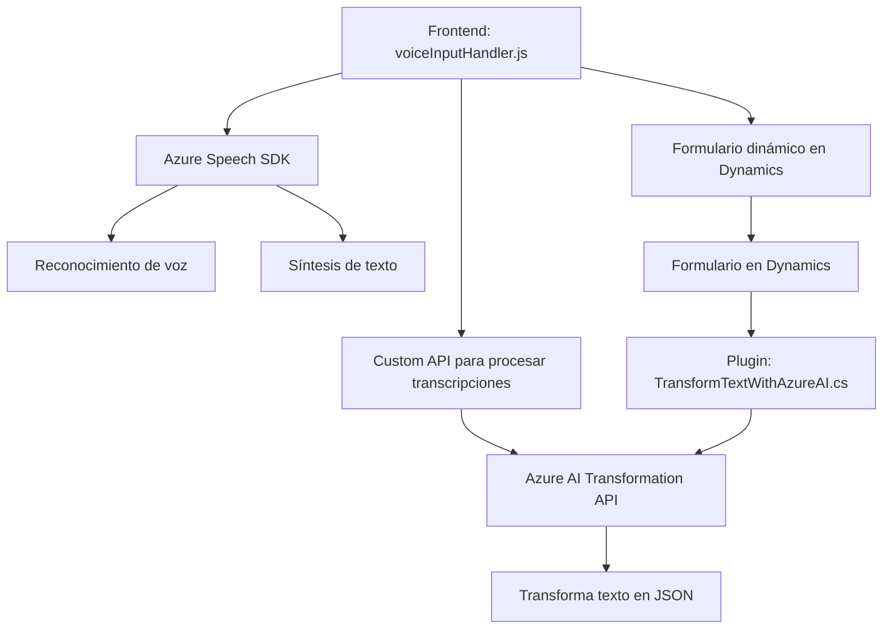

### Breve resumen técnico

La solución analizada consiste en un conjunto de scripts JavaScript y un plugin en C#. Está diseñada para integrarse y extender un sistema como Microsoft Dynamics CRM. Estos archivos implementan funcionalidad avanzada mediante la integración con servicios de Azure y APIs externas, permitiendo la interacción con formularios dinámicos en CRM. Las funcionalidades principales son la entrada de voz para la transcripción y recuperación de datos del formulario, así como la transformación del texto transcrito en información estructurada y aplicable al CRM.

---

### Descripción de arquitectura

La arquitectura de la solución combina el modelo de capas tradicional con una orientación hacia microservicios y APIs externas. El frontend actúa como un cliente que utiliza la API de Azure Speech SDK para el reconocimiento de voz y síntesis de texto. Paralelamente, un plugin específico en C# interactúa directamente con Microsoft Dynamics CRM para la transformación y manejo avanzado de datos empleando un servicio externo de Azure OpenAI.

La solución muestra características de un diseño orientado a eventos y una interacción cliente-servidor. Asimismo, emplea el patrón de fachada para abstraer las complejidades de las APIs externas y utiliza patrones orientados a servicios, integrando dependencias de manera modular.

---

### Tecnologías usadas

1. **Frontend:**
   - JavaScript ES6: Punto central de la funcionalidad del cliente.
   - **Azure Speech SDK**: Usado para el reconocimiento y síntesis de voz dinámicos.

2. **Backend:**
   - **Microsoft Dynamics CRM SDK**: Para mapeo y gestión dinámica de datos del CRM.
   - **C# .NET Framework**: Para el desarrollo de plugins personalizados.
   - **Azure OpenAI API**: Servicio avanzado de procesamiento y transformación de idioma.
   - **Newtonsoft.Json**: Manejo de estructuras JSON en el backend.

3. **Patrones y aproximaciones:**
   - Modularidad.
   - Cliente-servidor con uso de APIs.
   - Plugin-based Architecture para ampliación de funcionalidades.
   - Lazy initialization para cargar el Azure Speech SDK bajo demanda.
   - Facade Pattern para conexión a APIs.
   - External Service Integration para manejar dependencias como Azure Speech SDK y Azure OpenAI.

---

### Dependencias o componentes externos

1. **Azure Speech SDK**:
   - Usado para la síntesis y el reconocimiento de voz.
   - Descargado dinámicamente cuando la solución lo requiere (`ensureSpeechSDKLoaded`).

2. **Microsoft Dynamics CRM**:
   - Utilización del contexto del formulario, que incluye datos de controles visibles y de atributos para interactuar con los registros.
   - Ejecución del plugin utilizando la interfaz de servicio `IPlugin`.

3. **Azure OpenAI API**:
   - Servicio externo para procesamiento avanzado de lenguaje natural y generación de JSON estructurado desde texto.

4. **AJAX/Fetch API**:
   - Comunicación con APIs usando solicitudes HTTP dinámicas.

5. **Browser Context**:
   - Necesita acceso al formulario dinámico de Microsoft Dynamics para la manipulación de datos.

---

### Diagrama **Mermaid** válido para GitHub

---

### Conclusión final

La solución se presenta como una integración avanzada de herramientas de Microsoft Dynamics CRM y servicios de Azure, en este caso, Speech SDK y OpenAI API. La arquitectura tiene características de modularidad, cliente-servidor y uso extensivo de APIs externas para potenciar el ecosistema CRM con funcionalidades de síntesis de voz y entrada inteligente. El diseño es orientado a eventos y basado en plugins para ampliar el alcance del CRM mientras utiliza servicios externos de manera eficiente.

Se recomienda verificar y fortalecer aspectos de seguridad del manejo de datos, fundamentalmente en las comunicaciones con las APIs externas (uso de claves de API de Azure y transferencia de datos sensibles) y el filtrado exhaustivo de las entradas para evitar inconsistencias en la solución.