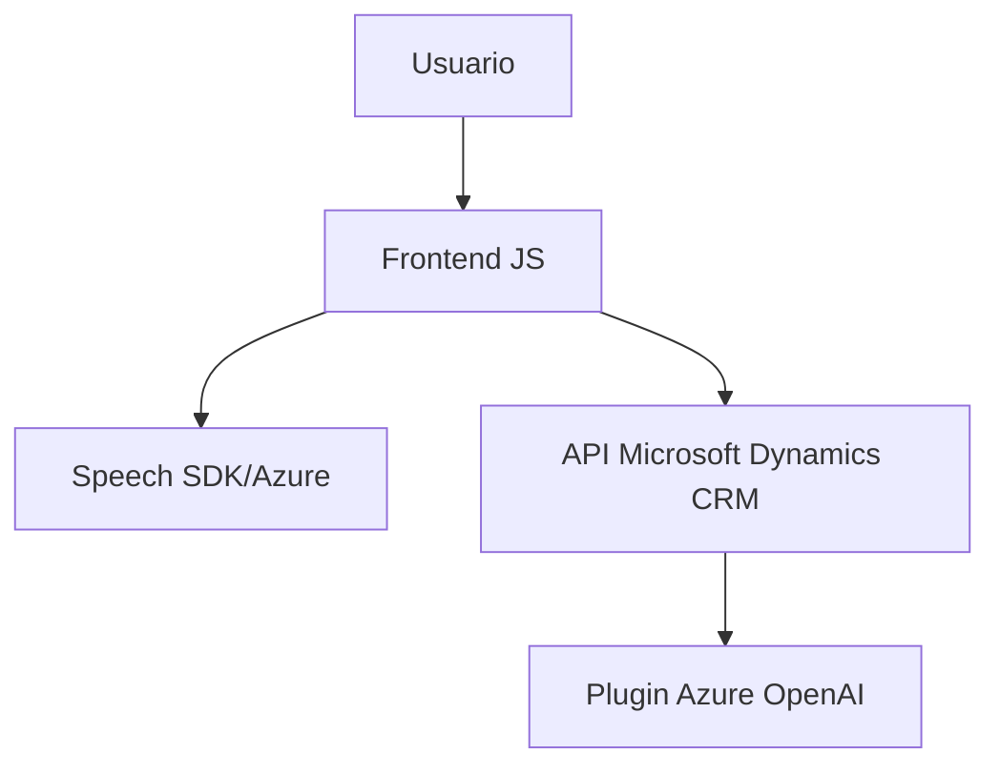

### Breve Resumen Técnico:

Este repositorio contiene tres componentes fundamentales:
1. **Frontend**: Maneja interacción de usuario mediante formularios, captura de comandos de voz y síntesis de texto en voz usando Azure Speech SDK.
2. **Middleware**: Procesa comandos de voz transcritos para modificar atributos del formulario localmente o enviar solicitudes a una API personalizada respaldada por inteligencia artificial.
3. **Backend (Dynamics CRM Plugin)**: Usa Azure OpenAI para transformar texto en JSON estructurado siguiendo normas específicas. Este plugin se integra con Microsoft Dynamics CRM mediante su SDK.

---

### Descripción de Arquitectura:

La solución utiliza una arquitectura **híbrida**, combinando características de una arquitectura **cliente-servidor** y **orientada a servicios** (SOA). Los componentes clave se encuentran organizados de la siguiente manera:
1. **Frontend**: Maneja la interfaz de usuario con el formulario y la síntesis de voz, siendo una capa de presentación basada en JavaScript.
2. **Middleware**: Administra la interacción con el Speech SDK, captura de voz, transcripción y posibles llamados a una API para procesamiento posterior. Funciona como una capa de lógica de procesamiento.
3. **Backend**: Implementado como un plugin para Dynamics CRM, ejecuta lógica de negocio avanzada mediante Azure OpenAI.

Esta solución utiliza una arquitectura de **capas (n-tiers)**:
- Capa de presentación **(frontend)**.
- Capa de lógica y evento **(speechForm/speechInputHandler)**.
- Capa de integración **(plugin CRM con API Azure)**.

---

### Tecnologías Usadas:
1. **Frontend**:
   - **JavaScript**: Usado en los archivos `readForm.js` y `speechForm.js`.
   - **Azure Speech SDK**: Para manejar síntesis y reconocimiento de voz dinámico en el navegador.
2. **Backend**:
   - **Microsoft Dynamics CRM SDK**: Para ejecutar el plugin desde Dynamics CRM.
   - **Azure OpenAI Service**: Para transformar texto mediante modelos de lenguaje avanzado.
   - **Newtonsoft.Json** y `System.Text.Json`: Para manipulación de JSON.
3. **Patrones**:
   - **Modularidad**: Cada función está separada por responsabilidad.
   - **SOA**: Uso de servicios como Azure Speech y OpenAI.
   - **Event-Driven**: Respuesta a interacciones de usuario y eventos del SDK.
   - **n-Tiers**: Arquitectura típica de separación en capas.

---

### Diagrama Mermaid válido para GitHub:

---

### Conclusión Final:

La solución es una integración avanzada que conecta la interacción del usuario con procesamiento de lenguaje y servicios de inteligencia artificial. Está diseñada con un enfoque modular y orientado a servicios, que permite extender funcionalidad a medida que las necesidades del cliente crecen. Una posible mejora sería implementar configuraciones dinámicas para claves, endpoints y parámetros de los servicios externos, así como optimizar el manejo de errores para mejorar la resiliencia del sistema.