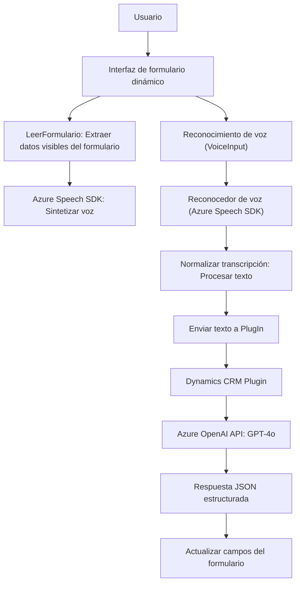

### Breve resumen técnico

El repositorio tiene tres componentes principales relacionados con el manejo de voz, transcripción y síntesis mediante la integración con el **Azure Speech SDK** y **Azure OpenAI Service**. Está orientado a una solución complementaria para formularios dinámicos en un sistema CRM, particularmente en **Dynamics CRM**, y aplica conceptos de IA, reglas de transformación de texto, y generación de audio con Microsoft Azure.

---

### Descripción de arquitectura

1. **Tipo de solución**: 
   - La solución combina un **frontend** en JavaScript (para la interacción y procesamiento interno) junto con un **plugin backend** desarrollado en C# usando Dynamics CRM SDK.
   - Está diseñada para ser un complemento modular dentro del ecosistema Dynamics CRM, facilitando la interacción con formularios.

2. **Tipo de arquitectura**:
   - **Modular de capas**:
     - La arquitectura divide claramente las responsabilidades:
       - **Frontend**: Gestiona la interacción del usuario (entrada y salida de voz).
       - **Plugin backend**: Procesa datos a nivel del servidor aplicando lógica avanzada.
       - Azure Speech SDK y Azure OpenAI actúan como servicios externos especializados en voz e inteligencia artificial.
   - **Orientación a servicios**: Integra servicios externos utilizando APIs para delegar responsabilidades de voz y procesamiento textual.
   - Uso de **patrones de separación de responsabilidades**: Manejo de lógica separada en frontend y backend, cada capa se ocupa de tareas específicas.

---

### Tecnologías usadas

- **Frontend**:
  - **JavaScript**: Lenguaje base del desarrollo front-end.
  - **Azure Speech SDK**:
    - Para síntesis de texto a voz.
    - Para transcripción de voz a texto.
  - **Promises y eventos asíncronos**: Procesamiento de datos dependientes de API externas en tiempo real.
  - **Dinámica de formularios CRM**: Manejo avanzado de contextos y mapeo de datos.

- **Backend**:
  - **C#**:
    - Desarrollo del plugin usando **Dynamics CRM SDK** (interfaz `IPlugin`).
    - Uso extensivo de **Microsoft.Xrm.Sdk** para la interacción con datos empresariales.
  - **Azure OpenAI Service**:
    - Procesamiento de texto a través de **GPT-4o**.
    - Solicitudes HTTP para servicios web RESTful.
  - **JSON parsers**:
    - Uso tanto de `Newtonsoft.Json.Linq` como `System.Text.Json` para gestionar JSON estructurados.

- **Servicio externo**:
  - **Azure Speech SDK**: Reconocimiento y síntesis de voz.
  - **Azure OpenAI Service**: Llamadas a modelos de lenguaje GPT para procesamiento textual inteligente.

---

### Diagrama Mermaid válido

---

### Conclusión final

La solución está diseñada para integrar capacidades avanzadas de síntesis y reconocimiento de voz junto con un sistema CRM. La arquitectura utiliza una clara división entre frontend y backend, implementando en el frontend funcionalidades que interactúan directamente con el usuario (lectura de formularios, síntesis y transcripción de voz) y delegando al backend tareas avanzadas como el procesamiento de texto usando AI a través de **Azure OpenAI**.

Su arquitectura modular hace que la solución sea escalable, fácil de mantener, y adaptable para proyectos similares donde se requieran capacidades de interacción fluida entre usuarios y aplicaciones empresariales (CRM). Además, la integración de **Azure Speech SDK** y **OpenAI API** resalta el enfoque moderno y orientado a servicios.