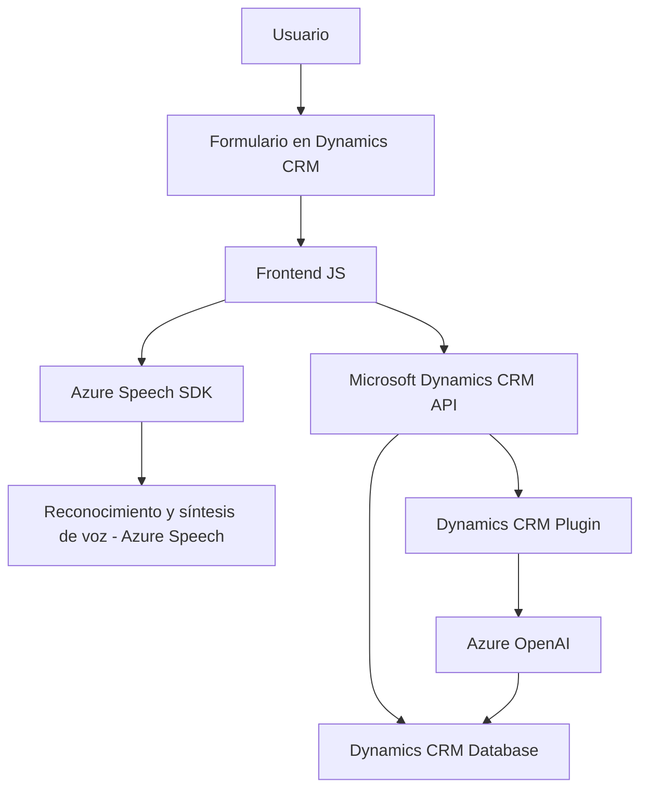

### Breve Resumen Técnico
El repositorio presentado parece corresponder a una solución tecnológica enfocada en la integración de la inteligencia artificial (IA) y el reconocimiento/síntesis de voz con formularios de **Microsoft Dynamics CRM** mediante el uso de **Azure** como proveedor de servicios en la nube. El repositorio incluye archivos **JavaScript** para procesamiento en el lado del cliente y un archivo **C# plugin** para la extensión de funcionalidades en el backend del CRM.

---

### Descripción de Arquitectura
1. **Tipo de solución**:
   - Este proyecto implementa un ecosistema compuesto que incluye:
     - Frontend basado en **JavaScript** para interactuar con formularios.
     - Backend **Dynamics CRM Plugin** en **C#**.
     - Integración con servicios externos como **Azure Speech SDK** y **Azure OpenAI**.

2. **Arquitectura**:
   - La arquitectura es de múltiples capas:
     * **Capa de presentación** basada en formularios y JavaScript.
     * **Capa de lógica de negocio** incluida en los plugins de Dynamics CRM.
     * **Capa de integración de servicios externos** mediante SDKs y API de Azure para síntesis de voz y procesamiento de IA.
   - Adicionalmente, el uso de servicios como **Azure OpenAI** y **Azure Speech SDK** posiciona la solución dentro de un modelo **Service-Oriented Architecture (SOA)**.

---

### Tecnologías Usadas
1. **Frontend**:
   - **JavaScript**: Maneja lógica de cliente, formularios y comunicación con los servicios externos.
   - **Azure Speech SDK**: Para reconocimiento de voz y síntesis de texto a voz.
   - **Microsoft Dynamics CRM JS API** (`formContext`, `Xrm.WebApi`).

2. **Backend**:
   - **C#**: Extensiones de CRM mediante plugins implementados bajo la interfaz `IPlugin`.
   - **Azure OpenAI**: Para procesamiento de texto usando modelos de inteligencia artificial.

3. **Frameworks y Patrones de Diseño**:
   - **Modularidad Funcional**: Cada operación está organizada en funciones específicas en el frontend y backend.
   - **Event-Driven Programming**: Uso de eventos y callbacks para la ejecución de procesos asíncronos.
   - **Service-Oriented Architecture (SOA)**: Dependencia de servicios externos como APIs de Azure y Dynamics CRM.

---

### Dependencias o Componentes Externos
1. **Azure Speech SDK**:
   - Base para reconocimiento y síntesis de voz.
   - Cargado dinámicamente desde su endpoint oficial (client-side).
   
2. **Azure OpenAI**:
   - Utilizado en el backend para el procesamiento avanzado del texto.

3. **Microsoft Dynamics CRM**:
   - Plugins y APIs presentan interacción directa con datos y formularios del CRM.

4. **Librerías JSON**:
   - `Newtonsoft.Json` y `System.Text.Json` para manipulación de objetos JSON en el backend.

---

### Diagrama Mermaid
El siguiente diagrama representa la interacción entre los componentes de la solución.

---

### Conclusión Final
La solución descrita es un sistema híbrido que utiliza tecnologías avanzadas como **Azure Speech SDK** y **Azure OpenAI** para reconocer, sintetizar y procesar datos provenientes de la voz del usuario. Su arquitectura está diseñada en capas, utiliza componentes de software modulares en el cliente (frontend) y extendidos mediante plugins en el backend de Dynamics CRM. Además, se apoya en un modelo **SOA** gracias a su integración con servicios especializados en la nube.

Este enfoque permite la automatización de tareas repetitivas, aumentando la eficiencia, precisión y usabilidad de los sistemas basados en formularios y datos, como los de Microsoft Dynamics CRM.