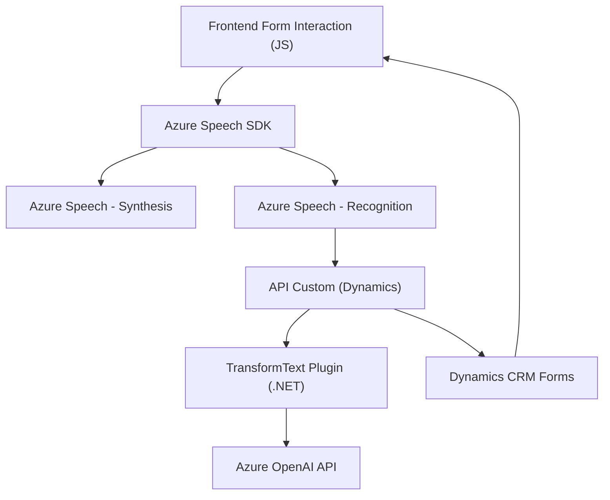

### Breve resumen técnico

El repositorio parece ser parte de un sistema desarrollado para integrar servicios avanzados de Azure (Speech SDK y OpenAI) con formularios dinámicos en Microsoft Dynamics CRM. El código contiene una interfaz frontend (JavaScript), lógica backend (C# plugin para Microsoft CRM), y utiliza APIs externas de Azure para reconocimiento de voz, síntesis de voz, y transformación de texto con IA.

---

### Descripción de arquitectura

1. **Tipo de solución**: Con base en los repositorios analizados, esta solución es una interfaz híbrida que interactúa con un sistema CRM, y puede categorizarse como una **integración de CRM extendida mediante servicios avanzados de Azure**. Está diseñada para ofrecer una interacción dinámica mediante reconocimiento y síntesis de voz, combinado con reglas de procesamiento avanzado usando IA.

2. **Arquitectura**:
   - La arquitectura principal es **n-capas**: la solución incluye capas frontend (interacción de usuario), lógica de negocio distribuida (Azure Speech y IA), y backend (plugin que se ejecuta en Dynamics CRM). 
   - Dentro del backend, se sigue una aproximación **basada en servicios externos**, como plugins de CRM y servicios RESTful.
   - El frontend tiene algunos elementos de integración con SDK (altamente modular), lo que facilita su uso en diferentes páginas o contextos de formularios.

---

### Tecnologías, frameworks y patrones utilizados

1. **Frontend**:
   - **JavaScript**: Uso estándar de ES6+ con funciones async/await para manejar flujos asincrónicos.
   - **Azure Speech SDK**: Para servicios de reconocimiento y síntesis de voz.
   - **Patterns**:
     - **Event-Driven Architecture**: El código responde a eventos (por ejemplo, acciones del usuario en el formulario).
     - **Facade Pattern**: Resumir acciones complejas de SDK detrás de una API coherente.
     - **Mapper Pattern**: Relaciona etiquetas visibles con nombres lógicos en los formularios.
     - **SDK Integration**: Fuerte integración con Azure Speech SDK.

2. **Backend (Plugin)**:
   - **Microsoft Dynamics CRM SDK**: Framework para extender funcionalidades del CRM.
   - **Azure OpenAI**: Explotación de una API basada en servicios REST para transformar texto.
   - **Built-in .NET Framework Libraries**: Implementados para trabajar con APIs REST y JSON.
   - **Patterns**:
     - **Plug-in design pattern**: Extender un sistema existente (CRM).
     - **Service-Oriented Architecture (SOA)**: Uso de APIs Azure Speech y OpenAI como servicios externos.

---

### Dependencias o componentes externos presentes

1. **API externas**:
   - Azure Speech SDK (usado para síntesis y reconocimiento de voz).
   - Azure OpenAI API (usada para transformaciones de texto).
   - APIs de Dynamics CRM (`Xrm.WebApi`), utilizadas para integraciones y consultas relacionadas con formularios CRM dinámicos.

2. **Dependencias internas**:
   - Uso de utilidades para consultas de atributos y datos de formularios (`getFieldMap`, `applyValueToField`).
   - Utilidades para convertir datos (`palabrasANumeros`, manejo de lookup).

---

### Diagrama Mermaid

---

### Conclusión final

Este sistema combina tecnologías frontend y backend para brindar una integración avanzada entre formularios dinámicos de Microsoft Dynamics CRM y servicios de Microsoft Azure. La solución utiliza una **arquitectura n-capas** con un enfoque muy modular y destaca la implementación de **patrones de diseño como Event-Driven y Facade** para el frontend, mientras que el **Plugin pattern** y **Service-Oriented Architecture** son clave en el backend. Sin duda, el proyecto tiene una estructura sólida y utiliza estándares modernos, pero sería importante auditar el tratamiento de claves sensibles y evaluar el diseño para escalabilidad y mantenimiento, ya que los servicios externos son críticos para su funcionalidad.