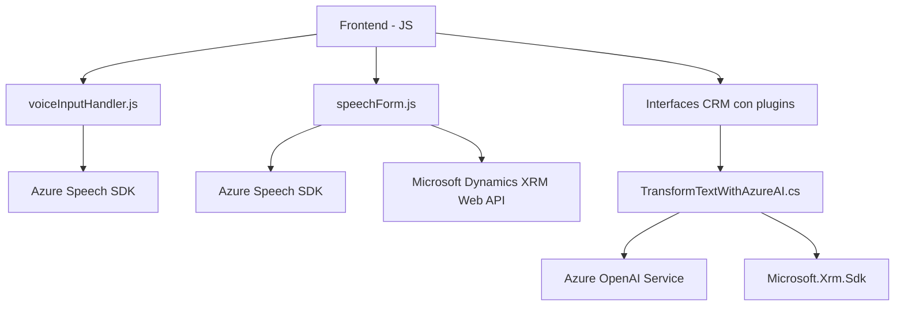

### Breve resumen técnico

El repositorio presenta una solución destinada a la interacción entre usuarios y formularios de Microsoft Dynamics CRM, integrando capacidades de síntesis de voz, reconocimiento de voz, y procesamiento de texto mediante servicios de Azure Speech SDK y Azure OpenAI. Incluye un módulo frontend (JavaScript), lógica de procesamiento de plugins en Dynamics CRM utilizando C#, y dependencias de servicios externos para mejorar la accesibilidad y usabilidad.

---

### Descripción de arquitectura

La arquitectura puede clasificarse como una **arquitectura n-capas**, con varias capas funcionales representadas por:
- **Frontend (JavaScript)**: Encargada de la interacción directa con el usuario, el procesamiento en tiempo real de voz, y funciones como síntesis y reconocimiento de voz.
- **Plugin (C# - TransformTextWithAzureAI.cs)**: Promueve la integración de Dynamics CRM con Azure OpenAI para el procesamiento avanzado del texto estructurado y validación de entrada.
- **Servicios externos (Azure Speech SDK, Azure OpenAI)**: Proveen capacidades como reconocimiento de voz, síntesis de voz, y transformación semántica del texto.

Se observa una separación clara entre la capa **frontend** y la lógica de negocio personalizada implementada como un plugin en Dynamics CRM. Este diseño facilita la extensión de capacidades existentes del sistema CRM con integraciones modernas basadas en inteligencia artificial y gestión dinámica de datos.

---

### Tecnologías usadas

1. **Frontend**
   - Lenguaje: JavaScript.
   - SDK: Azure Speech SDK.
   - Patrones: Modularidad, asincronía (callbacks y Promises), procesamiento dinámico de datos.

2. **Plugin Dynamics CRM**
   - Lenguaje: C#.
   - Framework: .NET Framework para Dynamics CRM Plugin Development.
   - Bibliotecas:
     - `Microsoft.Xrm.Sdk` para la interacción con objetos de CRM.
     - `System.Text.Json`, `Newtonsoft.Json.Linq` para la manipulación de datos JSON.
     - `System.Net.Http` para las solicitudes HTTP a Azure OpenAI API.
   - Patrones: Encapsulación, integración de servicios externos, lógica encapsulada.

3. **Servicios Externos**
   - Azure Speech SDK: Síntesis de voz y reconocimiento de voz.
   - Azure OpenAI: Procesamiento de texto inteligente.

---

### Diagrama **Mermaid** válido para **GitHub Markdown**:

---

### Conclusión final

La solución implementa una integración efectiva entre frontend y backend, con servicios externos de Azure para potenciar funcionalidades como accesibilidad y procesamiento avanzado de datos. La arquitectura modular y basada en n-capas permite una interacción sencilla con los formularios de Dynamics CRM, resolviendo problemas clave relacionados con accesibilidad y mapeo dinámico de datos mediante AI e integración de redes externas. 

El diseño es adecuado para un escenario corporativo enfocado en mejorar la experiencia del usuario y eficiencia operativa, pero podría beneficiarse de prácticas avanzadas de seguridad, como el manejo seguro de claves API y almacenamiento en un vault externo (Azure Key Vault). También se observa que podría evolucionar hacia una arquitectura más orientada a microservicios al separar lógicas clave en procesos independientes escalables.