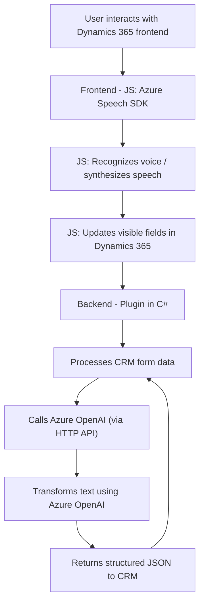

### Breve Resumen Técnico
Los archivos analizados pertenecen a una solución que implementa capacidades de entrada y salida por voz en formularios de Dynamics 365 y utiliza tecnologías de Microsoft Azure, como Azure Speech SDK para reconocimiento/síntesis de voz y Azure OpenAI para procesamiento de datos. Los módulos están divididos en frontend (implementación en JavaScript) y backend (integración mediante plugins de Dynamics CRM, escritos en C#).

### Descripción de Arquitectura
La solución tiene una arquitectura de **n capas**, distribuyendo responsabilidades en:  
1. **Frontend (JavaScript)**: Proporciona la interfaz de usuario y lógica de reconocimiento/síntesis de voz. También gestiona la interacción directa con el navegador y los formularios de Dynamics 365.  
2. **Backend (Plugins en C#)**: Procesa texto generado, interactúa con el contexto de Dynamics CRM, y realiza transformaciones avanzadas mediante servicios externos, como Azure OpenAI.  

Ambos componentes interactúan mediante la API y objetos internos de Dynamics 365 y emplean servicios externos basados en SDK y APIs de Azure.

### Tecnologías Usadas
1. **Frontend**:
   - **JavaScript**: Lenguaje base para la lógica de los módulos de voz.
   - **Azure Speech SDK**: Para reconocimiento/síntesis de voz.
   - **Dynamics 365 Form API**: Para interactuar con formularios y valores dinámicos.
   - **Promises y programación asíncrona**: Para llamadas externas (e.g., SDK).

2. **Backend**:
   - **C#**: Lenguaje base para el desarrollo de plugins personalizados.
   - **Microsoft Dynamics CRM SDK**: Integración con CRM (entidades, registros).
   - **Azure OpenAI API**: Consumo de servicios cognitivos para transformación de datos.
   - **JSON Manipulation**: Uso de librerías como Newtonsoft.Json.

### Dependencias / Componentes Externos
1. **Azure Speech SDK**: Para síntesis y reconocimiento de voz.
2. **Dynamics 365 Web API**: Para interacción con formularios y datos del CRM.
3. **Azure OpenAI**: Para transformar entradas de voz en formato JSON estructurado.
4. **Frontend dependencies**: Por ejemplo, herramientas de manipulación del DOM, llamadas REST (como fetch, axios).
5. **Backend dependencies**:
   - `Newtonsoft.Json`: Procesamiento de respuestas JSON de Azure OpenAI.
   - `System.Net.Http`: Comunicación con servicios externos vía HTTP.

### Diagrama Mermaid 100% compatible con GitHub Markdown

### Conclusión Final
La solución implementa funcionalidades avanzadas de interacción por voz y procesamiento cognitivo de datos. Su diseño de arquitectura en capas desacopla claramente la lógica frontend (JS) y backend (C#), permitiendo flexibilidad en la integración con Microsoft Dynamics 365 y servicios externos de Azure. Aprovecha SDKs y APIs como Azure Speech y OpenAI para habilitar interfaces innovadoras y mejorar la experiencia del usuario, respaldada por buenas prácticas de modularidad y programación asincrónica.