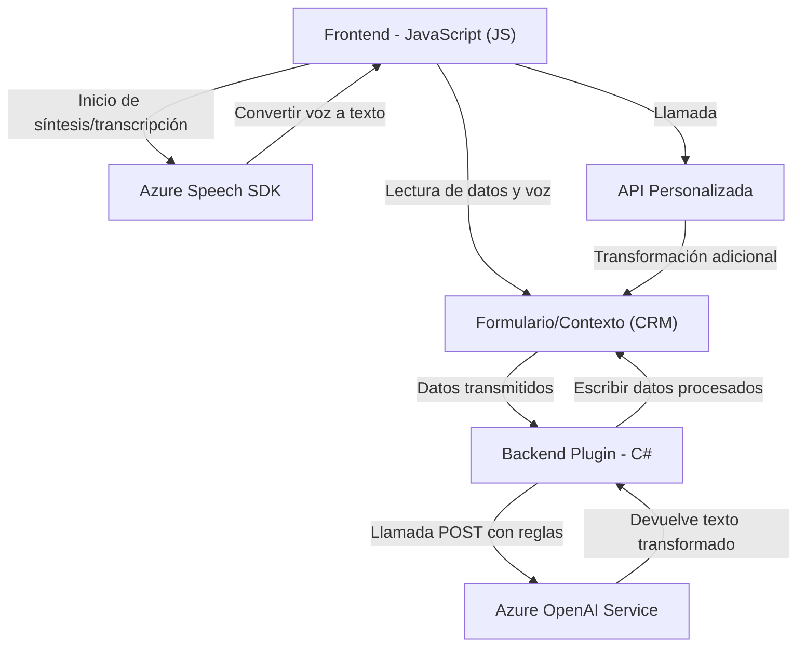

# Análisis Detallado

## Breve resumen técnico
El repositorio presenta archivos orientados al consumo e integración de servicios de Azure en un entorno de formularios, probablemente Dynamics CRM. Los **JS** tienen una función centrada en procesamiento de datos de entrada y salida desde/hacia formularios y servicios externos como **Azure Speech SDK** y **Custom APIs**. Por otro lado, el **plugin C# (.cs)** implementa la integración de **Azure OpenAI** para analizar y transformar texto directamente desde el backend del CRM.

---

### **1. Tipo de Solución**
La estructura sugiere una implementación mixta:
- **Frontend (JavaScript):** Procesamiento visual en clientes web asociado a formularios del CRM para manejo de entrada de voz y lectura de datos.
- **Backend Plugin (C#):** Componente de un servicio o plugin dedicado a procesos backend del CRM, incluyendo conexión con Azure OpenAI y datos dinámicos.
Por estas características, podemos concluir que el repositorio contiene:
- Una **integración con Dynamics CRM**, que genera datos dinamizados y procesados.
- Servicios tipo **API externalizados**, específicamente **Azure Speech SDK** y **Azure OpenAI**.

---

### **2. Tecnologías, Frameworks y Patrones**
#### **JavaScript (Frontend):**
- **Azure Speech SDK:** Para síntesis y transcripción de voz.
- Patrones:
  - Modularización: Cada archivo JS está organizado en funciones o métodos centrados en responsabilidades específicas (lectura, asignación, transcripción, etc.).
  - Asincronía con promesas y callbacks: Uso intensivo de operaciones asincrónicas para manejar dependencias externas.
  - Dependencias externas dinámicas: Carga de SDK mediante creación dinámica de scripts.

#### **C# (Backend Plugin):**
- **Microsoft Dynamics CRM SDK:** Para creación de plugins que interactúan con objetos y servicios del CRM (e.g., `IPluginExecutionContext`, `IOrganizationService`).
- **Azure OpenAI Service:** Para procesamiento avanzado de texto.
- Dependencias importantes:
  - `System.Net.Http` para interacción REST.
  - `Newtonsoft.Json` para manipulación de datos JSON.

---

### **3. Tipo de Arquitectura**
La arquitectura general es **híbrida**, combinando componentes cliente-servidor:
- **Multicapa:**
  - Dividida claramente entre **Presentación (JS)** y **Lógica de negocio (Plugins)**. La capa de presentación consume datos y realiza operaciones asíncronas.
  - Lógica backend manejada desde un plugin encapsulado, que actúa como una integración externa con **Azure OpenAI API**.
- **Integración de Servicios y SDKs Externos:** Comunicación directa con servicios REST y SDKs de Azure, lo cual incluye dos principales servicios externalizados:
  - **Azure Speech** para texto a voz y transcripción.
  - **Azure OpenAI** para procesamiento de datos textuales.

---

### **4. Dependencias y Componentes Externos**
1. **Externo:**
   - **Azure Speech SDK:** Para sintetizar y transcribir voz en JavaScript.
   - **Azure OpenAI Service:** Conexión en backend para transformación de texto según reglas específicas.
   - **APIs personalizadas de Dynamics CRM:** Indica endpoints específicos llamados desde los JS para realizar transformaciones complementarias por backend.
2. **Interno:**
   - **Xrm.WebApi:** Componentes del SDK de CRM usados para gestionar datos y ayudar en integración.
3. **Dependencias comunes:**
   - **System.Net.Http**: Comunicación HTTP desde plugins.
   - **Newtonsoft.Json:** Procesamiento y generación de JSON en **C#**.

---

### **5. Diagrama Mermaid**
El siguiente diagrama simplifica las relaciones entre frontend, backend y servicios:

---

## Conclusión Final
La solución es un sistema híbrido integrado que emplea un modelo **multicapa** con cliente y servidor:
1. **Frontend (JavaScript):** Orientado a la presentación de datos del formulario asociado al CRM, lectura de entrada de usuario y transcripción/síntesis mediante **Azure Speech SDK**.
2. **Backend Plugin (C#):** Enfocado en reglas de negocio que transforman texto mediante **Azure OpenAI Service** con fuerte integración al contexto de Dynamics CRM.

### Ventajas:
- **Grande reutilización:** Solución modular que permite adaptaciones futuras.
- **Escalabilidad:** Uso de APIs externas (Azure), delegando procesamiento pesado fuera del sistema local.
- **Extensibilidad:** Fácil integración de nuevos endpoints o SDK.

### Desafíos:
- **Robustez:** La dependencia en SDKs externos y su carga dinámica podría llevar a fallos en producción si hay problemas de red o servicio.
- **Complejidad:** Manejar varios servicios externos y APIs puede crear problemas de cuello de botella o latencias.

Este proyecto sigue buenas prácticas de diseño para sistemas orientados a servicios (SOA) y prometedores componentes modulares que favorecen integraciones futuras.