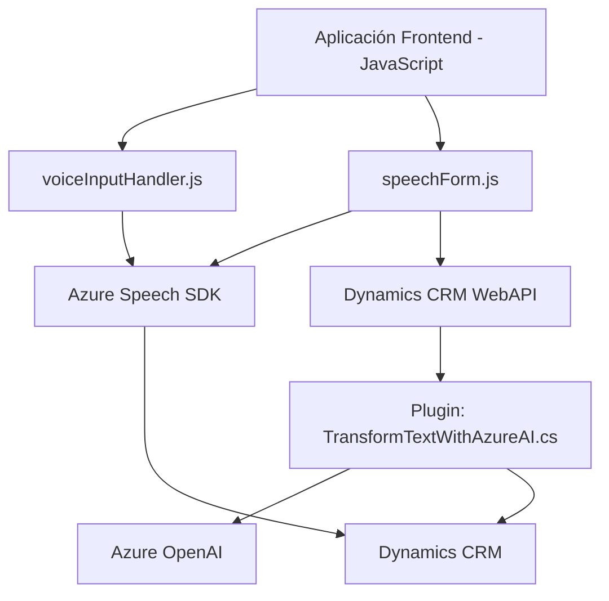

## Breve resumen técnico

Este repositorio contiene múltiples componentes que integran funcionalidades avanzadas de síntesis de texto a voz, reconocimiento de voz y transformación de texto mediante Azure AI y Dynamics CRM. Se utiliza una combinación de frontend basado en JavaScript, servicios API personalizados, y plugins CRM en .NET.  

**Frontend:** Encapsula la interacción del usuario con formularios y utiliza Azure Speech SDK para convertir texto a voz y voz a texto.  
**Backend:** Contiene un plugin implementado en C# que invoca el servicio de Azure OpenAI para transformar texto en objetos JSON estructurados, extendiendo la funcionalidad de Dynamics CRM.  

---

## Descripción de arquitectura

La solución tiene una arquitectura **híbrida** que consta de los siguientes elementos principales:  
- **Frontend:** Modular y basado en JavaScript, con integración directa al backend mediante Dynamics CRM APIs y el SDK de Azure Speech. El frontend organiza las funciones en tareas específicas, siguiendo el patrón **Facade**.  
- **Plugins de Dynamics CRM:** Un plugin .NET integrando Azure OpenAI como un servicio externo de transformación de texto.
- **Flujo de procesamiento:** Interacción bidireccional entre el frontend y backend para modificar datos de formularios en tiempo real. Por ejemplo, el usuario dicta información en voz, procesada mediante reconocimiento de voz y transformada en datos de formulario.  

**Patrones arquitectónicos:**  
- **Facade Pattern:** Para simplificar el uso de múltiples funciones y SDK en los módulos JS.  
- **Event-Driven Architecture:** Utilizada en plugins CRM y para el manejo de eventos en el frontend (reconocimiento de voz y entrada de datos dinámicos).  
- **Integración externa:** La solución depende de Azure Speech Service y Azure OpenAI para tareas específicas.  

---

## Tecnologías usadas

1. **Frontend (JavaScript):**
   - Azure Speech SDK: Para síntesis y reconocimiento de voz.
   - Microsoft Dynamics CRM WebAPI: Comunicación entre el frontend y la base de datos CRM.  

2. **Backend (.NET Plugin):**
   - Microsoft Dynamics CRM SDK: Creación de plugins personalizados para CRM.  
   - Azure OpenAI API: Transformación de texto utilizando el modelo GPT-4.  
   - Newtonsoft.Json & System.Text.Json: Manejo de objetos JSON.  
   - System.Net.Http: Comunicación HTTP con la API de Azure.  

3. **Patrones:** Modularidad en el frontend, y extensibilidad mediante plugins en el backend.  

---

## Diagrama Mermaid válido para GitHub

---

## Conclusión final

La solución integra múltiples tecnologías combinando Azure Speech SDK y OpenAI con Dynamics CRM, ideal para potenciar la accesibilidad y el manejo de datos en sistemas empresariales. Se observa una arquitectura híbrida, con un frontend dinámico y modular, y un backend con plugins extendiendo la funcionalidad CRM. Aunque el diseño es eficiente y claro, habría margen para optimizar algunos aspectos, como la estandarización de dependencias externas en plugins y simplificar la lógica.