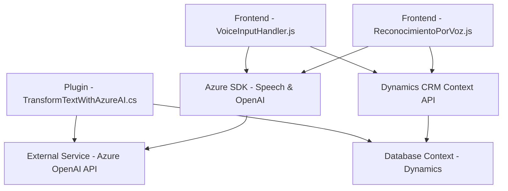

### Breve resumen técnico

El repositorio representa una solución que implementa funcionalidades avanzadas para aplicaciones basadas en **Microsoft Dynamics CRM**. La solución incluye un **plugin en C#** para la transformación de texto con Azure OpenAI, y componentes JavaScript para la integración de **SDKs de reconocimiento y síntesis de voz (Azure Speech)**, que se utilizan para automatizar procesos en formularios y mejorar la experiencia de usuario mediante tecnologías de IA.

---

### Descripción de arquitectura

- **Tipo de solución**: Este repositorio parece ser parte de una solución híbrida orientada a **Dynamics CRM**, que combina extensiones de backend (plugins) con funcionalidades frontend (form plugins en JavaScript) para manipular datos de formularios y realizar operaciones relacionadas con IA.
  
- **Arquitectura y patrones**:
  - **Multicapa**:
    - El lado del backend utiliza el patrón de plugin (Integración nativa con Dynamics CRM).
    - El frontend está orientado a servicios, aprovechando SDKs de Azure y APIs personalizadas.
    - Conexión entre capas mediante servicios externos como Azure OpenAI y Azure Speech SDK.
  - **Modularidad**: El código separa claramente responsabilidades por funciones específicas (procesamiento de datos visibles, manejo de voz, integración IA).
  - **Microservicios**: Uso de APIs externas, como Azure OpenAI y Dynamics Web API, refuerzan el modelo distribuido.

---

### Tecnologías usadas

1. **Frontend (JavaScript)**
   - **Azure Speech SDK**: Utilizado para reconocimiento de voz, síntesis de texto y reproducción en voz.
   - **Dynamics CRM Context API (`formContext`)**: Manipulación de formularios en Dynamics CRM.
   - **Browser APIs**: Carga dinámica de scripts y manipulación de DOM.

2. **Backend (C# Plugin)**
   - **Azure OpenAI**: Para el procesamiento de texto usando modelos GPT-4.
   - **Microsoft Dynamics SDK**:
     - Manejo de datos mediante `IPlugin` y `IServiceProvider`.
     - Consultas a través de `Microsoft.Xrm.Sdk.Query`.
   - **Newtonsoft.Json y System.Text.Json**: Parsing y manejo de datos JSON.
   - **System.Net.Http**: Envío de solicitudes HTTP para integración con servicios externos.

3. **API externas**:
   - **Azure Speech SDK y OpenAI API** proporcionan servicios de alto nivel basados en IA.

---

### Diagrama Mermaid (válido para GitHub)

---

### Conclusión Final

El repositorio implementa una solución altamente integrada para aplicaciones en Dynamics CRM mediante IA y reconocimiento de voz. Los aspectos más destacados incluyen el uso del Azure Speech SDK y Azure OpenAI para mejorar la usabilidad del sistema, proporcionando interacción por voz y automatización de procesos en formularios dinámicos. La arquitectura multicapa ofrece una buena separación de responsabilidades y modularidad.

Este diseño centrándose en servicios externos permite mayor escalabilidad y extensibilidad, pero requiere cuidado adicional en la gestión de dependencias externas, posibles tiempos de respuesta de servicios como Azure, y seguridad de las claves API utilizadas.