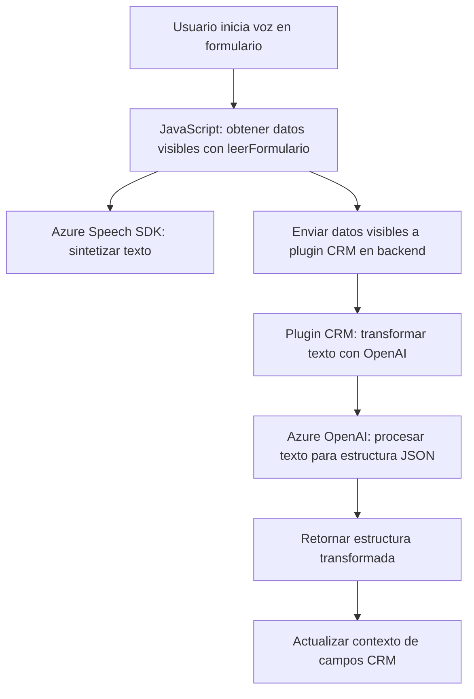

### Breve resumen técnico
Este repositorio está centrado en implementar una solución que utiliza reconocimiento y sintetización de voz, así como generación de datos con ayuda de APIs externas, en un contexto de CRM (Dynamics 365). La funcionalidad abarca tanto la interacción frontend (usando JavaScript y Azure SDK) como un plugin backend programado en C#. El objetivo es mejorar la entrada y manejo de datos en formularios de Dynamics CRM mediante reconocimiento de voz, sintetización en audio, y procesamiento avanzado con OpenAI.

---

### Descripción de arquitectura
La arquitectura parece ser híbrida: presenta una capa frontend implementada en JavaScript y atada al navegador y al CRM. También contiene una capa backend en forma de plugin para Dynamics CRM que interactúa con APIs externas (Azure OpenAI para procesamiento avanzado). Esto indica una **arquitectura de n-capas** donde el frontend gestiona la entrada de datos y comunicación con servicios (como Azure Speech SDK), y el backend centraliza la lógica avanzada y persistencia mediante el plugin CRM.

---

### Tecnologías usadas
1. **Frontend:**
   - **JavaScript:** Lenguaje base para la lógica de procesamiento de formularios y conexión con el SDK.
   - **Azure Speech SDK:** Para reconocimiento y síntesis de voz.
   - **Dynamics CRM**: Para integrar los formularios y datos con un contexto empresarial.
   - **Xrm.WebApi:** API que permite interactuar con Dynamics CRM desde el frontend.

2. **Backend:**
   - **C#:** Lenguaje de programación utilizado para extender funcionalidades en Dynamics CRM mediante plugins.
   - **Microsoft.Xrm.Sdk & Microsoft.Xrm.Sdk.Query:** Dependencias para interactuar con entidades de Dynamics CRM.
   - **Azure OpenAI:** Servicios GPT-4 en Azure para procesamiento avanzado de texto.
   - **System.Net.Http:** Para realizar solicitudes HTTP a APIs externas.
   - **Newtonsoft.Json & System.Text.Json:** Manejo de estructuras JSON en las respuestas.

---

### Diagrama Mermaid válido para GitHub

---

### Conclusión final
Este sistema implementa una solución innovadora para complementar la entrada de datos en un entorno CRM mediante tecnologías avanzadas como reconocimiento de voz (Azure Speech SDK) y generación de texto estructurado (Azure OpenAI). La arquitectura sigue patrones de n-capas con un frontend (JavaScript) interactivo que complementa el backend C# en Dynamics CRM. Además, usa servicios externos para manejar inteligencia en la interpretación de datos, lo cual optimiza la experiencia del usuario y reduce errores humanos en la entrada de datos. Es una solución robusta que combina UX/enriquecimiento de datos con integración profunda en el ecosistema Dynamics.