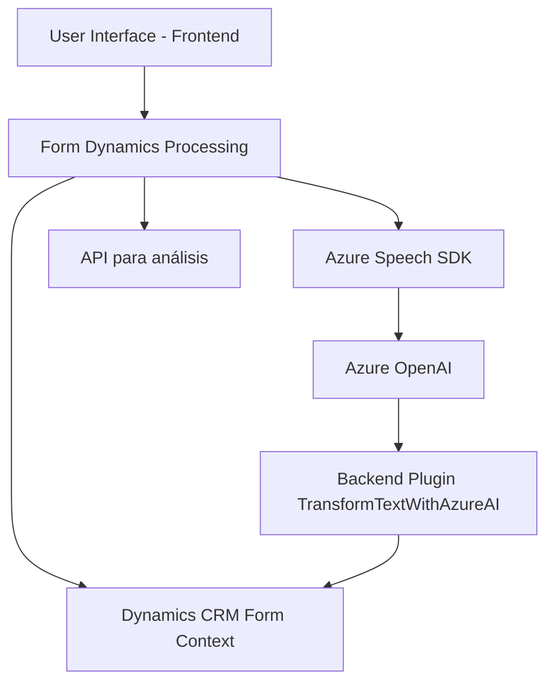

### Breve Resumen Técnico
El repositorio contiene una solución diseñada para integrar capacidades de reconocimiento y síntesis de voz mediante el **Azure Speech SDK** y Azure OpenAI, dentro del contexto de **Dynamics 365 CRM**. Incluye un frontend en JavaScript para la interacción dinámica con formularios y un plugin en **C#** para procesamiento de texto con servicios de IA. La solución ayuda a automatizar la entrada y manipulación de datos en formularios del CRM mediante voz y servicios externos.

---

### Descripción de Arquitectura
1. **Arquitectura General**: 
   - La solución tiene características de **arquitectura de n capas**, donde se distingue entre las interfases cliente (frontend), controladores backend (plugins de C#) y servicios externos (Azure Speech SDK y Azure OpenAI).
   - Adicionalmente, hay un enfoque de integración de inteligencia artificial mediante APIs externas.

2. **Integración de Servicios**:
   - El frontend interactúa de manera directa con el SDK de Azure Speech para entrada y salida de datos de voz, convirtiéndolos en texto para manipulación de formularios del CRM.
   - El backend utiliza un plugin en Dynamics CRM para transformación avanzada de texto mediante Azure OpenAI.

---

### Tecnologías Usadas
1. **Frontend**:
   - **JavaScript**: Lenguaje principal para implementar la interacción con formularios dinámicos.
   - **Azure Speech SDK**: Manejo de síntesis y entrada de voz.
   - **Dynamics 365 CRM APIs**: Integración directa con formularios y sus contextos.

2. **Backend**:
   - **C# / .NET Framework**: Desarrollo del plugin para CRM.
   - **Microsoft.Xrm.Sdk**: Necesario para la interacción con Dynamics CRM.
   - **Newtonsoft.Json.Linq**: Procesamiento de estructuras JSON.
   - **Azure OpenAI**: Transformación de texto mediante reglas predefinidas.

---

### Diagrama **Mermaid** Válido para GitHub

---

### Conclusión Final
Este repositorio combina tecnologías modernas para la automatización de procesos en entornos CRM mediante entradas de voz y capacidades de IA. Utiliza una arquitectura bien estructurada basada en capas, con una separación clara de responsabilidades entre el frontend, servicios externos y el backend. La solución se adapta eficientemente a escenarios de procesamiento de voz y análisis avanzado de datos, mejorando significativamente la experiencia del usuario y la interacción con Dynamics CRM.