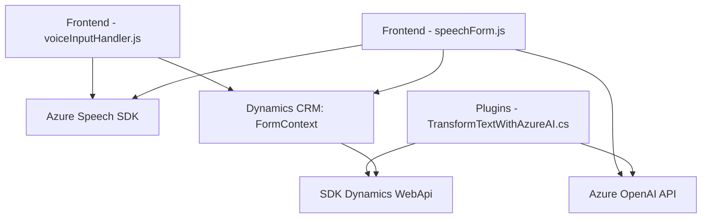

### Breve resumen técnico
El repositorio contiene soluciones con funcionalidades relacionadas con integración de formularios web y soluciones empresariales como Dynamics CRM, usando Azure Speech y Azure OpenAI para síntesis y procesamiento de texto. Está orientado a dos capas funcionales principales: frontend interactivo con integración de SDKs y plugins para transformar datos.

---

### Descripción de arquitectura
#### Tipo de solución
La solución es híbrida:
- **Frontend interactivo** basado en JavaScript, con funciones para captar datos de formularios y sintetizar voz usando Azure Speech SDK.
- **Backend para CRM** basado en .NET (plugin de Dynamics CRM) que interactúa con Azure OpenAI para transformar texto en datos estructurados.

#### Arquitectura
La arquitectura corresponde a un **modelo n-capas** con un enfoque híbrido:
1. **Frontend funcional**: Implementación modular del lado cliente enfocada en la funcionalidad de reconocimiento de voz y síntesis, comunicándose directamente con APIs externas.
2. **Plugin basado en backend**: Lógica del lado servidor con Dynamics CRM, usando Microsoft SDKs y servicios de Azure OpenAI.

En cuanto a patrones, incluye:
- **Capa de integración con servicios externos**: SDKs de Speech y OpenAI.
- **Modularidad**: Separación lógica en funciones específicas.
- **Plugin-based architecture** (para funcionalidad del backend con CRM).

---

### Tecnologías usadas
1. **Frontend**:
   - **Lenguaje**: JavaScript.
   - **SDK externo**: Azure Speech SDK.
   - **Web SDKs estándares de Microsoft**: `window`, `fetch`.
   - **Frontend modular**: Funciones aisladas para síntesis y procesamiento.

2. **Backend**:
   - **Lenguaje**: C#, .NET Framework.
   - **Dynamics CRM Plugins**: Integración de plugins basados en `IPlugin`.
   - **Servicios de Azure OpenAI API**: HTTP client para interacción con la API de Azure.
   - **Librerías**: Newtonsoft.Json, System.Net.Http.

#### Patrones de diseño
1. **Integración de servicios externos**:
   - SDK de Azure Speech (frontend).
   - Azure OpenAI API (backend).
   
2. **Callbacks y Promesas**: Para manejar carga dinámica de SDKs y comunicación asíncrona.
3. **Plugin pattern**: Extendiendo las funcionalidades del CRM mediante los estándares de Dynamics CRM.
4. **Factory pattern**: Uso de IOrganizationServiceFactory en la capa backend.

---

### Dependencias o componentes externos presentes
1. **Azure Speech SDK**: Para síntesis y reconocimiento de voz.
2. **Azure OpenAI API**: Para procesamiento y transformación de texto.
3. **Dynamics CRM (Microsoft Xrm.Sdk)**: Para contexto del formulario y operaciones en CRM.
4. **Newtonsoft.Json**: Para manejo de datos JSON estructurados.
5. **URL cargada dinámicamente**: `https://aka.ms/csspeech/jsbrowserpackageraw`.

---

### Diagrama Mermaid (Validado para GitHub Markdown)

---

### Conclusión final
La solución presentada es una implementación basada en una arquitectura de tipo **n-capas híbrida** que combina un frontend modular y un plugin de backend para aprovechar los servicios de Azure Speech y OpenAI conjuntamente. Se opta por una estrategia de integración directa con API y SDKs externos, ideal para aplicaciones modernas con reglas empresariales y procesamiento avanzado basado en IA. Esta arquitectura es escalable y modular, lo que permite explotar las capacidades de plataformas como Dynamics CRM y los servicios en la nube.