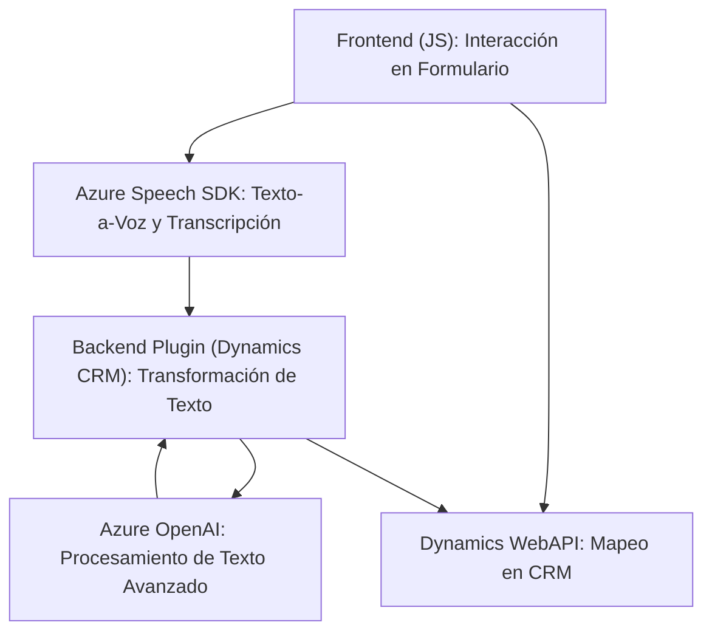

### Breve resumen técnico

El repositorio tiene una estructura que describe funcionalidades relacionadas con la interacción entre formularios web y servicios como Azure Speech SDK y Dynamics 365. Además, se utiliza Azure OpenAI para procesamiento de texto avanzando en una integración dinámica con CRM. La solución combina funcionalidades frontend, API externas y plugins de un sistema CRM.

### Descripción de arquitectura:

#### Tipo de solución
La solución puede clasificarse como una integración híbrida que mezcla frontend para manejo de accesibilidad y entrada de datos, servicios externos (Azure Speech SDK y Azure OpenAI), y un backend basado en plugins de Dynamics 365 para procesamiento de datos.

#### Tipo de arquitectura:
1. **Frontend**: Tiene una arquitectura modular orientada a componentes funcionales simples. Segrega responsabilidades de extracción y síntesis de texto.
2. **Backend**: Implementa un **patrón Plugin** en el CRM que se conecta con una API externa (Azure OpenAI), siguiendo características de **arquitectura n-capas**, donde hay una capa de integración entre el CRM (servicios de organización), capa de negocio para procesar datos y capa externa API para ejecutar el procesamiento.
3. **Integración con servicios externos**: Funciona como una arquitectura basada en APIs o microservicios en cuanto a las interacciones dinámicas con Azure Speech SDK y OpenAI para texto a voz, transcripciones, y transformaciones textuales.

### Tecnologías usadas
1. **Frontend:**
   - **JavaScript**: Manejo de lógica del cliente, manipulación de DOM y carga dinámica del SDK.
   - **Azure Speech SDK**: Para síntesis y transcripción de voz.
   
2. **Backend:**
   - **Dynamics 365 plugin pattern**: Extensión del CRM con funciones personalizadas.
   - **Microsoft.Xrm.Sdk**: Librería oficial para manipular servicios internos en Dynamics.
   - **Azure OpenAI service API**: Procesamiento de texto avanzado con modelos GPT.
   - **HTTP Client**: Comunicación con endpoints externos.
   - **System.Text.Json**: Manejo de datos estructurados en formato JSON.

3. **Patrones:** 
   - Funcional
   - Factory Pattern
   - Plugin Pattern
   - Asynchronous programming (Callbacks y Promesas)

### Dependencias o componentes externos presentes
1. **Azure Speech SDK**:
   - Para funcionalidades relacionadas con la síntesis y transcripción de voz en tiempo real.
2. **Azure OpenAI**:
   - Para el procesamiento avanzado de texto mediante modelos GPT.
3. **Dynamics CRM WebAPI**:
   - Para manipular datos internos del formulario y realizar acciones CRUD sobre registros.
4. **Newtonsoft.Json**:
   - Procesamiento y manipulación de datos JSON.

### Diagrama Mermaid 100% compatible con GitHub
Representa los principales componentes de la arquitectura:

### Conclusión final
La solución presentada en el repositorio combina tecnologías modernas y servicios en la nube para resolver problemas de accesibilidad y automatización en el contexto de formularios CRM. Utiliza la arquitectura de plugins en el backend para extender las capacidades de Dynamics 365 a través de APIs externas (Azure Speech y Azure OpenAI), mientras que el frontend utiliza una estructura modular funcional. La implementación refleja buenas prácticas como modularidad, separación de responsabilidades y gestión dinámica de dependencias.