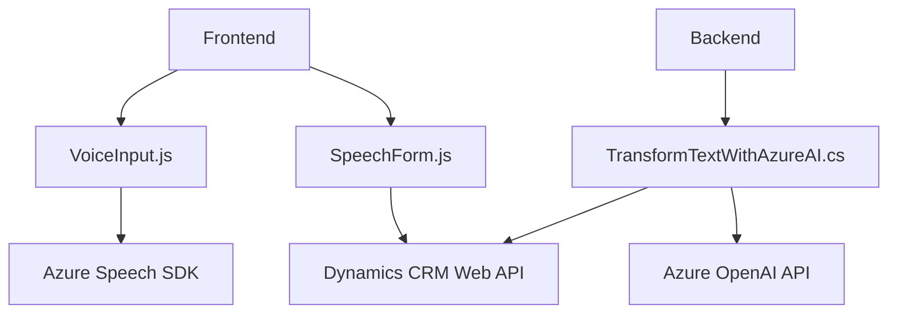

### Resumen técnico
La solución presentada en el repositorio se distribuye en componentes frontend y backend, con integración directa a servicios externos basados en el SDK de Azure Speech y la API de Azure OpenAI. Está orientada al ecosistema Dynamics CRM para manejo de datos y procesamiento por voz, con aplicación de inteligencia artificial para transformaciones adicionales.

---

### Descripción de arquitectura
La arquitectura es híbrida y sigue los patrones de **n-capas**, incluyendo estas características:
1. **Frontend (JavaScript)**: Trabajo con el contexto de Dynamics CRM y SDK de Azure Speech para manipulación de datos y voz. Predomina el patrón de modularización por funciones.
2. **Backend (Plugin .NET)**: Plugin de Dynamics CRM diseñado como una pieza discreta que interactúa con Azure OpenAI.
3. **Integración con APIs externas**: Se conecta con servicios de Azure (SDK de Speech y OpenAI) para realizar operaciones especializadas de procesamiento.

---

### Tecnologías y patrones utilizados
1. **Tecnologías principales:**
   - **Frontend**: JavaScript, Azure Speech SDK, Dynamics CRM Client Context (`executionContext`, `formContext`).
   - **Backend**: .NET Framework, Dynamics CRM SDK (`Microsoft.Xrm.Sdk`), Azure OpenAI API.
2. **Patrones de diseño:**
   - **Carga condicional de SDK**: "Lazy loading" de Speech SDK desde Azure.
   - **Modularización funcional**: Frontend dividido en funciones especializadas para tareas como síntesis, transcripción y actualización de campos de formularios.
   - **Plugin dinámico**: Backend diseñado para integrarse como parte del flujo del sistema CRM.
   - **Microservicio-Driven Architecture**: Dependencia de servicios externos (OpenAI y Speech SDK) para funcionalidades clave.

---

### Dependencias/components externos
1. **Azure Speech SDK**:
   - Usado para síntesis de voz y transcripción de entrada.
   - Importado dinámicamente en el frontend.
2. **Azure OpenAI API**:
   - Utilizado en el plugin backend para transformación avanzada de texto en estructuras JSON.
3. **Dynamics CRM Web API**:
   - Usado para operaciones de lectura/escritura en formularios CRM.
4. **System libraries for .NET**:
   - Incluye System.Net.Http para comunicación HTTP y Newtonsoft.Json para manipulación de JSON en el backend.

---

### Diagrama Mermaid (GitHub Markdown compatible)

---

### Conclusión final
La solución integra capacidades avanzadas de procesamiento de voz y texto mediante tecnologías de Azure y Dynamics CRM, siendo ideal para aplicaciones empresariales orientadas a accesibilidad e inteligencia artificial. Su arquitectura híbrida basada en **n-capas** garantiza modularidad y escalabilidad, mientras que los patrones empleados aseguran una integración eficiente con APIs externas.