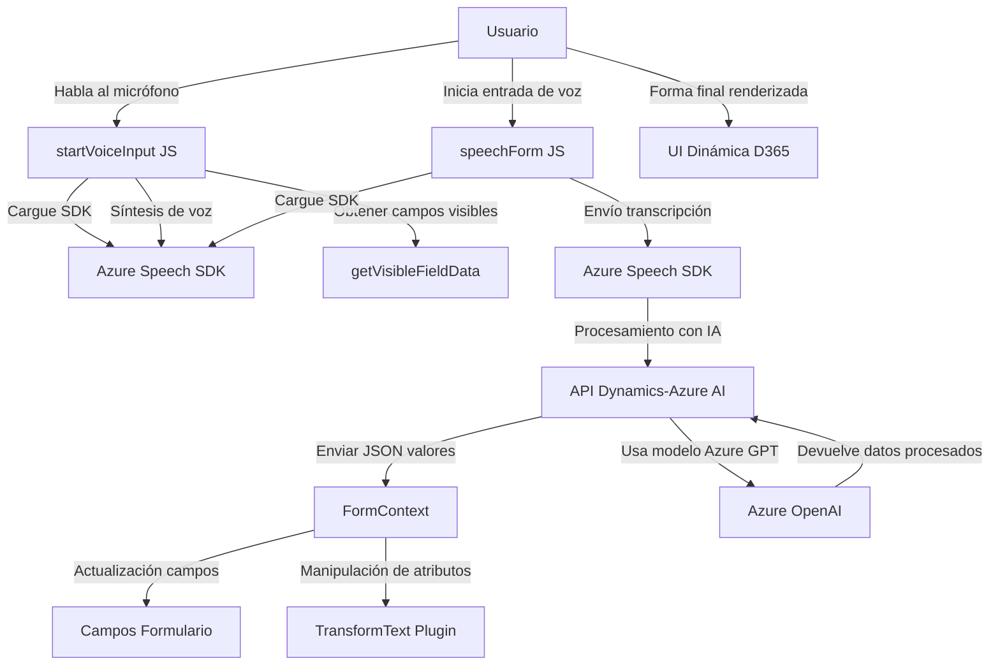

### Breve resumen técnico

El repositorio contiene tres módulos principales que trabajan juntos en una solución. A partir del análisis de los archivos `readForm.js`, `speechForm.js` y `TransformTextWithAzureAI.cs`, se puede concluir que el sistema integra Azure Speech SDK, Dynamics 365, y un plugin que utiliza Azure OpenAI (GPT).

Estos archivos representan una solución híbrida que interactúa con la nube (Azure) y una específica instancia de Dynamics CRM/365, permitiendo la síntesis de voz, reconocimiento de voz, procesamiento de textos con IA y operaciones en el contexto de un formulario dentro de la plataforma Dynamics 365.

---

### Descripción de la arquitectura

La solución tiene una arquitectura **n capas** con una integración fuerte hacia la arquitectura **plugin** nativa de Dynamics. Las capas y sus responsabilidades incluyen:
1. **Capa de presentación:** Los scripts `readForm.js` y `speechForm.js` están diseñados para funcionar en un entorno cliente (probablemente web) directamente integrado con las UI de Dynamics 365.
2. **Capa de lógica de negocio:** Los plugins en `TransformTextWithAzureAI.cs` contienen la lógica empresarial principal mediante el uso de Dynamics CRM SDK y el servicio de inteligencia artificial de Azure OpenAI.
3. **Capa de acceso externo:** Las llamadas a los servicios externos (Azure Speech SDK y Azure OpenAI) realizan funciones específicas como reconocimiento y síntesis de voz, además de procesamiento de texto usando IA.
4. **Capa de datos:** Utilización de Dynamics 365 como base para manipular datos del formulario y/o instancias de entidades (usando mapeo dinámico de campos).

---

### Tecnologías usadas

1. **Frontend JS Scripts:**
   - **Azure Speech SDK** para la síntesis y el reconocimiento de voz.
   - JavaScript ES6 para la implementación de lógica en el cliente (integración con Dynamics).
   - API personalizada basada en Dynamics 365 para comunicación cliente-servidor.

2. **Backend Plugin (C#):**
   - Microsoft Dynamics CRM SDK (gestión del contexto de ejecución del sistema CRM, operaciones CRUD).
   - Azure OpenAI (GPT) API para el procesamiento de texto mediante modelos de inteligencia artificial.
   - .NET Framework (dependencias tales como Newtonsoft.Json para manejo de JSON y System.Net.Http para solicitudes API).

3. **Arquitectura basada en la nube:**
   - Servicios en la nube de Microsoft Azure para reconocimiento de voz y procesamiento de lenguaje natural.
   - Microsoft Dynamics 365 como plataforma SaaS (acceso a formularios, servicios REST, entidades y plugins).

---

### Diagrama Mermaid válido

---

### Conclusión final

La solución analizada es una integración híbrida de tecnologías cliente-servidor con una arquitectura **n capas** y adherencia al patrón de diseño tipo **plugin** en Dynamics 365. El propósito es facilitar una experiencia de usuario inclusiva mediante la síntesis y entrada de voz para la gestión de formularios dentro de Dynamics 365.

El sistema utiliza tecnologías modernas como Azure Speech SDK y OpenAI para reconocimiento de voz y procesamiento avanzado de lenguaje natural, alineándose con buenas prácticas de modularización, servicio de dependencia externo y capas desacopladas. Si se escala correctamente, esta solución puede servir como una base sólida para implementar interfaces accesibles en entornos empresariales.