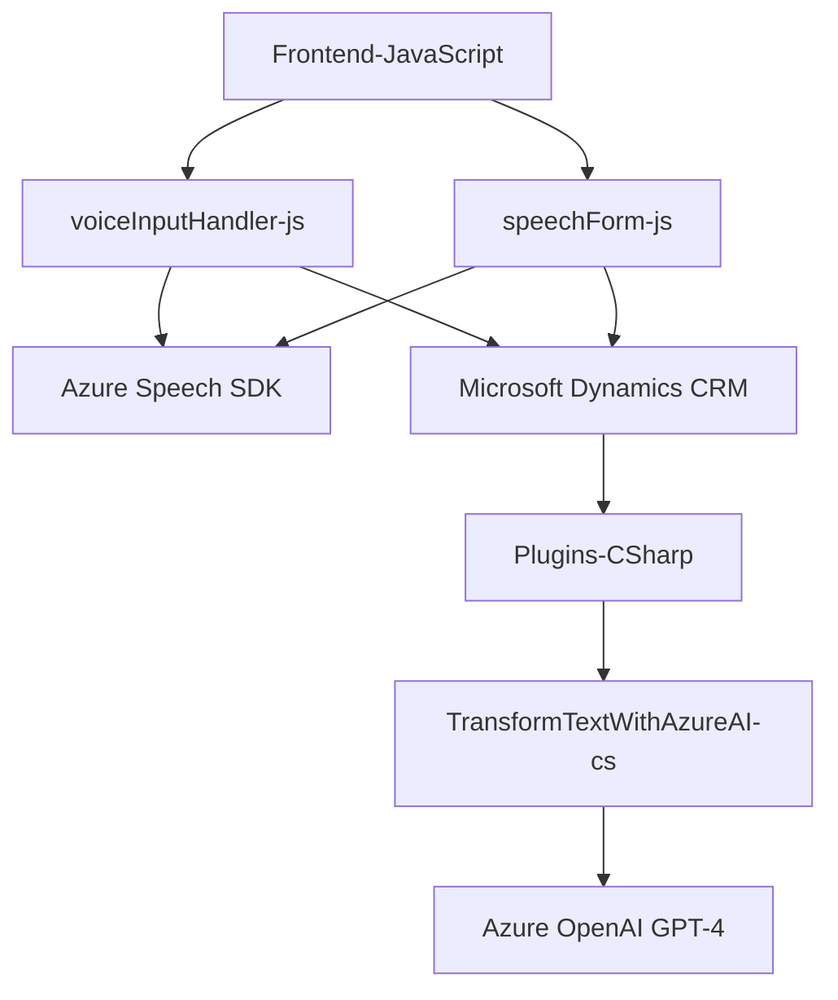

### Breve resumen técnico:
El repositorio contiene una solución completa de software que implementa funcionalidades de reconocimiento de voz y transformación de texto usando servicios de Azure (Speech SDK y OpenAI GPT-4), junto con la integración con Dynamics CRM mediante plugins backend. Es una aplicación orientada a formularios dinámicos, que utiliza datos personalizados para síntesis y entrada de texto, así como su transformación en estructuras JSON para una mayor interacción con sistemas externos.

---

### Descripción de arquitectura:
La arquitectura general se asemeja a una estructura **n-capas**, diferenciada en:
1. **Frontend**:
   - Repositorio `FRONTEND/JS` (archivos como `voiceInputHandler.js`, `speechForm.js`, etc.)
   - Implementación en JavaScript de funcionalidad de reconocimiento de voz y síntesis de datos, con soporte para manipulación dinámica de formularios.
2. **Backend Plugin**:
   - Repositorio `Plugins/TransformTextWithAzureAI.cs`.
   - Implementación como plugin en `.NET` para Dynamics CRM, que actúa como procesador de texto usando Azure OpenAI.
3. **Servicios externos**:
   - Integración directa con:
     - **Azure Speech SDK** para procesamiento de voz en el frontend.
     - **Azure OpenAI Service (GPT-4)** en el backend.

La arquitectura tiene características híbridas: combina principios de desacoplamiento entre frontend y backend mediante servicios externos (SDKs) y APIs, pero no está completamente distribuida al nivel de microservicios.

---

### Tecnologías usadas:
1. **Frontend**:
   - **HTML/JavaScript** para formularios dinámicos y validación del DOM.
   - **Azure Speech SDK** para reconocimiento de voz y síntesis de texto.
   - **Microsoft Dynamics 365 API** para CRUD y datos tipo `lookup`.
   - **Promesas/Async-Await** para programación asíncrona en el navegador.
   
2. **Backend**:
   - **.NET Framework** para el plugin (`C#`).
   - **Microsoft.Xrm.Sdk** para interacción con Dynamics CRM.
   - **Azure OpenAI GPT-4** para procesamiento de texto en JSON.
   - **HTTP Client** para comunicación con endpoints externos.
   - **Newtonsoft.Json** para manipulación de datos JSON.

---

### Dependencias o componentes externos:
1. **Azure Speech SDK** (frontend):
   - Reconocimiento y síntesis de voz en español.
   - URL de carga dinámica: `https://aka.ms/csspeech/jsbrowserpackageraw`.
2. **Azure OpenAI GPT-4** (backend):
   - Servicio para transformar texto natural en JSON estructurado.
3. **Dynamics CRM**:
   - Manipulación de datos y atributos del formulario (`Xrm.WebApi.online.execute`).
4. **API dinámica personalizada**:
   - En el frontend, una API opcional procesa datos transformados por IA.

---

### Diagrama Mermaid:

---

### Conclusión final:
La solución en este repositorio representa una **arquitectura híbrida basada en servicios** que combina un frontend interactivo con capacidades avanzadas de reconocimiento y síntesis de voz, un backend que utiliza plugins de Dynamics CRM, y servicios externos de Azure para AI y procesamiento de datos. Es modular, desacoplada, y altamente extensible, con tecnologías de última generación que permiten interacción natural entre usuarios, formularios, y datos estructurados. Su diseño es ideal para aplicaciones centradas en formularios dinámicos y tareas de automatización empresarial asistidas por IA.