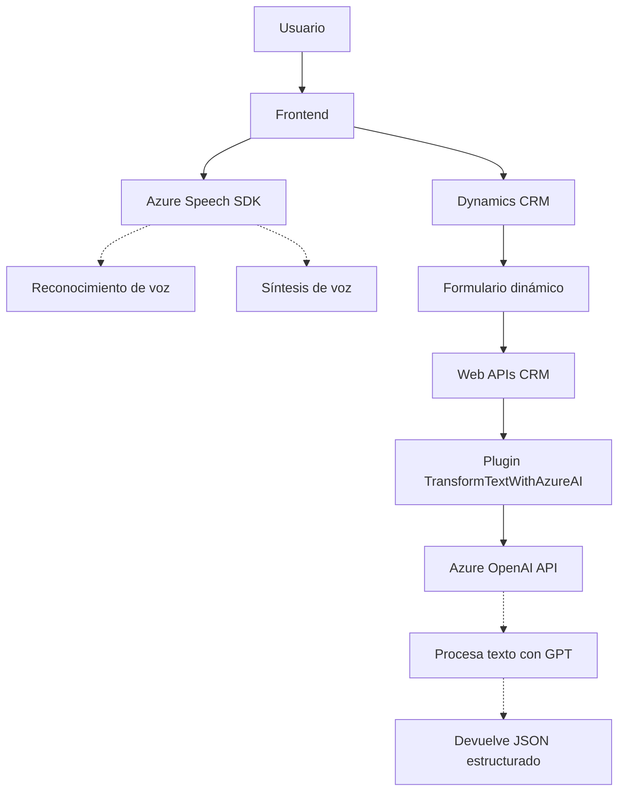

### Breve resumen técnico

El repositorio contiene tres componentes principales: un **frontend en JavaScript** que interactúa con formularios y el reconocimiento, y síntesis de voz mediante **Azure Speech SDK**, un plugin backend en **C# para Dynamics CRM** que transforma datos utilizando **Azure OpenAI Service**, y una posible integración entre ambos que simplifica la interacción entre usuarios y sistemas basados en CRM. Su propósito general es mejorar la experiencia de usuario en aplicaciones empresariales al agregar capacidades de reconocimiento de voz, síntesis y procesamiento avanzado de datos.

---

### Descripción de arquitectura

La arquitectura parece orientada hacia un modelo de integración de servicios externos:
1. **Frontend**:
   - Usa **Azure Speech SDK** (carga dinámica) para reconocimiento de voz y síntesis.
   - Integración con CRM Dynamics a través de `formContext` para manipular formularios y datos.

2. **Backend Plugin**:
   - Plugin en Dynamics CRM que responde al procesamiento de texto mediante **Azure OpenAI Service**.
   - Estructurado como un servicio dentro de Dynamics CRM, automatiza el procesamiento de entradas de texto hacia un formato JSON estructurado.

La arquitectura general combina **n capas** y **servicios externos** que pueden extenderse a un enfoque **event-driven** mediante reconocimiento de voz y llamadas asincrónicas a APIs externas.

---

### Tecnologías usadas
1. **Frontend**:
   - HTML, JavaScript
   - **Azure Speech SDK**: Para síntesis y reconocimiento de voz.
   - **CRM Dynamics Web APIs**: Manupulación de formularios dinámicos en CRM.

2. **Backend Plugin**:
   - Lenguaje: **C#**
   - Plataforma: Dynamics CRM
   - **Azure OpenAI Service**: Procesamiento avanzado de texto con GPT.
   - Frameworks utilizados: **Microsoft.Xrm.Sdk** y varias APIs de Dynamics para manipulación de campos y entidades.

3. **Patrones de diseño**:
   - **Desacoplamiento modular**: Componentes separados para procesamiento de voz, manipulación de formularios y transformación de texto.
   - **Service Interaction**: Integración con servicios externos mediante REST API.
   - **Facade Pattern** en el plugin: Simplificación de interacción con Azure OpenAI.

---

### Diagrama Mermaid

---

### Conclusión final

La solución presentada es un sistema híbrido que se apoya tanto en un frontend interactivo como en un backend plugin para la plataforma Dynamics CRM. Su enfoque arquitectónico es uno de **integración de servicios externos (Azure AI)** y uso de **componentes desacoplados**, lo que garantiza flexibilidad y potencial extensibilidad. Los puntos fuertes incluyen:
1. **Modularidad**: Separación efectiva de tareas como reconocimiento/síntesis de voz, manipulación de formularios y procesamiento avanzado.
2. **Servicios externos**: Aprovecha tecnologías de última generación como Azure Speech y OpenAI para mejorar la usabilidad y la automatización del sistema.

Sin embargo, es clave mejorar aspectos como la seguridad de las claves API sensibles, optimizar la carga del SDK dinámico en el frontend, y mejorar el manejo de errores para un sistema más robusto.