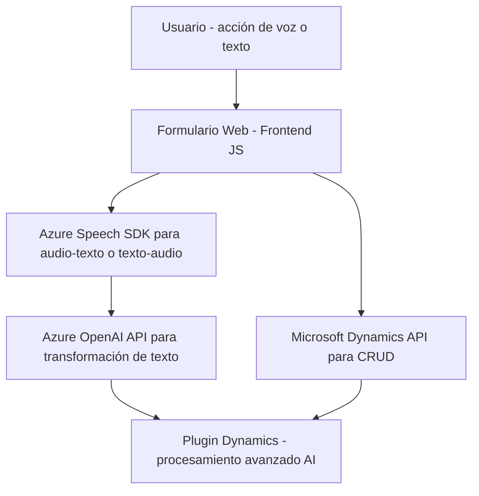

### Breve resumen técnico

El repositorio contiene archivos que principalmente implementan funcionalidades relacionadas con la entrada y salida de datos por voz en un entorno de formularios web asociado a Microsoft Dynamics 365. Adicionalmente, incluye un plugin para Azure OpenAI que se integra con Dynamics CRM. Estas soluciones combinan capacidades de reconocimiento y síntesis de voz (Azure Speech SDK) y procesamiento de texto con IA (Azure OpenAI API), para ofrecer un modo de interacción avanzado con datos en tiempo real dentro del CRM.

---

### Descripción de arquitectura

La solución está compuesta por tres elementos clave:
1. **Frontend (JavaScript)** para formularios que interactúan dinámicamente con los datos visibles mediante:
   - Sintetización de voz (texto → audio) usando Azure Speech SDK.
   - Reconocimiento de voz (audio → texto), con procesamiento mediante reglas definidas o IA externa.
2. **Microservicio (Azure AI Plugin)** que actúa como un plugin en Dynamics CRM, transformando texto con reglas personalizadas aprovechando Azure OpenAI API.
3. **Integración con el entorno CRM** mediante plugins y APIs nativas como `Xrm.WebApi`.

Esta estructura utiliza una **arquitectura en capas**:
- **Capa visual (frontend)**: Operaciones de entrada por voz y salida de texto desde un formulario web.
- **Capa de negocio (APIs y reglas)**: Validaciones, mapeo dinámico y consumo de servicios externos.
- **Capa de datos y plugin**: Plugins en Dynamics CRM para automatización avanzada.

Adicionalmente, utiliza **patrones event-driven**, modularidad, y servicios externos para manejar flujo de voz y texto.

---

### Tecnologías usadas

- **Backend y Plugins**:
  - Lenguaje: C# (.NET Framework).
  - Framework: Dynamics CRM APIs (Microsoft Xrm SDK, Microsoft.WebApi).
  - API: Azure OpenAI para procesamiento y transformación de texto.
  
- **Frontend**:
  - Lenguaje: JavaScript ES6+.
  - SDK: Azure Speech SDK (para reconocimiento y síntesis de voz).
  - Entorno: Microsoft Dynamics 365 Form Context para manejar datos en formularios.

- **Servicios Externos**:
  - **Azure Speech SDK**: Cargado desde CDN, manejando entrada y salida de voz.
  - **Azure OpenAI API**: Transformación de texto con normas específicas.

---

### Diagrama Mermaid válido para GitHub Markdown

---

### Conclusión final

El repositorio implementa una solución avanzada de interacción con formularios en Dynamics CRM que combina reconocimiento de voz, síntesis de audio y procesamiento de texto con IA. Está diseñada en capas, con un frontend modular y una integración robusta con servicios de Azure y APIs específicas del CRM. Aunque la arquitectura general recuerda al modelo de **microservicios** (por la separación del plugin y servicios externos), se integra principalmente bajo una **n-capas** orientada al entorno Dynamics. Esto la hace una solución adecuada para negocios que requieren automatización cognitiva en herramientas empresariales.