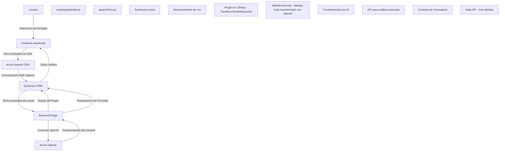

## Resumen Técnico
Este repositorio está diseñado para integrar funcionalidades avanzadas en el ecosistema de Microsoft Dynamics CRM mediante interacción con usuarios, análisis semántico del texto y síntesis de voz. Se divide principalmente en dos componentes: un frontend basado en JavaScript con integración de Azure Speech SDK y un backend bajo la arquitectura extensible de plugins del CRM, utilizando servicios de Azure OpenAI.

---

## Descripción de Arquitectura
La arquitectura del proyecto parece una combinación híbrida de:
1. **Cliente-Servidor**: Logrando interacción con APIs remotas (Azure Speech SDK y Azure OpenAI) para procesamiento avanzado.
2. **N Capas (Micro Frontends)**: Separando la capa de presentación (frontend en JavaScript) del procesamiento lógico (backend como plugins en .NET).
3. **Integración con servicios externos vía API**: Sistemas como el Azure Speech SDK y OpenAI son dependencias claves que amplían las capacidades del sistema.
4. **Orientación a Eventos**: Uso de patrones como callbacks para cargar servicios bajo demanda (Azure Speech SDK).
  
---

## Tecnologías Usadas
### **Frontend:**
- **Lenguaje y Framework:** JavaScript.
- **SDK:** Azure Speech SDK para reconocimiento y síntesis de voz.
- **Plataforma:** Microsoft Dynamics CRM JavaScript API.
- **Principales patrones:**
  - Modularidad: Código segmentado en funciones específicas y reutilizables.
  - Llamadas dinámicas a servicios remotos (`ensureSpeechSDKLoaded`).

### **Backend:**
- **Lenguaje y Framework:** C# bajo Microsoft Dynamics SDK.
- **Servicios Externos:** 
  - Azure OpenAI para análisis semántico de texto.
- **Librerías Utilizadas:** 
  - `Newtonsoft.Json` para manejo de JSON.
  - `System.Net.Http` para comunicación HTTP.
- **Principales patrones:**
  - Plugin Architecture: Extensión modular del CRM.
  - Separación de responsabilidades: Métodos que desacoplan la lógica de transformación y las reglas de negocio.

---

## Dependencias y Componentes Externos
1. **Azure Speech SDK:** Para integración de datos basados en voz (sintetización y reconocimiento).
2. **Azure OpenAI:** Procesamiento semántico de texto mediante IA.
3. **Dynamics CRM SDK:** Proveer contexto de trabajo empresarial y acceso a modelos de datos.
4. **APIs de Dynamics CRM:** Tales como `Xrm.WebApi` para realizar consultas y manejo de los datos del sistema.
5. Dependencia de bibliotecas estándar (.NET Framework/Core) para la comunicación HTTP y serialización de datos.

---

## Diagrama Mermaid

Aquí está el diagrama **Mermaid**, compatible con Markdown en GitHub, que representa claramente cómo los componentes interactúan entre ellos:

---

## Conclusión Final
Este sistema combina dos capas principales: una capa de presentación que interactúa directamente con el usuario utilizando capacidades de síntesis y reconocimiento de voz mediante Azure Speech SDK, y una capa lógica que opera como un plugin en Microsoft Dynamics CRM utilizando Azure OpenAI para procesamiento semántico avanzado. La modularidad y dependencia en servicios externos como Azure reflejan una arquitectura orientada a aprovechar las capacidades de IA modernas, mejorando la eficiencia en entornos empresariales.

El uso de tecnologías como Azure Speech SDK, OpenAI, y Dynamics CRM lo posiciona como una solución robusta para automatización de formularios y análisis enriquecido de datos. La arquitectura híbrida cliente-servidor permite un flujo eficiente y escalable.