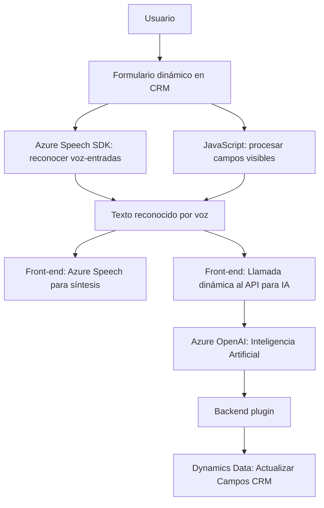

# Análisis del repositorio

## Breve resumen técnico
El repositorio contiene múltiples archivos organizados principalmente en el frontend y plugins para Dynamics CRM que implementan funcionalidades relacionadas con el procesamiento del lenguaje natural (NLP), interacción de voz con formularios y transformación de datos mediante servicios de Azure. Está diseñado para ser usado en un ecosistema CRM (Dynamics) y aprovecha las capacidades de plataformas como Azure Speech SDK y Azure OpenAI.

---

### Descripción de arquitectura
La solución parece seguir una arquitectura **Cliente/Servidor híbrida**, con componentes divididos en:
1. **Frontend orientado a formularios dinámicos en CRM**: Utiliza JavaScript para conectar la lógica del navegador con Azure Speech y formularios dinámicos.
2. **Complementos en el backend CRM**: Implementa plugins (en .NET) que permiten integrar servicios externos (Azure AI) con lógica de negocio dentro del CRM.
3. **Integración con APIs externas (Azure Speech, Azure OpenAI, Dynamics WebApi)**: La comunicación se realiza mediante REST y SDKs que facilitan el procesamiento asíncrono.

---

### Tecnologías usadas
1. **Front-end**:
   - **JavaScript ES6+:** Implementación de funciones modernas de procesamiento y manipulación DOM.
   - **Azure Speech SDK:** Utilizado para síntesis y reconocimiento de voz.
   - **Dynamics CRM Web API (Xrm.WebApi):** Para operaciones relacionadas con los datos en Dynamics.

2. **Back-end**:
   - **C# (.NET Framework):** Desarrollo de plugins que interactúan directamente con el sistema Dynamics CRM.
   - **Microsoft.Xrm.Sdk:** API para extensiones en CRM.
   - **Azure OpenAI Service:** Para procesamiento de texto en el backend.
   - **HTTP Client:** Usado para enviar y recibir información de endpoints REST (Azure OpenAI).

3. **Servicios externos:** 
   - Azure Speech SDK para convertir texto en voz y reconocer comandos de voz.
   - Azure OpenAI GPT API para transformar texto mediante IA con reglas predefinidas.

---

### Patrones y estilo arquitectónico
1. **Frontend:**
   - Modularidad: Funciones autónomas organizadas de manera lógica.
   - Event-driven: Respuesta a eventos como carga de SDK y acciones sobre formularios.
   - **Adaptador de datos:** Transforma estructuras del formulario en valores legibles para el SDK.
   - Integración SDK externo: Usa Speech SDK de Azure para voz y comandos interactivos.

2. **Back-end:**
   - **Single Responsibility:** Los plugins en Dynamics CRM están diseñados para ejecutar tareas específicas (ej.: transformación de texto).
   - **Integración con API externa:** Componente REST que consume servicios de Azure.
   - Plugin Pattern: Implementación en Dynamics basada en extensiones dentro de la lógica de negocio.

---

### Dependencias o componentes externos presentes
1. **Azure Speech SDK:** Integración directa en el frontend.
2. **Azure OpenAI Service:** Comunicación REST desde el plugin backend.
3. **Dynamics CRM Web API:** Operaciones sobre formularios y objetos del CRM.
4. **Microsoft.Xrm.Sdk:** Biblioteca estándar para desarrollo en Dynamics.
5. **System.Net.Http:** Comunicación HTTP con servicios externos.
6. **Newtonsoft.Json o System.Text.Json:** Para serialización JSON al interactuar con la OpenAI API.
7. **HTML DOM:** Manipulación directa en el frontend.

---

### Diagrama **Mermaid**

---

### Conclusión final
Este repositorio implementa una solución integrada, ideal para entornos empresariales que usan Dynamics CRM y buscan aprovechar tecnologías avanzadas como el reconocimiento de voz y NLP (procesamiento del lenguaje natural). La arquitectura Cliente/Servidor híbrida, junto con patrones modulares y de integración SDK, permiten la evolución y escalabilidad de la solución. La elección de Azure para IA y voz asegura compatibilidad y estabilidad en entornos productivos.