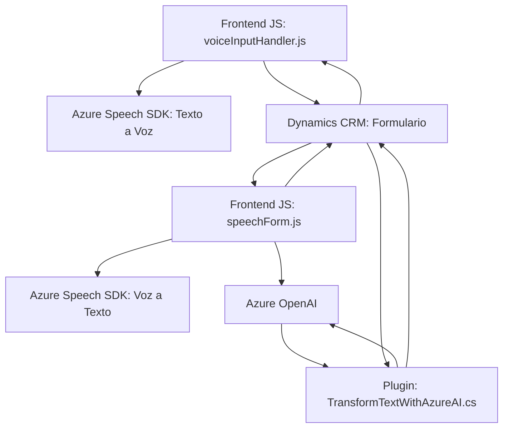

### Breve resumen técnico
El repositorio define un conjunto de archivos con funcionalidades orientadas a mejorar la accesibilidad y productividad en entornos Dynamics CRM mediante integración con servicios de voz, IA y APIs personalizadas. Está enfocado en la integración de **Azure Speech SDK** y **Azure OpenAI Service**, además de manejar interacciones dinámicas con formularios y plugins en Dynamics 365.

### Descripción de arquitectura
La arquitectura es **orientada a servicios** y sigue un enfoque modular. Los componentes principales están organizados de forma funcional: 
- **Frontend**: Interfaz responsable de la interacción con el usuario y el reconocimiento de voz para llenar formularios. Usa APIs y SDK de Azure para voz y datos.
- **Plugins**: Extensiones que ejecutan lógica personalizada en Dynamics CRM. Estos plugins interactúan con un servicio externo, en este caso, **Azure OpenAI**, para transformar texto y devolver respuestas estructuradas.
- **APIs externas**: Uso de reconocimientos de voz (Azure Speech SDK) y sistemas de IA (Azure OpenAI) como servicios externos integrados.
- Aunque el diseño tiene componentes desacoplados, no se identificaron características típicas de arquitectura de microservicios ni capas nítidamente definidas. Las interacciones sugieren una **estructura complexión de monolito con integración de terceros**.

### Tecnologías usadas
- **Frontend:** JavaScript, DOM Manipulation, SDK dinámico de Azure Speech (https://aka.ms/csspeech/jsbrowserpackageraw).
- **Backend:** Microsoft Dynamics SDK (`Microsoft.Xrm.Sdk`), C#, Azure OpenAI Service, HTTP Client para integración con APIs.
- **Librerías en C#:** Newtonsoft.Json, System.Text.Json.
- **Servicios:** Azure Speech y Azure OpenAI.
- **Patrones detectados:** 
  - Dynamic Loader (carga de dependencias en tiempo de ejecución, como el SDK de Azure).
  - Service-Oriented Architecture (integración con servicios Azure).
  - Gestión de errores y asincronía: Promises en JS y manejo en C#.

### Diagrama Mermaid válido para GitHub

### Conclusión final
Este repositorio utiliza integración avanzada con servicios de Azure para enriquecer funcionalidades en Dynamics CRM, enfocándose en accesibilidad (mediante síntesis y reconocimiento de voz) y procesamiento de información con IA. La arquitectura es modular y orientada a servicios pero se estructura como un monolito debido a su fuerte dependencia del contexto CRM. La robusta separación lógica permite extensibilidad, aunque puede mejorarse la configuración de seguridad y alinearse más a prácticas modernas como el desacoplamiento completo en microservicios.