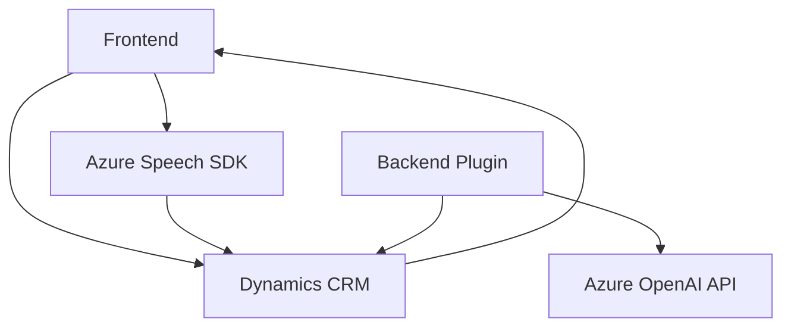

### Breve Resumen Técnico
El repositorio parece estar diseñado para una solución integrada que interactúa con formularios CRM en Microsoft Dynamics 365. Su propósito principal es habilitar funcionalidades de lectura, síntesis, reconocimiento de voz y transformación de datos utilizando servicios de Azure (Azure Speech SDK y Azure OpenAI). La solución incluye archivos frontend y backend; los del frontend implementan integración directa con el SDK de Azure, mientras que el backend utiliza un plugin en C# para trabajar con Dynamics CRM y Azure OpenAI.

---

### Descripción de Arquitectura
- **Tipo de arquitectura**: Arquitectura por capas (n capas) con integración de servicios externos. El frontend y el backend están organizados como módulos, y el flujo de datos se realiza de forma estructurada (desde cliente, API hasta servicios externos).
- **Niveles**:
  1. **Presentación** (Frontend): Gestión de interfaz de usuario CRM enriquecida con reconocimiento de voz y síntesis.
  2. **Lógica de plugins** (Backend): Procesamiento especializado definido como un servicio independiente en Dynamics CRM.
  3. **Servicios externos**: Integración con Azure Speech SDK y Azure OpenAI.

---

### Tecnologías Usadas
1. **Frontend**:
   - Azure Speech SDK (para reconocimiento y síntesis de voz).
   - Lenguaje JavaScript (con ES6 y promesas/async-await para flujo asincrónico).
2. **Backend**:
   - C# (plugin para Dynamics CRM).
   - Microsoft .NET SDK para Dynamics (Microsoft.Xrm.Sdk).
   - Azure OpenAI API para reglas de procesamiento de texto.
   - HTTP Client (`System.Net.Http`) y JSON utilitarios (`Newtonsoft.Json.Linq` y `System.Text.Json`) para integración de servicios REST.
3. **Entornos**:
   - Dynamics CRM (integración con formularios y datos contextuales).

---

### Dependencias o Componentes Externos
1. **Azure Speech SDK**:
   - Proporciona reconocimiento y síntesis de voz.
2. **Azure OpenAI API**:
   - Transformación avanzada de texto según normas definidas.
3. **Microsoft Dynamics 365 Web API**:
   - Interacción directa con el entorno Dynamics CRM.
4. **Eventos del SDK Dynamics**:
   - Contexto y manejo de datos en formularios CRM.

---

### Diagrama Mermaid 100 % Compatible

---

### Conclusión Final
La solución está implementada siguiendo un enfoque modular y orientado a eventos, con integración de servicios externos avanzados como Azure Speech SDK y Azure OpenAI. Es ideal para aplicaciones CRM enriquecidas con reconocimiento de voz y procesamiento de datos dinámicos. Sin embargo, la seguridad debe ser reforzada, especialmente en la gestión de claves de servicios externos. Además, una posible evolución sería la incorporación de una arquitectura más avanzada, como hexagonal, para desacoplar la lógica y facilitar la extensibilidad.