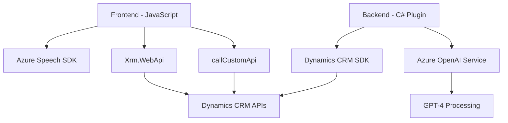

### Breve resumen técnico
El repositorio contiene elementos de software destinados a procesar entradas de voz y texto en formularios dinámicos de aplicaciones empresariales, con una integración específica de **Azure Speech SDK** y **Azure OpenAI**. Se enfoca en comunicación con APIs externas y manipulación de formularios, utilizándose en entornos como **Dynamics 365**.

### Descripción de arquitectura
La solución emplea una arquitectura **híbrida basada en capas**:
1. **Frontend**: Archivos JavaScript para procesamiento de datos en formularios web y manejo de entradas/salidas basadas en voz.
2. **Backend (Plugin)**: Código C# que sigue el patrón **Plugin-based architecture** de Dynamics 365, diseñado para eventos preconfigurados en la entidad. Este conecta con Azure OpenAI para expandir capacidades de procesamiento de texto.

### Tecnologías usadas
1. **Frontend**:
   - **Azure Speech SDK**: Para reconocimiento y síntesis de voz.
   - **RESTful APIs**: Comunicación desde formularios hacia servicios en Dynamics 365 o Azure.
   - **JavaScript modular**: Código organizado en funciones de propósito específico.
2. **Backend**:
   - **C# y Dynamics CRM SDK**: Implementación de plugins y gestión de datos CRM.
   - **Azure OpenAI (GPT-4)**: Procesamiento avanzado de texto.
   - **HTTPClient**: Comunicación entre el plugin y servicios externos.
3. **Dependencias internas**:
   - **Xrm.WebApi**: API nativa de Dynamics CRM.
   - **Newtonsoft.Json**: Manejo avanzado de estructuras JSON.
4. **Patrones**:
   - Modularidad para separación de responsabilidades.
   - Integración mediante SDKs de Azure y RESTful patterns.

### Diagrama Mermaid válido para GitHub

### Conclusión final
Este repositorio define una solución arquitectónica **híbrida en capas** que combina aplicaciones **frontend en JavaScript** y **backend en C#** sobre la plataforma **Dynamics CRM**. Está diseñada para realizar tareas específicas de input/output de voz y texto, aprovechando capacidades de inteligencia artificial (Azure OpenAI) y síntesis/reconocimiento de voz (Azure Speech SDK). Entre sus puntos fuertes destacan la modularidad del código y la integración efectiva con servicios en la nube.