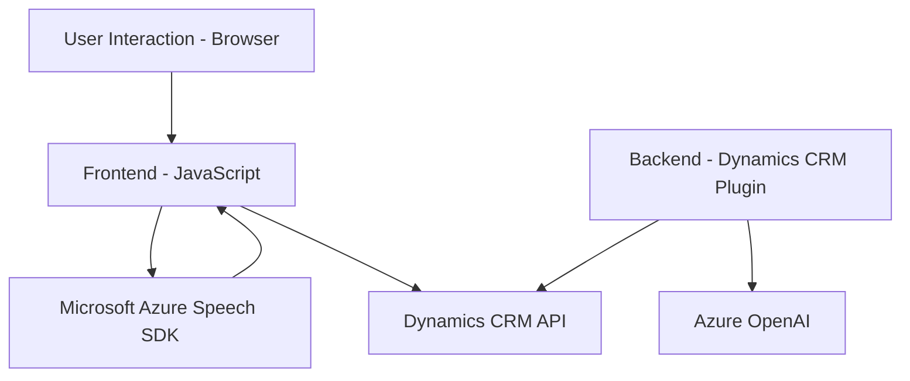

### Breve resumen técnico
El repositorio aborda una solución que integra procesamiento de formularios y funcionalidades avanzadas de voz mediante el Microsoft Azure Speech SDK y Azure OpenAI para aplicaciones y flujos en Dynamics CRM. Está compuesto por:
1. Archivos frontend que se encargan del reconocimiento de voz, síntesis de voz, manipulación del DOM y formulación de datos de formularios.
2. Un archivo backend que actúa como un plugin en Dynamics CRM, transformando texto a objetos estructurados mediante servicios de Azure OpenAI.

### Descripción de arquitectura
Este sistema sigue una arquitectura híbrida, ya que combina elementos modulares de frontend JavaScript con un backend donde los plugins se integran al sistema CRM en un patrón basado en eventos. Los frontend utilizan una estructura de **n capas**, con funciones encapsuladas en módulos que interactúan con servicios externos como SDKs de Azure y APIs HTTP. En el backend, el plugin se adhiere al patrón **plugin architecture** propio de Dynamics CRM. La solución conecta estos dos mundos mediante APIs, cerrando el ciclo entre captura de datos y automatización.

### Tecnologías usadas
1. **Frontend:**
   - JavaScript para manipulación del DOM e integración de SDKs.
   - **Microsoft Azure Speech SDK**: Reconocimiento y síntesis de voz.
   - Interaction with **Microsoft Dynamics CRM** via `Xrm.WebApi`.

2. **Backend:**
   - **C#** para desarrollo del plugin.
   - .NET SDK para Dynamics CRM.
   - Comunicación con **Azure OpenAI** vía HTTP (`System.Net.Http`).

3. **Patrones aplicados:**
   - **Single Responsibility Principle (SRP)**: Funciones encapsuladas para tareas específicas.
   - **SDK Initialization Pattern**: Carga condicional y asíncrona de SDKs.
   - **Integration Pattern**: Coordinación mediante API HTTP entre Dynamics CRM y servicios Azure.
   - **Service Locator**: Uso de `IServiceProvider` para obtener recursos del sistema Dynamics.

### Dependencias o componentes externos presentes
1. **Microsoft Azure Speech SDK** (voz: sintetización y reconocimiento).
2. **Microsoft Dynamics CRM API** (interacciones entre el plugin y el sistema CRM).
3. **Azure OpenAI API** (transformación de texto estructurado a JSON según reglas).

---

### Diagrama **Mermaid**

---

### Conclusión final
El repositorio representa una solución completa para la integración de procesamiento de voz, síntesis de datos y automatización de flujos de trabajo en aplicaciones de formulario de Dynamics CRM. La arquitectura combina un enfoque **modular** en frontend con una implementación **plugin-based** backend, y establece una conexión robusta con dos sistemas principales: **Microsoft Azure Speech SDK** y **Azure OpenAI**. La solución también es extensible, ya que el uso de APIs permite integración flexible con otras soluciones del ecosistema Microsoft.