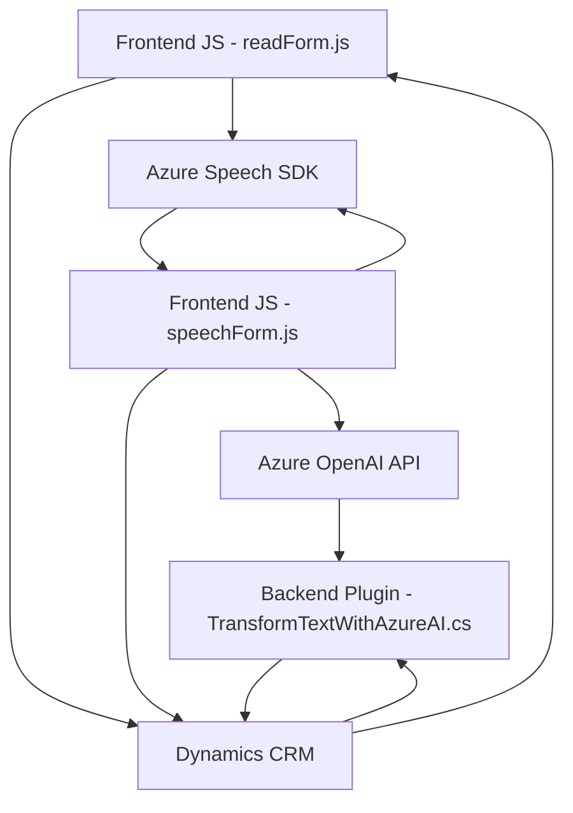

# Análisis estructural y técnico del repositorio

## Resumen técnico

Este repositorio es una solución técnica que combina tecnologías para el procesamiento de datos provenientes de formularios interactivos y voz, con integración profunda hacia plataformas externas como Azure Speech SDK y Azure OpenAI. Su principal objetivo es implementar funcionalidades relacionadas con el reconocimiento de voz, la síntesis de texto a voz, y la transformación de datos usando servicios de inteligencia artificial como Azure OpenAI, dentro de un entorno Microsoft Dynamics CRM.

---

## Descripción de arquitectura

### Tipo de solución
La solución incluye dos componentes principales:
1. **Frontend**: Scripts y funcionalidades relacionadas con la interacción del usuario, incluyendo procesamiento de datos de formularios y su interacción con Azure Speech SDK.
2. **Backend**: Plugins desarrollados para una arquitectura de Dynamics CRM, que integran funcionalidades de procesamiento con Azure OpenAI.

Se trata de una solución híbrida que conecta un **frontend JavaScript** con una **lógica de plugins en Microsoft Dynamics CRM**, y extiende capacidades mediante **servicios en la nube (Azure)**.

---

### Tipo de arquitectura
La arquitectura general sigue una mezcla entre:
1. **Multicapa (N capas):**
   - **Frontend:** Scripts JavaScript estructurados modularmente. Gestionan interacción directa con usuarios y envían solicitudes al backend.
   - **Backend:** Lógica de plugins para procesamiento más avanzado de datos.
   - **Servicios en la nube:** Azure Speech SDK y Azure OpenAI sirven como capas externas para funcionalidades específicas.
   - **Base de datos:** Dynamics CRM almacena y gestiona los datos de formularios y entidades relacionadas.

2. **Cliente-servidor:** Flujo típico para aplicaciones web basadas en CRM, en el cual el frontend realiza solicitudes al backend (APIs) y usa plugins.

3. **Integración con servicios externos:** Azure Speech SDK y Azure OpenAI extensivamente integrados para agregar valor mediante reconocimiento/síntesis de voz y procesamiento de texto.

En cuanto a patrones de arquitectura:
- **Plugin-based architecture:** En el backend, cada funcionalidad está encapsulada en un plugin único adherido a los estándares de generación de procesos en Microsoft Dynamics CRM.
- **Modularidad en frontend:** Diferentes funciones manejan partes específicas de la lógica de negocio, dejando claro cómo se distribuyen roles y responsabilidades.
- **Dynamic Module Loading:** En el frontend se realiza una carga condicional del SDK de Azure Speech para optimizar el uso de recursos.

---

## Tecnologías usadas

### Frontend
1. **JavaScript:** Base del comportamiento interactivo de la solución y comunicación con el backend o APIs externas.
2. **Azure SDKs:**
   - **Azure Speech SDK:** Utilizado para el reconocimiento y síntesis de voz. Carga como biblioteca externa.
3. **Dynamics CRM SDK:** Proporciona acceso al contexto del formulario CRM y sus estructuras asociadas.

### Backend
1. **Microsoft Dynamics CRM Technology:**
   - **Plugins:** Implementación de lógica en C# usando `IPlugin`.
   - **Xrm.WebApi**: API estándar de Dynamics CRM para la manipulación de datos.
2. **Azure OpenAI:** Servicio de procesamiento inteligente para la transformación del texto en JSON estructurado.

### Adicionales
1. **System.Net.Http:** Realiza llamadas HTTP desde el backend.
2. **System.Text.Json:** Manipula data serializada/deserializada en JSON.
3. **Newtonsoft.Json:** Otra herramienta de trabajo con datos JSON.
4. **HTML/DOM:** Uso en el frontend para manipulación de formularios interactivos.

---

## Dependencias y componentes externos
1. **Azure Speech SDK:** Para reconocimiento y síntesis de voz. Se incluye dinámicamente en el frontend mediante un script cargado desde `https://aka.ms/csspeech/jsbrowserpackageraw`.
2. **Azure OpenAI API:** Para transformación avanzada de texto en el backend utilizando HTTP REST.
3. **Custom API:** Llamada desde el frontend para procesamiento adicional basado en Azure AI.
4. **Dynamics CRM:** Base de datos y modelo de entidades. Gestiona herramientas como `Xrm.WebApi` para interacciones extensibles.
5. **Sistema operativo cliente/servidor:** Soporte para ejecución de plugins en la infraestructura de Dynamics CRM.
6. **Servidores web y de aplicaciones:** Azure o servidores Dynamics para la ejecución del backend y de servicios.

---

## Diagrama Mermaid

---

## Conclusión final

La solución está diseñada alrededor de Microsoft Dynamics CRM y utiliza de manera eficiente servicios de Azure (Speech SDK y OpenAI) para proporcionar capacidades avanzadas de reconocimiento y síntesis de voz, así como procesamiento de datos textuales. Su arquitectura modular combina un frontend orientado a cliente ligero y un backend robusto basado en plugins, logrando una integración fluida entre las tecnologías y patrones empleados.

Este enfoque hace que sea ideal para aplicaciones de CRM interactivas y flexibles que busquen mejorar la experiencia del usuario mediante tecnologías de inteligencia artificial y servicios en la nube.