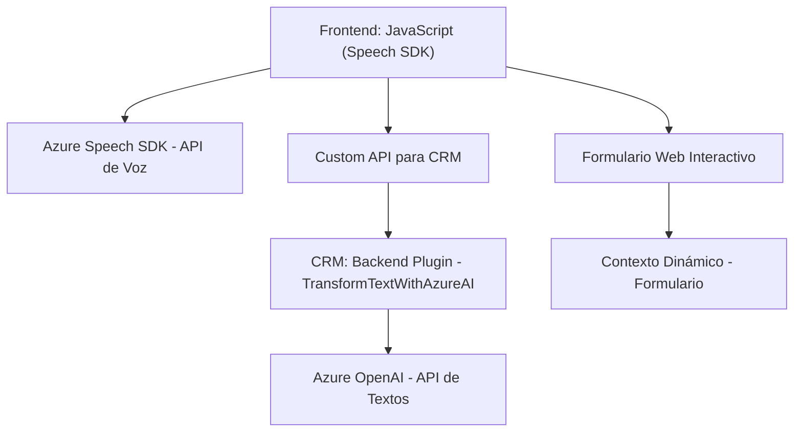

### Breve resumen técnico
El repositorio gestiona interacciones entre formularios web y capacidades de procesamiento y síntesis de voz, junto con la aplicación de servicios IA (Azure OpenAI) en el contexto de Dynamics CRM. Integra SDKs y APIs externas para funcionalidades avanzadas como reconocimiento y síntesis de voz, procesamiento de texto basado en IA, y actualizaciones de formularios.

### Descripción de arquitectura
1. **Tipo de solución**: 
   - Principalmente un sistema híbrido compuesto por frontend (gestión, interacción y voz), integración con backend en forma de plugins en Dynamics CRM, y APIs externas (Azure OpenAI y Speech SDK).
   - Actúa como una solución de interfaz avanzada para formularios, empleando mecanización vocal e inteligencia artificial.

2. **Arquitectura**:
   - **N capas**: Separación explícita entre front-end (JavaScript para gestión del formulario y síntesis/reconocimiento de voz), lógica del negocio (plugin en `.NET` para manipulación e interacción con Azure OpenAI), y APIs externas.
   - Los componentes funcionan con alta modularidad y están distribuidos, utilizando servicios externos que envuelven operaciones específicas (voz y IA).

### Tecnologías usadas
- **Frontend**:
  - JavaScript.
  - Azure Speech SDK.
- **Backend en el Plugin Dynamics CRM**:
  - `.NET Framework` o `.NET Core` (base para el plugin).
  - Dynamics CRM SDK (`Microsoft.Xrm.Sdk` y `Microsoft.Xrm.Sdk.Query`).
- **Servicios externos**:
  - **Azure Speech SDK**: Para procesamiento de voz.
  - **Azure OpenAI**: Procesamiento de texto avanzado con inteligencia artificial.
  - **Custom APIs**: Comunicación con CRM a través de capacidades extendidas.

### Dependencias o componentes externos presentes
- **Azure Speech SDK**: Conecta con servicios de voz en Azure.
- **Azure OpenAI API**: Para inteligencias artificiales generativas.
- **Dynamics CRM SDK**: Para capturar y aplicar lógica del negocio en el contexto del CRM.
- **Newtonsoft.Json/Librerías JSON**: Para procesar y serializar datos JSON.
- **Microsoft Dynamics Web APIs**: Manejan interacciones entre frontend y backend para formularios.
  
### Diagrama Mermaid
Aquí un diagrama que muestra la relación simplificada entre los componentes principales:

### Conclusión final
La solución presentada se basa en una arquitectura robusta de múltiples capas que integra servicios externos (Azure Speech SDK y Azure OpenAI) para ofrecer interacción de voz y procesamiento de IA en formularios asociados a Dynamics CRM. Mantiene una estructura modular y asíncrona, facilitando la delegación funcional y buenas prácticas en la gestión de SDKs y APIs. Aunque destacable en complejidad y alcance, la administración de credenciales debe ser revisada para mejorar la seguridad del sistema. El sistema resulta particularmente útil para escenarios de accesibilidad y mecanización.