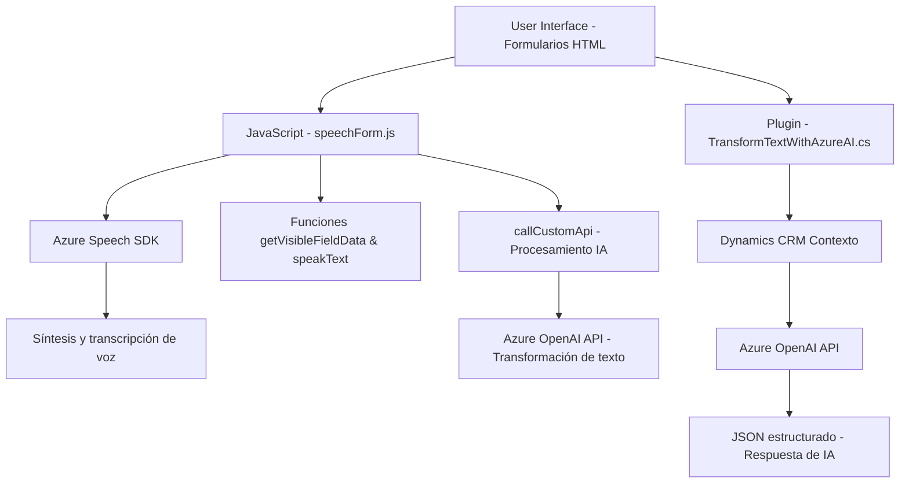

### Breve resumen técnico
El repositorio contiene múltiples archivos con lógica vinculada al procesamiento de formularios HTML y su integración con tecnologías como Azure Speech SDK y Azure OpenAI. Estos componentes trabajan juntos para implementar dos flujos principales: la lectura de datos visibles de formularios HTML y la interacción con controles de formularios mediante comandos de voz, además de un plugin para transformar texto usando un servicio externo de Azure mediante inteligencia artificial.

---

### Descripción de arquitectura
1. **Tipo de solución**
   - Se trata de una solución compuesta que incluye tanto una **librería frontend en JavaScript** como un **plugin backend en .NET**. El objetivo es interactuar con formularios basados en Dynamics 365 y proporcionar accesibilidad avanzada mediante procesamiento de voz y AI.

2. **Tecnologías usadas**
   - **Frontend**:
     - **HTML** (formularios visibles en el DOM).
     - **Azure Speech SDK** para entrada y salida de voz.
     - **JavaScript** con funciones modulares y callbacks.
   - **Backend **:
     - **Microsoft Dynamics 365 SDK** y **Xrm.WebApi**.
     - **Azure OpenAI API** para transformar texto.
     - **C# .NET**.
   - **Json.Net (Newtonsoft.Json)** para manipulación de JSON.
   - **Servicios externos**:
     - Azure Speech Service para síntesis y transcripción de voz.
     - Azure OpenAI para procesamiento avanzado de texto.

3. **Patrones arquitectónicos**
   - **En el frontend**:
     - Modularidad: Las funciones están separadas por responsabilidad específica (e.g., extracción de información, síntesis de voz, gestión del SDK).
     - Callback pattern: Uso de funciones de devolución de llamada para cargar el SDK de manera asíncrona.
     - Facade pattern: Simplificación de la interacción con servicios externos (Azure Speech SDK y APIs personalizadas).
   - **En el backend**:
     - Plugin Architecture: Extensión directa de Dynamics 365 mediante plugins para procesar texto con normas específicas.
     - Service-Oriented Architecture (SOA): Dependencia en servicios externos para funcionalidades avanzadas.

4. **Arquitectura general**
   - La solución tiene características de una arquitectura **de capas**:
     - Capa de presentación (frontend) administra la interacción con el usuario y dinámicamente los formularios HTML.
     - Capa de lógica empresarial (implementada en plugins y scripts) orquesta el flujo de procesamiento.
     - Capa de integración con **APIs externas** (Azure Speech SDK, Xrm.WebApi y Azure OpenAI) para procesar texto/transcripciones de voz y transformar datos con IA.

---

### Diagrama Mermaid válido para GitHub

---

### Conclusión final
La solución proporciona un enfoque eficiente e innovador para interactuar con formularios HTML en entornos de Dynamics 365 mediante entrada/salida de voz y procesamiento de voz. Su uso de servicios de Azure (Speech y OpenAI) permite funcionalidades avanzadas, aunque presenta oportunidades de mejora en la modularidad del código (en el frontend) y en la seguridad de las configuraciones (en la clave API para el plugin). La arquitectura de capas, junto con la integración de patrones como facades y callbacks, asegura una buena separación de responsabilidades y facilita la escalabilidad.