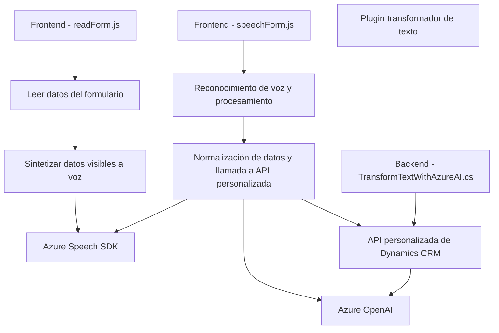

### Breve resumen técnico

El repositorio contiene archivos organizados en dos áreas principales: **frontend** y **backend/plug-ins**. Los archivos en el frontend están relacionados con la integración del reconocimiento/síntesis de voz y el procesamiento de datos de formulario, mientras que el backend implementa la lógica de un plugin que usa Azure OpenAI para transformar texto en un entorno Dynamics CRM. 

Los elementos del sistema interactúan con servicios externos como **Azure Speech SDK** y **Azure OpenAI**, además de integrar funcionalidades específicas que permiten la comunicación y manipulación de datos en el CRM de Microsoft Dynamics 365.

---

### Descripción de la arquitectura

#### Tipo de solución:
La solución es **híbrida**:
1. **Frontend**: Basado en reconocimiento y síntesis de voz, enfocado en mejorar la usabilidad de formularios en Dynamics CRM.
2. **Backend plugins**: Desarrollado para extender la lógica del CRM utilizando un plugin que interactúa con servicios de inteligencia artificial de Azure.

#### Arquitectura: 
1. **Frontend**:
   - Modular.
   - Uso de **n capas** en lógica de UI y servicios.
   - Dependencia de APIs externas (**Azure Speech SDK**).

2. **Backend plugins**:
   - Plugin dentro de la arquitectura de Dynamics CRM extensible.
   - Lógica centralizada con integración directa de Azure OpenAI Service.
   - Enfoque **driver-API** para la interacción con servicios externos mediante solicitudes HTTP.

#### Comunicación entre módulos:
- **Servicios externos**: El diseño utiliza APIs de terceros como **Azure AI** y las capacidades de Dynamics CRM para comunicar datos entre el cliente (browser) y el servidor (CRM backend).
- **Patrones utilizados**:
  - **Callback y Promesas**: Para manejar tareas asincrónicas en JavaScript.
  - **Procesamiento asíncrono** en el plugin, al integrar external APIs (Azure OpenAI).
  - Modularización y separación de capas por funcionalidades.

---

### Tecnologías y frameworks utilizados
1. **Frontend**:
   - **JavaScript**: Para manejar la lógica del reconocimiento de voz y síntesis.
   - **Azure Speech SDK**: Integración con servicios de reconocimiento/síntesis de audio mediante SDK de Azure para navegadores.
   - **HTTP Requests**: Utilizadas para enviar datos a APIs personalizadas y obtener resultados.

2. **Backend Plugins**:
   - **C#**: Lenguaje backend preferido para implementar plugins en Dynamics CRM.
   - **Microsoft Dynamics SDK**: Para extender la funcionalidad principal del CRM con componentes personalizados.
   - **Azure OpenAI Service**: Consumido vía HTTP desde el plugin para procesamiento de texto.
   - **Newtonsoft.Json**: Para manejo y manipulación de objetos JSON.

---

### Dependencias externas y componentes
1. **APIs y SDKs de Azure**:
   - **Azure Speech SDK**: Reconocimiento de voz y generación de audio desde texto.
   - **Azure OpenAI Service**: Transformación de texto con inteligencia artificial.
2. **Microsoft Dynamics SDK**: Para integrar la lógica de plugins en Dynamics CRM.
3. **HTTP Client Libraries** (en el backend): Para el consumo de los servicios externos.
4. **JSON manipulation**: Utilización de Newtonsoft.Json (backend).

---

### Diagrama Mermaid válido para GitHub
 

---

### Conclusión final

La solución en este repositorio combina tecnologías frontend y backend integradas con servicios externos para extender las capacidades de **Dynamics CRM**. El archivo `readForm.js` y `speechForm.js` lideran la experiencia de usuario al facilitar reconocimiento y síntesis de voz en tiempo real mediante el SDK de Azure Speech. En el backend, el archivo C# implementa un plugin que conecta el CRM con **Azure OpenAI** para transformar texto con IA según reglas predefinidas.

La arquitectura es modular y extensible, utilizando principios de integración de servicios externos. Aunque es funcional, el manejo de configuraciones estáticas (API Keys en el código) puede ser un área de mejora en términos de seguridad.