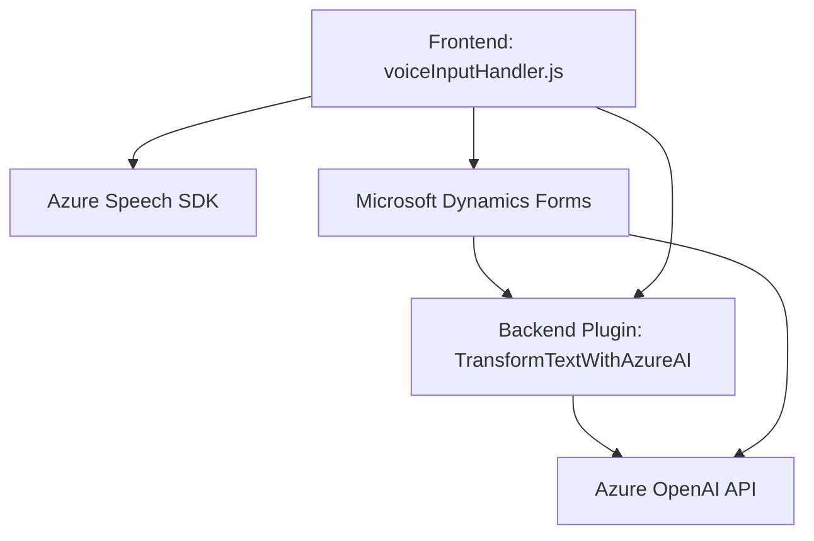

### Breve resumen técnico
El repositorio implementa una solución basada en una integración entre una **interfaz de usuario dinámica** para formularios, un **servicio de síntesis y reconocimiento de voz (Azure Speech SDK)**, y un **plugin de Dynamics 365 CRM** que conecta con **Azure OpenAI API** para transformar texto según normas específicas. El código combina una interfaz frontend en JavaScript, funciones que interactúan con servicios cloud, y un backend funcional basado en Dynamics CRM plugins.

---

### Descripción de arquitectura
1. **Tipo de solución**: Esta solución es un **integración de múltiples sistemas**:
   - **Frontend**: Para manejo de interfaces de usuario (formularios dinámicos con voz).
   - **API personalizada**: Implementada como un plugin de Dynamics CRM que aprovecha Azure OpenAI para transformar texto.
   - **Externo**: Integración con **Azure Speech SDK** y **Azure OpenAI**.

2. **Arquitectura**: Se utiliza una combinación de arquitectura **Cliente-Servidor** y **plugin/event-driven** en Dynamics CRM. Los scripts proporcionan lógica para la capa de presentación (UI) mientras que los plugins procesan las solicitudes hacia servicios externos mediante una estructura de microservicio-like.

---

### Tecnologías usadas
1. **Frontend**:
   - **JavaScript**: Para la manipulación de formularios, SDK y lógica local en el navegador.
   - **Azure Speech SDK**: Para síntesis y reconocimiento de voz.
   - **Microsoft Dynamics CRM Web API (Xrm.WebApi.online)**

2. **Backend**:
   - **C# (.NET Framework)**: Para crear plugins en Dynamics CRM.
   - **Azure OpenAI API**: Utilizada para transformar texto.
   - Librerías de .NET como: `System.Net.Http`, `Newtonsoft.Json`, etc., para el procesamiento de datos y conexiones HTTP/REST.

---

### Dependencias o componentes externos
1. **Azure Speech SDK**: Para la generación de voz y reconocimiento de voz.
2. **Azure OpenAI API**: Para transformar texto utilizando IA.
3. **Microsoft Dynamics 365 Web API**: Para actualización y lectura de datos de formulario.
4. **Libraries**:
   - **Newtonsoft.Json**: Procesamiento JSON en plugins para transformar las respuestas de Azure OpenAI.
   - **Microsoft.Xrm.Sdk**: Para manipular datos del modelo CRM.
   - **System.Net.Http**: Para llamar a API externas desde el plugin.

---

### Diagrama Mermaid (100% válido para GitHub Markdown)

---

### Conclusión final
La solución está diseñada como una **integración compleja basada en servicios cloud**, donde:
- El **frontend** se conecta dinámicamente con servicios de voz y actualiza UI basadas en formularios CRM.
- El plugin en Dynamics CRM actúa como una capa de procesamiento con lógica basada en Azure OpenAI para transformar texto de entrada en un formato JSON estructurado.
La arquitectura combina **cliente-servidor**, **modularidad**, y se apoya en la extensibilidad nativa de Dynamics CRM y servicios externos como Azure. Es especialmente útil para soluciones que requieran capacidades de voz y procesamiento de lenguaje natural en formularios dinámicos.