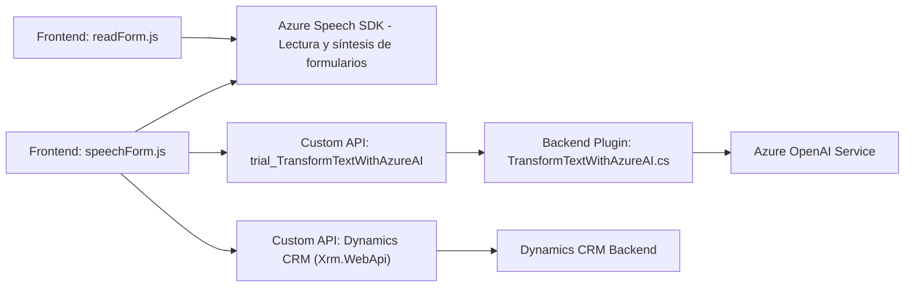

## Breve resumen técnico

El repositorio describe una solución híbrida para el manejo de formularios dinámicos en un sistema CRM (posiblemente Microsoft Dynamics 365) mediante la integración de capacidades de síntesis y reconocimiento de voz proporcionadas por **Azure Speech SDK**. Además, se utiliza un plugin en el backend para la transformación de texto mediante **Azure OpenAI (GPT)**, facilitando la automatización y la aplicación de reglas inteligentes en los formularios CRM.

---

## Descripción de arquitectura

El sistema tiene dos componentes principales:

1. **Frontend:** Implementado con funciones JavaScript (archivos `readForm.js` y `speechForm.js`), el frontend interactúa con los formularios dinámicos del CRM para leer y manipular datos visibles. También incorpora funcionalidades avanzadas de entrada y salida de voz utilizando el **Azure Speech SDK**.

    - Diseño modular con funciones independientes.
    - Integración con el SDK de Azure para la síntesis de voz y reconocimiento de habla.
    - Interacción con formulación dinámica vía API del sistema CRM.

2. **Backend Plugin:** Un plugin de CRM (`TransformTextWithAzureAI.cs`) en **C#**, desarrollado bajo la plataforma de extensibilidad de **Microsoft Dynamics CRM**.
   - Implementa la interfaz `IPlugin` para responder a eventos.
   - Integra **Azure OpenAI GPT** para transformar texto por reglas predefinidas.
   - Se comunica mediante solicitudes HTTP hacia el servicio externo de Azure OpenAI.

La arquitectura es una **solución de integración de servicios externos**, donde los datos se sincronizan entre un frontend basado en JavaScript y un backend extensible del sistema central CRM. Tiene componentes de automatización por voz, IA y transformación de datos.

---

## Tecnologías usadas

1. **Frontend**:
   - **JavaScript (ES6)**: Base del frontend con funciones bien estructuradas.
   - **Azure Speech SDK**: Reconocimiento de voz y síntesis en lenguaje natural.
   - **Dynamics CRM JavaScript API**: Para acceder y manipular formularios dinámicos en el sistema CRM.
2. **Backend Plugin**:
   - **C# (.NET Framework)**: Implementación del plugin.
   - **Microsoft.Xrm.Sdk**: Para manipulación directa de objetos y servicios de Dynamics CRM.
   - **Azure OpenAI Service**: API para transformación de texto con GPT.
3. **Libraries**:
   - `Newtonsoft.Json`: Procesamiento de JSON en C#.
   - `System.Text.Json`: Trabajo adicional con JSON en C#.
   - `System.Net.Http`: Realización de solicitudes HTTP desde el backend.

---

## Diagrama **Mermaid** válido para GitHub Markdown

---

## Conclusión Final

La solución presenta una arquitectura híbrida con un uso extendido de servicios externos como el **Azure Speech SDK** y **Azure OpenAI GPT**, con un enfoque en la modularidad y separación de responsabilidades. Este enfoque permite el desarrollo de una solución flexible para integrar reconocimiento y síntesis de voz, junto a transformaciones avanzadas de texto con IA, con un sistema CRM como Dynamics 365.

Sin embargo, surgen algunos puntos de mejora:
1. **Seguridad:** Las claves API utilizadas para los servicios de Azure deben ser almacenadas y manejadas de manera segura.
2. **Error handling:** Mejorar el tratamiento de errores de las APIs externas para robustecer el sistema frente a fallos.
3. **Estructura del código:** Si el proyecto escala, sería útil migrar hacia una arquitectura de microservicios para desacoplar las funcionalidades del sistema (voz, transformación de texto, manejo del formulario).

Como solución actual, se trata de un sistema modular, extensible y adaptado a un entorno empresarial con una integración eficiente entre frontend, backend y servicios externos.