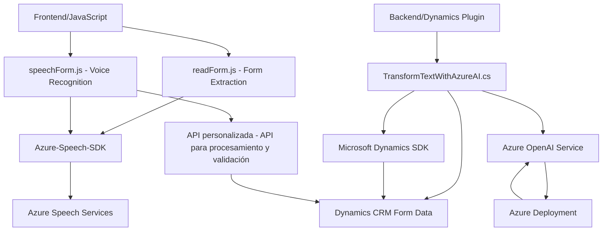

### Resumen Técnico
El repositorio incluye varios archivos que implementan funcionalidades privadas de una solución basada en Dynamics 365. Los archivos están organizados en diferentes carpetas, como `FRONTEND/JS` y `Plugins`. Las funciones principales giran en torno al uso del Azure Speech SDK para síntesis y reconocimiento de voz, interacción por voz con formularios y el uso del servicio Azure OpenAI para procesar y transformar texto según normativas específicas. La solución está orientada al uso de Inteligencia Artificial para mejorar la interacción entre el usuario y una plataforma CRM.

---

### Descripción de arquitectura
La arquitectura de la solución parece alinearse con un enfoque **n-capas**, donde:
1. La capa frontend (JS) permite la interacción directa con el usuario mediante un navegador, ofreciendo capacidades como la síntesis del texto en voz y el reconocimiento del habla.
2. La capa backend (plugins de Dynamics 365) procesa, analiza y traslada los datos entre el frontend y las API basadas en Azure (Azure OpenAI).

La modularidad en la implementación de funciones sugiere una arquitectura de **microservicios aplicado en API**, donde cada función realiza una tarea específica y se integra con servicios externos.

---

### Tecnologías y frameworks usados
1. **Frontend:**
   - **JavaScript ES6+:** Base para implementar las funcionalidades descritas en `readForm.js` y `speechForm.js`.
   - **Azure Speech SDK:** Utilizado para la síntesis y reconocimiento de voz, con servicios disponibles en distintas regiones de Azure.
   - **Integration with Dynamics 365:** Contextos y formularios dinámicos se gestionan a través de las API del entorno de Dynamics 365.

2. **Backend Plugin:**
   - **Microsoft Dynamics CRM SDK**: Para implementar plugins personalizados.
   - **Azure OpenAI API**: Para transformación automática de texto en JSON mediante inteligencia artificial.
   - **HttpClient**: Para interactuar con servicios externos en las API empleadas por Azure OpenAI.
   - **Newtonsoft.Json** y **System.Text.Json**: Para la serialización y deserialización de estructuras JSON enviadas o recibidas a través de las peticiones API.

### Dependencias o Componentes Externos Presentes
1. **Azure Speech SDK**: Integración directa para síntesis de texto a voz y reconocimiento de voz.
2. **Azure OpenAI Service**: Utilizado en el plugin backend para la transformación avanzada de texto en JSON.
3. **Microsoft Dynamics 365**: El núcleo de la solución, usado para formularios dinámicos, datos y servicios relacionados con CRM.
4. **Dynamics API**: Uso de métodos como `Xrm.WebApi` para CRUD y peticiones de datos en Dynamics.
5. **Azure Function/API personalizada**: Mencionada en la funcionalidad de llamadas (e.g., `callCustomApi`) para envío y procesamiento de datos transcritos.
6. **SDK dinámico cargado desde una URL**: Carga de recursos del SDK (`https://aka.ms/csspeech/jsbrowserpackageraw`) de manera dinámica en frontend.

---

### Diagrama Mermaid

---

### Conclusión final
Este repositorio implementa una solución híbrida (frontend-backend) que se centra en mejorar la interacción con formularios de Dynamics 365 a través de opciones de entrada de texto conversacional, guía por síntesis de voz y transformación avanzada de datos mediante Azure OpenAI. 

La arquitectura de la solución se asemeja a una **n-capas** con integración de servicios basados en IA y reconocimiento de voz, lo cual es ideal para casos de uso en sistemas CRM modernos. No obstante, sería recomendable mejorar la seguridad del manejo de claves y credenciales para los servicios externos. **El uso de Azure Speech SDK, Azure OpenAI y APIs personalizadas integradas con Dynamics CRM destaca como una unión eficaz entre tecnologías.**