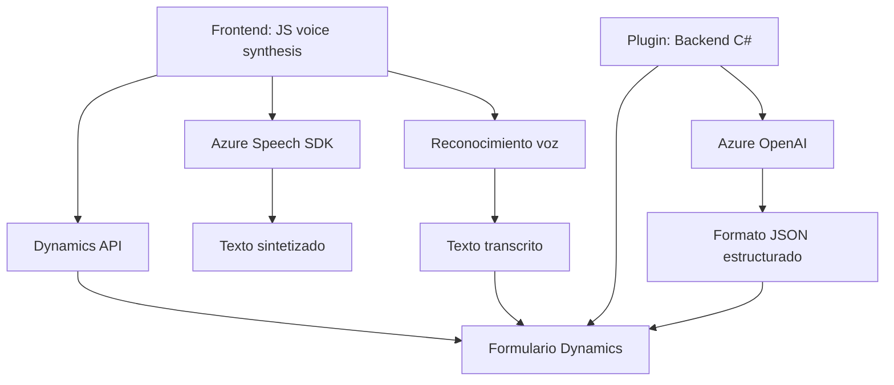

### Breve resumen técnico:
El repositorio combina varios archivos de diferentes entornos y lenguajes para implementar funcionalidades basadas en entrada de voz y procesamiento de texto en aplicaciones Dynamics 365. Estas funcionalidades están integradas con **Azure Speech SDK** (para síntesis y reconocimiento de voz) y **Azure OpenAI API** (para transformación avanzada de texto). Los archivos están dirigidos al manejo de formularios, extracción de datos, síntesis de voz, reconocimiento de voz, y procesamiento avanzado de texto mediante inteligencia artificial.

---

### Descripción de arquitectura:
1. **Tipo de solución:** La arquitectura representa un sistema híbrido compuesto por:
   - Una **frontend** diseñada para interactuar con formularios en Dynamics 365.
   - **Plugins de backend** orientados a la integración con servicios de Azure OpenAI para la transformación avanzada de datos.
2. **Patrones usados:**
   - **Modularización:** Alta cohesión en funciones especializadas por tarea (extraer datos, sintetizar voz, reconocer voz, etc.).
   - **Integración de servicios externos:** Servicios de Azure como Speech SDK y OpenAI para delegar funcionalidad avanzada.
   - **Plugin Architecture:** El sistema utiliza el patrón de plugin para extender las capacidades de Dynamics CRM.
   - **Strategy:** Elección dinámica de modalidad de reconocimiento según la integración con IA.
   - **Repository Pattern:** En el manejo de formularios hay lógica para acceder y modificar campos, siguiendo la estructura de los datos.
3. **Arquitectura general:** Multicapa híbrida: Contiene un frontend robusto (JavaScript), un backend basado en eventos/plugin (C#) y agrega lógica delegada a servicios externos como Azure.

---

### Tecnologías usadas:
1. **Frontend:**
   - Lenguajes: JavaScript (Vanilla JS).
   - SDK: Azure Speech SDK para síntesis/reconocimiento de voz.
   - Servicios: Dynamics 365 APIs para integración con formularios.
2. **Backend:**
   - Frameworks: Dynamics CRM SDK (Microsoft CRM), .NET Framework/Core (lenguaje C#).
   - Servicios: Azure OpenAI API conectada con GPT-4, con soporte para JSON.
3. **Otros:** 
   - HttpClient para solicitudes HTTP.
   - JSON parsing (Newtonsoft Json / System.Text.Json).

---

### Diagrama Mermaid

---

### Conclusión final:
El repositorio muestra una solución híbrida con capacidades avanzadas que expanden la funcionalidad de Dynamics CRM mediante integración con servicios de Azure. La arquitectura emplea patrones modernos como modularización y plugins para garantizar alta cohesión y extensibilidad. La frontend (JavaScript) se basa en un patrón de cliente persistente, mientras que la backend implementa Azure OpenAI y Speech SDK para el procesamiento delegado. Esto asegura una solución eficiente, conectada y adecuada para entornos empresariales dinámicos.