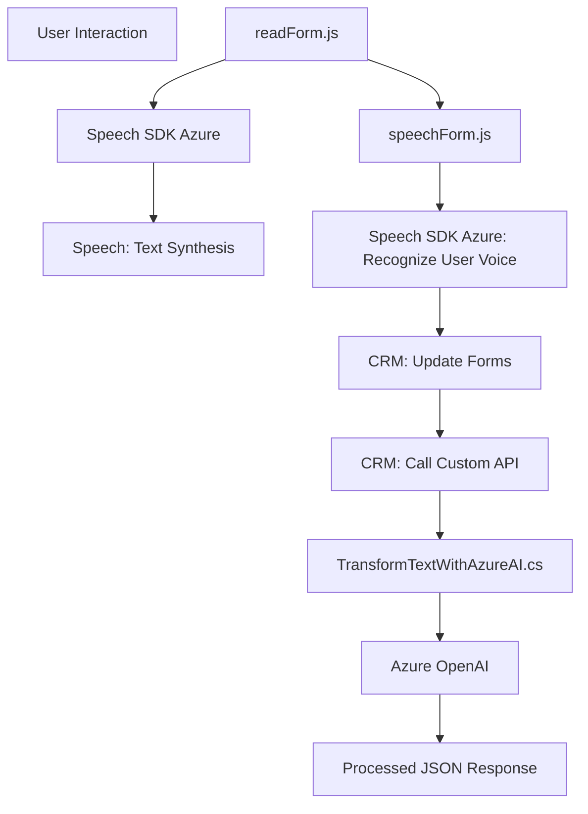

# Análisis y Explicación Técnica del Repositorio

## Breve resumen técnico
El repositorio parece ser parte de una solución híbrida que mezcla un **frontend** de JavaScript, un servicio externo de nube (Azure Speech SDK), y un backend orientado a Dynamics CRM. Está diseñado para la interacción avanzada entre usuarios y un sistema CRM, usando **procesamiento de lenguaje natural (PLN)** y reconocimiento de voz mediante Azure Speech y Azure OpenAI. Combina varias tecnologías para interfaces de voz y procesamiento de documentos mediante servicios externos.

---

## Descripción de arquitectura
La solución utiliza una **arquitectura de n capas**:
1. **Frontend**: Archivos JS (`readForm.js` y `speechForm.js`) que manejan interacción del usuario con formularios, reconocimiento de voz y síntesis de voz.
2. **Backend**: Plugin en C# (`TransformTextWithAzureAI.cs`) que extiende la funcionalidad de Dynamics CRM para integrar procesamiento de texto y transformaciones con Azure OpenAI.
3. **Servicios externos**:
   - Azure Speech SDK: Reconocimiento y síntesis de voz.
   - Azure OpenAI Service: Generación de texto estructurado (probablemente con GPT).
4. **Integración:** Los componentes se comunican a través de APIs (WebApi de Dynamics CRM, Azure APIs) y eventos en tiempo real.

Esta arquitectura se puede clasificar como **orientada a servicios**, ya que integra múltiples servicios externos, separados por su funcionalidad (Speech SDK y OpenAI) y las capas constituyen módulos independientes para su propósito.

---

## Tecnologías usadas
### Frontend:
- **JavaScript** para lógica de frontend.
- **Azure Speech SDK**: Para reconocimiento/síntesis de voz desde el navegador.
- **Event-Driven Programming**: Evaluaciones y eventos basados en la interacción del usuario (ejemplo: `onClick`, SDK dinámico).

### Backend:
- **C# para plugins de Dynamics CRM** como punto de extensión en la capa de negocio.
- **Azure OpenAI Service**: Procesamiento avanzado de texto mediante IA.
- **Microsoft.Xrm.Sdk**: APIs para conexión con CRM.
- **Newtonsoft.Json.Linq**: Procesamiento JSON.
- **HttpClient (System.Net.Http)**: Peticiones a servicios web externos.

### Patrones detectados:
- **Carga dinámica de dependencias**: En frontend, el SDK se carga dinámicamente desde una CDN a través del DOM.
- **Pipeline lógico**: Pasos progresivos como extracción de datos del formulario, reconocimiento de voz, y síntesis de texto.
- **Plugin Oriented Design**: Extensión de eventos en Dynamics CRM.
- **Integración vía servicios**: Comunicación con APIs de nube (Azure).

### Herramientas:
- Servidor web, probablemente configurado para Dynamics CRM backend.
- Integración con Azure Speech y OpenAI para reconocimiento y transformación de texto.

---

## Dependencias externas posibles
1. **Azure Speech SDK**: Para reconocimiento y síntesis de voz en frontend.
2. **Azure OpenAI Service**: Procesamiento de texto con IA en backend.
3. **Dynamic-CRM Xrm WebApi**: Interfaz API del CRM para leer y registrar datos.
4. **SDK de Microsoft y bibliotecas estándar**:
   - `Newtonsoft.Json.Linq` (JSON).
   - `System.Net.Http` (peticiones web).
5. **CDN externas** para cargar dependencias en frontend (ejemplo: Azure Speech SDK).

---

## Diagrama Mermaid 100% compatible con GitHub Markdown

---

## Conclusión final
Este repositorio representa una solución orientada a servicios que integra un frontend avanzado para interacción mediante voz, conexión con APIs de Azure y plugins que extienden la funcionalidad de Dynamics CRM. Usa una **arquitectura de n capas**, siendo cada componente modular y especializado. Sin embargo, algunos aspectos como "claves estáticas en frontend" podrían exponerse a riesgo de seguridad. Finalmente, la solución está bien diseñada para manejar formularios de manera programática e interactuar con usuarios mediante voz y texto natural gracias a la conexión con tecnologías de IA modernas.