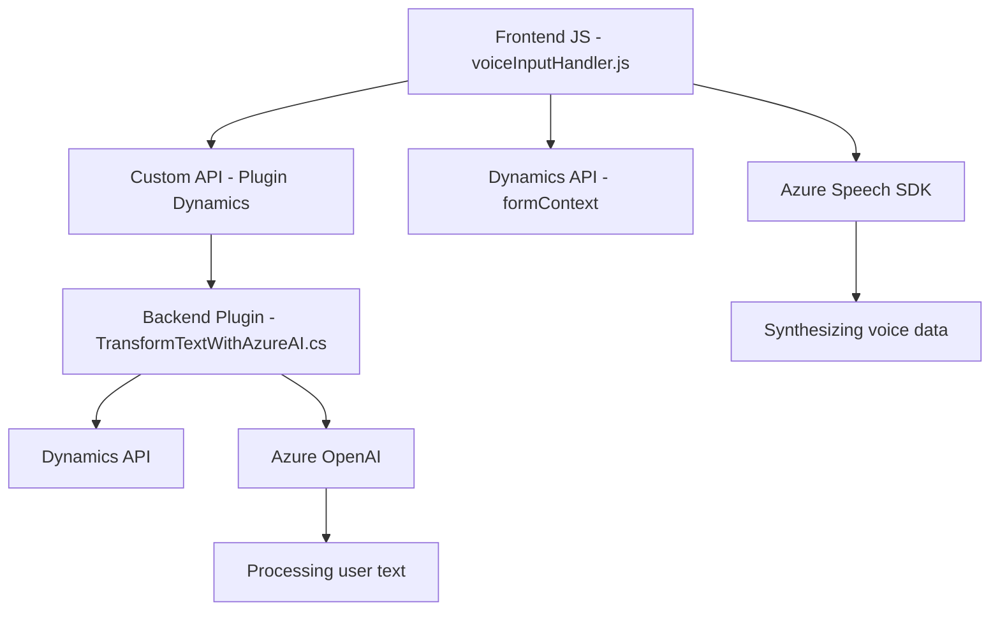

### Resumen técnico:
El repositorio analizado parece contener diferentes componentes que interactúan con APIs externas (Azure Speech SDK y Azure OpenAI) y servicios internos (Dynamics CRM). La solución está orientada principalmente a proporcionar una integración entre interfaces de usuario (formularios en Dynamics) y servicios de inteligencia artificial, utilizando código modular en el frontend y un plugin en el backend.

---

### Descripción de arquitectura:
La arquitectura de esta solución presenta las siguientes características principales:
1. **Frontend**:
   - Se basa en archivos JavaScript que interactúan con servicios externos y manipulan formularios en Dynamics CRM. Implementa un modelo modular y asincrónico.
2. **Backend**:
   - Implementación como un **plugin** para Dynamics CRM usando C#. Sigue una arquitectura orientada a eventos y servicios, interactuando directamente con APIs de Dynamics y servicios externos como Azure OpenAI.

En general, la arquitectura puede clasificarse como una aproximación híbrida:
- **Integración n-capas**: Los módulos se dividen claramente entre frontend (gestión de interfaces) y backend (plataforma empresarial y procesamiento).
- **API-driven architecture**: Usa APIs externas (Azure Speech y Azure OpenAI) para cumplir con requisitos de funcionalidad avanzada.

---

### Tecnologías usadas:
#### Frontend:
- **JavaScript**: Principal lenguaje para la interacción del cliente.
- **Azure Speech SDK**: SDK para síntesis y reconocimiento de voz.
- **Promesas y flujo asincrónico**: Uso de `async/await` y callbacks para gestionar operaciones asíncronas.
- **SDK XRM**: Para manejar la lógica del formulario en Dynamics CRM.

#### Backend:
- **C#, Dynamics CRM SDK**: Base de implementación para crear plugins interactuando con el contexto organizacional.
- **HTTPClient (System.Net.Http)**: Consumidor de servicios RESTful como Azure OpenAI.
- **System.Text.Json**: Serialización/deserialización de datos JSON.

#### Otros servicios y dependencias:
- **Azure OpenAI**: Para modelar y transformar texto.
- **Microsoft Dynamics CRM**: Framework base de los plugins.

---

### Diagrama Mermaid:

---

### Conclusión final:
Este repositorio implementa una solución integrada para Dynamics CRM que utiliza servicios avanzados de inteligencia artificial y voz (Azure Speech SDK y OpenAI). Su estructura organizacional refleja una separación clara de responsabilidades y una combinación de diferentes patrones arquitectónicos. Aunque no es un monolito, no llega completamente al nivel de microservicios; está diseñado como una arquitectura híbrida de n-capas que organiza funcionalidades del frontend y backend de manera modular.