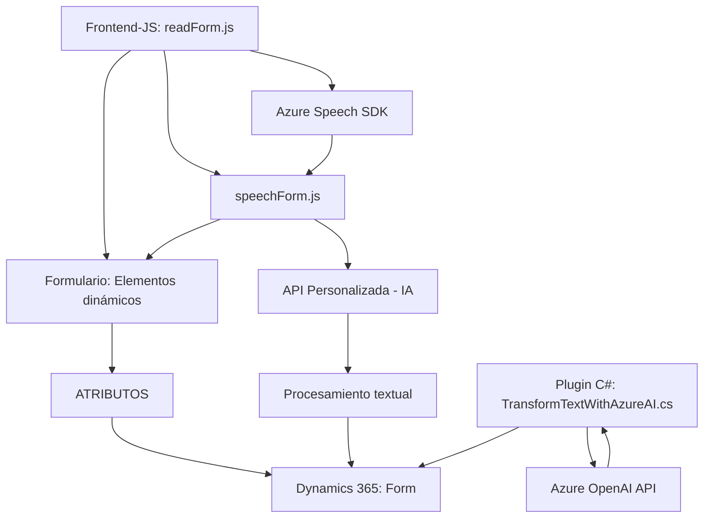

### Breve resumen técnico
El repositorio exhibe la arquitectura de una solución basada en la integración de sistemas mediante módulos especializados. Los archivos proporcionan funcionalidades que dependen de Microsoft Dynamics CRM, Azure Speech SDK, y Azure OpenAI API, con una evidente orientación hacia el desarrollo de módulos para procesamiento de datos de formularios y síntesis de voz/transformación de texto.

---

### Descripción de arquitectura
La solución presenta características que combinan arquitectura **n capas** y **cliente-servidor**. 
1. **Capa cliente**:
   - Archivos JavaScript (`readForm.js` y `speechForm.js`) forman la capa frontend. 
   - Funcionalidades como lectura, transcripción y síntesis de texto dependen casi completamente de ejecutar lógicas en el navegador del cliente, con comunicación mediante APIs externas.
2. **Capa servidor**:
   - Plugin en C# (`TransformTextWithAzureAI.cs`) implementa el patrón **plugin** y opera en el backend de Dynamics CRM para integrarse con la API de Azure OpenAI.
   
La solución presenta un alto grado de integración con servicios externos e implementa principios de modularización: cada funcionalidad específica está separada en su módulo.

---

### Tecnologías usadas
1. **Frontend (JavaScript)**:
   - **Azure Speech SDK**: Para síntesis y reconocimiento de voz, que también utiliza un sistema de carga dinámica del SDK.
   - **API web personalizada en Dynamics**: Llamada desde el código JS del cliente, probablemente para funciones de IA.
   - **Dynamics 365 Web API (`Xrm.WebApi`)**: Para manipular datos relacionados con Dynamics CRM directamente desde las funciones JavaScript.

2. **Backend (C#)**:
   - **Microsoft Dynamics CRM Plugin SDK**: Estructura estándar utilizada para la integración de plugins en entornos Dynamics.
   - **Azure OpenAI API**: Utilizada para procesar transformación de texto con modelos avanzados de IA.
   - **JSON Parsing**: Uso de `Newtonsoft.Json` y `System.Text.Json` para estructuración de datos enviados y recibidos.

---

### Diagrama Mermaid

---

### Conclusión final
La solución combina un frontend escrito en JavaScript con una integración profunda entre Dynamics 365, Azure Speech SDK y Azure OpenAI. La arquitectura puede considerarse **híbrida**, ya que combina características de cliente-servidor en el frontend y patrones de diseño específicos en el backend como plugins y servicios externos. Aunque la estructura es modular, el código parece altamente dependiente de APIs externas y de la configuración de credenciales estáticas, lo cual puede requerir mejoras para optimizar seguridad y escalabilidad.