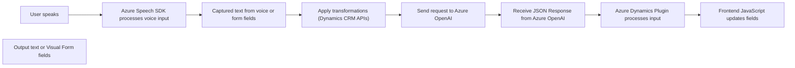

### Breve resumen técnico
El repositorio contiene una solución que desarrolla funcionalidades de entrada y salida de voz utilizando el servicio **Azure Speech SDK**, complementada por un procesamiento avanzado del texto mediante **Azure OpenAI** y su integración con **Dynamics CRM**. Los módulos están organizados en diferentes capas: un frontend para la interacción con formularios dinámicos y voz, y un plugin en el backend para operaciones más complejas.

---

### **Descripción de la arquitectura**
La arquitectura tiene las siguientes características:
1. **Tipo de solución:** Modular dentro de un sistema más grande basado en Dynamics CRM. Los archivos implementan funcionalidades específicas para procesar datos de formularios mediante voz y texto.
2. **Diseño arquitectónico:**  
   - **Backend:** Abordado como un sistema de **plugin basado en eventos** en Dynamics CRM, empleando la arquitectura de plugins (IPlugin).  
   - **Frontend y módulos de voz:** Modular; de estilo n-capas con una división clara entre entrada de voz, procesamiento de datos, y consumo de servicios externos (Azure Speech SDK, APIs personalizadas).
3. **Patrones utilizados:**  
   - **Arquitectura orientada a eventos (Event-driven)**: A nivel del plugin de Dynamics CRM y carga del SDK durante eventos específicos.  
   - **Lazy Loading:** El SDK se carga dinámicamente cuando es necesario.  
   - **API Wrapper:** Desarrollo de funciones específicas que simplifican la interacción con el Azure Speech SDK y otros servicios externos.  
   - **Middleware de integración:** El plugin actúa como un puente entre Dynamics CRM y Azure OpenAI.  
   - **Microservicio-like design:** Algunas funcionalidades dependen de servicios externos, como procesamiento de texto en Azure AI, simulando interacciones propias de un microservicio.  

---

### **Tecnologías usadas**
1. **Frontend:**  
   - **Lenguaje:** JavaScript.  
   - **Integración:** APIs del navegador para el control de voz y el uso de SDKs de terceros.  
   - **Framework externo:** **Azure Speech SDK** (importado dinámicamente).  
   - **Dinámica CRM:** La interacción con formularios se basa en Dynamics CRM.

2. **Backend (Plugin):**  
   - **Lenguaje:** C#.  
   - **Integración externa:** **Azure OpenAI API** para transformación avanzada de texto.  
   - **SDK:** Microsoft Dynamics CRM SDK (`IPlugin`, `IOrganizationService`).  
   - **Librerías adicionales:** `System.Net.Http`, `JsonSerializer`, y potencialmente `Newtonsoft.Json` para procesar datos JSON.  

3. **Servicios:**  
   - **Azure Speech SDK** (procesamiento de voz a texto y síntesis).  
   - **Azure OpenAI API** (transformación avanzada de texto).  

4. **Dependencias en el frontend:**  
   - Formularios de Dynamics CRM basados en contexto (`formContext` y `executionContext`).  

---

### **Diagrama Mermaid válido**
El flujo funcional mostrado en los archivos y dependencias puede representarse así:

---

### Conclusión final
La solución presentada combina **Microsoft Azure services** y **Dynamics CRM plugins** para construir una herramienta avanzada de procesamiento de voz y texto. Su diseño modular y uso de APIs externas favorece un desarrollo escalable que puede adaptarse y extenderse fácilmente dentro de la pila tecnológica de Microsoft. La implementación de patrones como **Lazy Loading**, **Plugin pattern**, y **Event-driven programming** evidencia un diseño sólido, aunque orientado al uso intensivo de servicios externos.

Por último, la arquitectura se clasifica como **n-capas** en su estructura, dado que separa las preocupaciones entre frontend (UI y voz), integración con SDKs externos y backend (plugins). Sin embargo, su uso de APIs externas como Azure Speech SDK y OpenAI aproximan su funcionalidad hacia un esquema de microservicios.