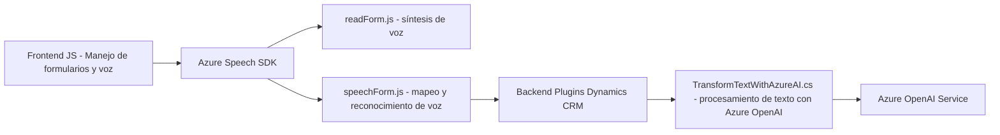

### Breve Resumen Técnico:

El repositorio presentado está diseñado para integrar funcionalidades avanzadas de reconocimiento y síntesis de voz, así como procesamiento de texto basado en inteligencia artificial, dentro de formularios de Dynamics CRM. Utiliza tecnologías como Azure Speech SDK y Azure OpenAI Services, estructurándose como una solución híbrida que combina un frontend dinámico (JavaScript) con plugins en el backend (C#).

---

### Descripción de la Arquitectura:

**1. Estructura general**:  
Esta solución tiene una arquitectura **híbrida** que combina el frontend y backend. En el frontend, módulos de JavaScript se encargan de la interacción con formularios y servicios de reconocimiento/síntesis de voz. En el backend, el plugin en C# responde a eventos específicos en Dynamics CRM y utiliza Azure OpenAI para manejar lógica avanzada.

- **Frontend**: Implementa un enfoque estructurado de programación modular con funciones específicas para diversas tareas como captura de voz, conversión de datos y síntesis de texto. Utiliza APIs de navegador y Azure Speech SDK.
  
- **Backend**: El plugin sigue el patrón estándar de Dynamics CRM basado en eventos. El procesamiento de texto mediante integración con Azure OpenAI está encapsulado en métodos especializados.

**2. Modelo arquitectónico**:
- **Base en capas** (frontend): Lógica segmentada conforme a tareas específicas como captura de datos, mapeo de campos y comunicación con APIs externas.
- **Microservicio externo**: Integración con Azure Speech y Azure OpenAI Service representa servicios externos diseñados para tareas específicas.
- **Plugin en arquitectura de eventos**: El backend en Dynamics CRM está basado en el patrón de suscripción y reacción ante eventos.

---

### Tecnologías usadas:

1. **Frontend**:
   - **JavaScript**: Manipulación del DOM y lógica de negocio.
   - **Azure Speech SDK**: Para habilitar sus capacidades de síntesis y reconocimiento de voz.
   - **APIs del navegador**: (e.g., DOM y Alertas).

2. **Backend**:
   - **C# y Dynamics CRM SDK**: Creación y ejecución de un plugin para eventos del sistema.
   - **Azure OpenAI Service**: Procesamiento avanzado de texto con IA.
   - **Newtonsoft.Json** y **System.Text.Json**: Manejo de objetos JSON.
   - **HTTP Client**: Llamadas API hacia servicios externos en Azure.

3. **Patrones**:
   - **Modularidad**: Separación de lógica en funciones específicas.
   - **Callback y asincronía**: Para garantizar que los servicios externos estén listos antes de la ejecución.
   - **Encapsulación**: Métodos con propósito bien definido para interactuar con servicios Azure y manipular datos.
   - **Event-driven architecture**: Uso de Plugins que responden a eventos del CRM.

---

### Diagrama Mermaid:

---

### Conclusión Final:

El repositorio presentado está diseñado para extender la funcionalidad de Dynamics CRM mediante la integración de capacidades de síntesis y reconocimiento de voz en el frontend, así como transformación avanzada de texto en el backend. La solución utiliza tecnologías líderes como Azure Speech SDK y Azure OpenAI, estructuradas bajo patrones de modularidad y manejo dinámico de eventos. La arquitectura híbrida combina elementos de capas en el frontend con la ejecución de plugins en el backend para garantizar un diseño eficiente y escalable.