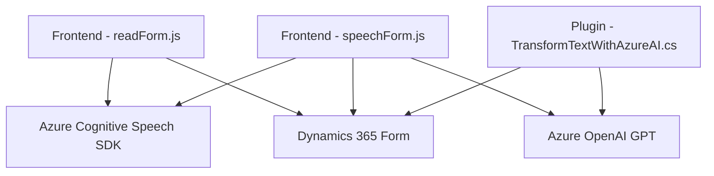

### Breve resumen técnico

El repositorio presenta tres archivos con funcionalidades diversas que interactúan con formularios y servicios externos, como **Azure Speech SDK** y **Azure OpenAI**. El sistema está diseñado para integrar procesamiento de datos, interacciones por voz y lógica de transformación inteligente en el entorno de Dynamics 365, divididos en módulos frontend y plugins backend.

---

### Descripción de arquitectura

La solución sigue una estructura **cliente-servidor** donde el frontend (Javascript) se comunica directamente con APIs y SDKs de Azure, mientras que el backend (C# plugin) opera en el contexto de Dynamics 365. Este enfoque utiliza:
- **Arquitectura modular**: Dividiendo responsabilidades en funciones específicas.
- **Patrón de n-capas**: Claramente separa el frontend para la interacción del usuario, el middleware para procesamiento de voz y lógica, y el backend para integración y persistencia de datos.
- **Plug-in architecture**: El archivo en el backend encapsula lógica transformativa de Dynamics CRM como extensiones del sistema.

Los patrones empleados reflejan una **arquitectura desacoplada** con integración de componentes externos como Azure Cognitive Services.

---

### Tecnologías usadas

1. **Frontend**:
   - **Javascript ES6**: Lenguaje principal para las funciones de procesamiento de voz y formularios.
   - **Azure Cognitive Services Speech SDK**: Para sintetizar voz y transcribir comandos hablados.
   - **Dynamics 365 APIs (Xrm.WebApi)**: Comunicación con custom APIs y manipulación de datos.

2. **Backend**:
   - **C# (.NET Framework)**: Lenguaje del plugin para Dynamics CRM.
   - **Azure OpenAI GPT**: API externa para transformación inteligente de texto.
   - **Newtonsoft.Json** / **System.Text.Json**: Librerías para manejo de estructuras JSON.

3. **Servicios externos**:
   - Azure Speech SDK (en frontend).
   - Azure OpenAI (en backend).

---

### Diagrama Mermaid

---

### Conclusión final

El repositorio presenta una solución bien estructurada y modular que integra **tecnologías avanzadas de Azure** en escenarios interactivos (frontend) y transformativos (backend). La arquitectura de n-capas y la conexión directa cliente-servicio aseguran un diseño robusto y flexible para entornos Dynamics CRM, pero dependen significativamente de las configuraciones de servicios externos como Azure SDK y OpenAI.