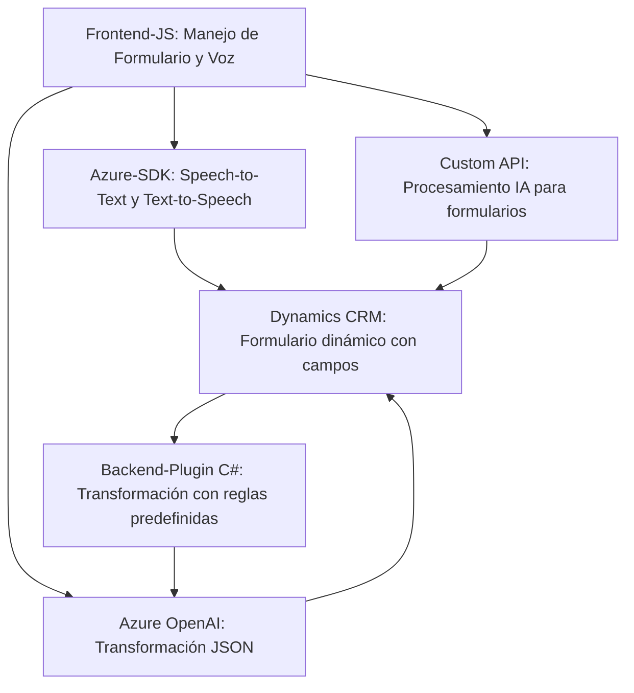

### Breve resumen técnico

El repositorio presentado tiene dos componentes principales:
1. **Frontend:** Implementa una solución para convertir datos y formularios en voz mediante el **SDK de Azure Speech**.
2. **Backend/plugin:** Diseñado para transformar texto en estructuras JSON utilizando **Azure OpenAI** e integrándose con Dynamics CRM para la automatización de datos.

El sistema parece estar orientado a mejorar la accesibilidad y la manipulación dinámica de datos en formularios, combinando servicios de entrada/salida de voz y procesamiento mediante inteligencia artificial.

---

### Descripción de arquitectura

La arquitectura implementada es de **n capas** con un **modelo desacoplado**:
- **Frontend (JS):** Maneja la interacción con el usuario (formulario dinámico), captura de datos y voz (input/output), y la lógica de integración con el Azure Speech SDK y una API personalizada. Usa callbacks, funciones específicas y asincronía para modularizar la lógica.
- **Plugin Backend (C#):** Funciona como una interfaz que se activa dentro de Dynamics CRM, interactuando con Azure OpenAI para convertir datos textuales en JSON siguiendo reglas predefinidas.

Aunque no es una arquitectura de microservicios, la solución tiene un enfoque modular que conecta el frontend con servicios de terceros (Azure Speech y OpenAI) mediante APIs.

---

### Tecnologías usadas

#### **Frontend**
- **Lenguaje:** JavaScript (ES6+).
- **Framework:** Ninguno mencionado directamente, pero utiliza APIs dinámicas para manipular formularios.
- **Dependencias externas:**
  - Azure Speech SDK: Para convertir texto en voz y procesar entrada de voz.
  - Dynamics 365 WebAPI: Para interactuar con formularios y entidades en Dynamics CRM.

#### **Backend (Plugin en C#)**
- **Lenguaje:** C# (.NET Framework).
- **Framework:** Dynamics 365 plugin framework.
- **Dependencias externas:**
  - Azure OpenAI Service: Conversión de texto con IA.
  - System.Net.Http + Newtonsoft.Json: Para enviar y procesar solicitudes HTTP hacia Azure OpenAI.

#### **Patrones empleados**
- **Cargar dependencias dinámicas:** Uso de `ensureSpeechSDKLoaded` para cargar el SDK según demanda.
- **Callback/eventos:** El flujo de trabajo se basa en la ejecución controlada por eventos asíncronos.
- **Separación de responsabilidades:** Cada función/método está diseñado para una tarea específica.
- **Encapsulación:** En el plugin de backend, el método `GetOpenAIResponse` encapsula toda la lógica de interacción con Azure OpenAI.
- **N capas:** Separación clara entre frontend (accesibilidad del usuario) y backend (procesamiento de datos).

---

### Diagrama Mermaid válido para GitHub

---

### Conclusión final

El repositorio representa una **solución basada en n capas** que integra accesibilidad, formulación de datos, y procesamiento mediante servicios de nube. En la interfaz de usuario, el sistema se enfoca en transformar datos en voz y capturar entrada de voz mediante **Azure Speech SDK**, mientras que en el backend, el **plugin de Dynamics CRM** utiliza **Azure OpenAI** para formalizar y transformar texto en estructuras JSON útiles.

Este diseño híbrido es modular y extensible, con un enfoque claro en la interacción con APIs externas y en la implementación de servicios orientados al usuario. Sin embargo, la solución se enfrenta a desafíos comunes de seguridad en el uso de claves de acceso hacia servicios de Azure, cuya protección se debe gestionar adecuadamente. 

El diagrama mermaid ilustra cómo los distintos componentes se relacionan dentro de esta infraestructura, con una clara conexión entre frontend, servicios de nube (speech y OpenAI), y backend/plugin.